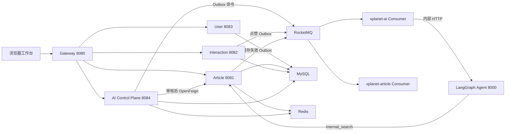

# XPlanet

> 面向开发者的可追溯研究与社区平台：高并发社区底座、Agent 工作流、人工审核和幂等发布已形成首个可运行闭环。

> **当前基线（2026-07-21）**：Research Workspace、有界动态工具循环、Claim–Evidence–Critic、站内知识回流、30 题评测和故障恢复均有可复现证据。真实 OpenAI/Web Search 质量仍需在明确提供密钥和成本授权后单独验收。

[](https://openjdk.org/)
[](https://spring.io/projects/spring-boot)
[](LICENSE)

## 项目定位

**XPlanet Research 是面向开发者的可追溯研究 Agent 与知识社区。** 用户提交技术问题后，Agent 在预算内动态选择站内检索、Web 搜索和网页抓取，形成 Evidence、Claim 与 Citation；报告通过 Critic 检查和人工审核后幂等发布为文章，并立即回流到下一次站内检索。Agent 研究闭环是主线，Java/Spring 平台负责让任务、证据和发布副作用可靠运行。

**Agent 研究与证据闭环**
- **Research Workspace**：无需 Node 构建即可运行的三栏工作台，覆盖登录、任务创建/列表/取消、带鉴权 SSE 重连、节点时间线、来源/Evidence/Citation、模型用量、报告编辑和人工发布
- **有界动态 Agent 图**：`xplanet-agent` 用 LangGraph 让 Planner 和 `decide_action` 在预算内循环选择 `web_search`、`web_fetch` 或结束；查询/URL 去重，工具次数、来源数、Token 和总超时均有上限
- **Claim–Evidence–Critic 闭环**：Writer 输出显式 Claim 与 Evidence 绑定，证据片段保存 SHA-256；结构化 Critic 检查缺证据、冲突和错误引用，并且最多触发一次定向补研究
- **安全工具边界**：搜索只产生候选来源，抓取结果再升级证据；HTTP 抓取逐跳检查协议、端口、DNS 公网地址、重定向、内容类型和响应大小
- **站内知识回流**：`internal_search` 通过内部 Token 调用 Article TopK 接口；MySQL FULLTEXT 只召回未删除文章，发布后的文章无需复制索引即可参与后续研究
- **评测与指标**：固定 30 条 JSONL 数据集离线评测结构成功率、引用索引有效性和确定性词面 Claim Support；Micrometer 暴露执行结果、节点耗时和 checkpoint 指标

**Java 控制面与可靠执行**
- **任务状态与请求幂等**：`xplanet-ai` 管理私有研究任务、运行实例、预算上限和版本条件状态迁移
- **可靠长任务命令**：任务/运行/Outbox 同事务提交，带租约 relay 向 RocketMQ 投递请求与取消命令
- **可恢复长任务**：每个节点把版本化 checkpoint 写入 MySQL，Agent 崩溃后由 RocketMQ 重投并从下一节点恢复，失败最多尝试 3 次后进入明确 `FAILED`
- **证据与进度闭环**：来源、证据、引用和报告在同一事务校验落库；步骤进度写 Redis Stream，并由 `xplanet-ai` 通过 SSE 输出
- **Human-in-the-loop**：报告必须由任务所有者确认，随后通过内部 OpenFeign 调用幂等发布为文章；重复确认返回同一文章

**知识社区与高并发后端**
- **Caffeine + Redis 二级缓存**：本地缓存承担热点读，Redis 支撑跨实例共享；空值缓存、分布式锁和 TTL 随机分别约束穿透、击穿和雪崩
- **可靠缓存失效**：Cache Aside + 事务 Outbox + MQ 广播让数据库变更后的立即/延迟失效可恢复，并同步清理多实例 L1
- **可靠点赞投影**：`like_relation` 是事实源，关系变更与 Outbox 同事务；消费端以 eventId 唯一去重，按文章合并 delta 并批量更新计数
- **服务协作与降级**：OpenFeign 用于需要立即结果的短调用；user 服务故障返回兜底作者名，MQ 故障由 Outbox 退避重试，缓存重建抢锁失败直接回源
- **完整社区闭环**：文章分页与详情、两级评论、点赞/取消、热榜，以及研究报告审核发布和知识回流

> 每个研究任务都可在工作台选择 `offline-demo` 或 `openai-tools`。离线模式用于零成本、可复现验收；在线模式通过 Responses API 完成结构化规划/决策/写作和 Hosted Web Search。API Key 只存在 Agent 服务端，前端只读取“在线能力是否可用”。在线质量仍应使用自己的 Key 和代表性问题单独验收，不能用离线评测代替。

> 已引入轻量 Spring Cloud Gateway 作为统一外部入口；注册中心、分布式事务和监控全家桶仍按业务规模暂不引入。
> 高可用(集群/哨兵/多实例)作为演进方向写在 [`docs/HA-AND-DEGRADE.md`](docs/HA-AND-DEGRADE.md),按需扩展。
> 工程的价值在于「按场景选型」,而不是技术数量。

## 架构



完整文档入口见 [`docs/README.md`](docs/README.md)。第一次接触项目建议先读 [`docs/BEGINNER-GUIDE.md`](docs/BEGINNER-GUIDE.md)，架构细节见 [`docs/ARCHITECTURE.md`](docs/ARCHITECTURE.md)，技术原理和快速巡检分别见 [`docs/TECHNICAL-GUIDE.md`](docs/TECHNICAL-GUIDE.md) 与 [`docs/VERIFICATION-GUIDE.md`](docs/VERIFICATION-GUIDE.md)。

## 模块说明

| 模块 | 端口 | 职责 | 关键特性 |
|---|---|---|---|
| `xplanet-gateway` | 8080 | 统一外部入口 | **路由、CORS、TraceId、JWT 前置校验；Docker 模式中唯一暴露的应用端口** |
| `xplanet-common` | - | 公共响应、异常、常量 | 全局异常处理、缓存 key 规范 |
| `xplanet-api` | - | DTO / VO | 跨服务数据契约 |
| `xplanet-article` | 8081 | 文章服务 | **二级缓存、延迟双删、批量消费点赞落库、列表分页、评论、限流、调用 user 服务** |
| `xplanet-interaction` | 8082 | 点赞服务 | **文章有效性校验、关系状态机、Transactional Outbox、可恢复 MQ relay** |
| `xplanet-user` | 8083 | 用户服务 | 用户查询、bcrypt 登录与 JWT 签发 |
 | `xplanet-ai` | 8084 | AI 控制面 | **私有任务、请求幂等、预算、可靠命令、checkpoint、模型用量、指标、SSE、审核发布** |
 | `xplanet-agent` | 8000（仅内部） | Python 执行面 | **LangGraph 动态工具循环、安全网页抓取、Claim/Evidence/Critic、单次补研究和断点恢复** |

## 快速开始

### 方式一：本地混合模式（开发推荐）

推荐:中间件用 Docker，Python Agent 和 5 个 Java 服务用 IDE / 命令行跑（便于断点调试）。

先设置所有服务共享的 JWT 签名密钥（至少32字符，实际使用请生成随机值）：

```powershell
$env:TOKEN_SECRET="replace-with-a-random-secret-at-least-32-bytes"
$env:AGENT_INTERNAL_TOKEN=$env:TOKEN_SECRET
```

Docker Compose 用户可复制 `.env.example` 为 `.env` 后替换其中的示例值。

#### 1. 启动中间件并迁移数据库

```powershell
.\scripts\setup-infra.ps1
```

脚本会启动 MySQL(3306)、Redis(6379)、RocketMQ(namesrv 9876 + broker 10911)，
选择供宿主机 JVM 使用的 broker 广播地址，等待 MySQL 就绪并执行 Flyway。
数据库结构只有一条 Flyway 演进路径：空库执行 V004 创建社区基础结构，现有 V4 库首次接入时自动建立 baseline；两者随后统一执行 V005～V010，增加 AI 控制面、幂等发布、持久化 checkpoint、Evidence 哈希、文章全文索引和任务级 Provider。后续只追加迁移，无需手工改库。

#### 2. 编译

```bash
mvn -DskipTests clean install
```

#### 3. 启动 Python Agent 和 5 个 Java 服务

先在一个终端启动内部 Agent：

```powershell
python -m venv .venv
.\.venv\Scripts\python.exe -m pip install -e ".\xplanet-agent[test]"
$env:AGENT_INTERNAL_TOKEN=$env:TOKEN_SECRET
$env:AI_CONTROL_URL="http://localhost:8084"
.\.venv\Scripts\python.exe -m uvicorn xplanet_agent.api:app --host 0.0.0.0 --port 8000
```

默认离线模式无需模型密钥。只有明确需要联网研究并接受外部 API 成本时才设置 Key；`AGENT_PROVIDER` 仅用于健康信息中的默认提示，实际执行模式由每个任务的 `provider` 决定：

```powershell
$env:OPENAI_API_KEY="replace-with-your-key"
$env:OPENAI_MODEL="gpt-5.6-terra"
```

全 Docker 模式可直接编辑被 Git 忽略的 `.env`，填写 `OPENAI_API_KEY` 后执行 `docker compose -f docker/docker-compose-app.yml up -d --force-recreate agent`。工作台刷新任务列表时会重新读取 Agent 能力：Key 未配置时在线选项禁用，配置后在线选项启用。不要把 `.env` 提交到仓库。

Gateway 容器默认暴露宿主机 8080；若 8080 已占用，启动脚本自动尝试 18080。浏览器工作台会探测两个端口并保存实际可用地址，因此不同浏览器不再依赖各自旧的 localStorage 配置。

IDEA 直接 Run:`ArticleApplication`(8081)、`InteractionApplication`(8082)、`UserApplication`(8083)、`AiApplication`(8084)、`GatewayApplication`(8080)。先启动下游服务，最后启动 Gateway。

或命令行(Windows 可用 `scripts/start-local.ps1` 一键起):
```bash
mvn -pl xplanet-article     -am spring-boot:run
mvn -pl xplanet-interaction -am spring-boot:run
mvn -pl xplanet-user        -am spring-boot:run
mvn -pl xplanet-ai          -am spring-boot:run
mvn -pl xplanet-gateway     -am spring-boot:run
```

#### 4. 验证

```bash
# 文章详情(走二级缓存,读操作免登录)
curl http://localhost:8080/api/article/1

# 文章列表(分页)
curl "http://localhost:8080/api/article/list?pageNum=1&pageSize=10"

# 登录拿 token(写操作需要)
TOKEN=$(curl -s -X POST -H "Content-Type: application/json" \
  -d '{"username":"alice","password":"password"}' http://localhost:8080/api/user/login \
  | grep -o '"token":"[^"]*"' | cut -d'"' -f4)

# 点赞(带 token,异步落库)
curl -X POST -H "Authorization: Bearer $TOKEN" http://localhost:8080/api/like/1

# 发评论(带 token)
curl -X POST -H "Authorization: Bearer $TOKEN" -H "Content-Type: application/json" \
  -d '{"articleId":1,"content":"不错"}' http://localhost:8080/api/comment
```

推荐在仓库根目录执行 `python -m http.server 4173 --directory xplanet-web`，然后访问 `http://127.0.0.1:4173`；也可以直接打开 `xplanet-web/index.html`。先在顶部用用户名 `alice`/`bob` 登录，再进入研究工作台。
本地初始化账号 `alice`、`bob`、`demo` 的初始密码均为 `password`，数据库中只保存 bcrypt 哈希。

全部服务与中间件都启动后，可执行可重复的端到端冒烟测试：

```powershell
.\scripts\smoke-test.ps1
```

脚本会验证健康检查、登录、AI 任务私有读取/幂等/跨用户隔离、Agent 动态决策/工具/checkpoint 数量关系、Prometheus 执行/恢复指标、来源—证据—引用闭包、人工审核、重复发布幂等和取消，
同时覆盖文章查询、可靠缓存失效 Outbox、重复点赞幂等、MQ 消费、持久化计数投影和未登录拦截。脚本会恢复原点赞状态和文章计数；研究任务和发布文章作为验收记录保留。

验证 Agent 在节点提交后进程崩溃仍能恢复：

```powershell
.\scripts\test-agent-recovery.ps1
```

运行不调用外部模型的固定数据集评测：

```powershell
.\.venv\Scripts\python.exe -m xplanet_agent.evaluation --dataset xplanet-agent/eval/golden_dataset.jsonl
.\scripts\test-internal-recall.ps1
```

### 方式二：全 Docker 模式（完整部署推荐）

先设置密钥，然后一条命令完成基础设施启动、数据库迁移、应用镜像构建和健康检查：

```powershell
$env:TOKEN_SECRET="replace-with-a-random-secret-at-least-32-bytes"
.\scripts\start-docker.ps1
.\scripts\smoke-test.ps1
```

若所在网络无法访问 Docker Hub，可临时通过参数或 `DOCKER_BASE_REGISTRY` 指定兼容镜像前缀；
仓库默认值仍为官方 `docker.io/library`，避免把特定镜像站写死到项目中。

## 项目结构

```
xplanet/
├── pom.xml
├── xplanet-common/          # 公共
├── xplanet-api/             # 契约
├── xplanet-gateway/         # 统一外部入口、路由、CORS、TraceId、前置鉴权
├── xplanet-article/         # 文章服务 ★ 核心
├── xplanet-interaction/     # 点赞服务 ★ 核心
├── xplanet-user/            # 用户服务
├── xplanet-ai/              # AI 任务控制面、SSE、审核和发布编排
├── xplanet-agent/           # Python LangGraph Agent 执行面
├── xplanet-web/             # 静态研究工作台
├── docker/
│   ├── docker-compose-infra.yml   # 中间件(本地混合模式用这个)
│   ├── docker-compose-app.yml     # 全 Docker 模式(可选)
│   ├── Dockerfile.app
│   ├── broker-host.conf           # 宿主机 JVM 使用的 broker 广播地址
│   └── broker-docker.conf         # 容器应用使用的 broker 广播地址
├── sql/migrations/          # V004 完整基线 + V005～V010 增量迁移
├── scripts/                 # 构建、迁移、启动、端到端与故障恢复测试
├── .github/workflows/ci.yml # 单测、Compose 与脚本语法检查
└── docs/
    ├── ARCHITECTURE.md
    ├── BEGINNER-GUIDE.md
    ├── README.md
    ├── TECHNICAL-GUIDE.md
    ├── VERIFICATION-GUIDE.md
    ├── CURRENT-SCOPE.md
    ├── EXPERIMENTS.md
    ├── evaluation-results.md / .json
    └── HA-AND-DEGRADE.md
```

## 已知取舍

- 中间件单机(Redis/MySQL/RocketMQ),未做集群/哨兵/主从——这是**高可用**演进项,
  与「应用可水平扩展」是两回事(应用层已按无状态多实例设计)。见 `docs/HA-AND-DEGRADE.md`
- Token 使用标准 JWT/JWS 库签发和校验，签名密钥通过 `TOKEN_SECRET` 外部注入
- 登录使用 Spring PasswordEncoder 校验 bcrypt 哈希；本地初始化账号共用初始密码，仅用于本地数据
- 点赞以 `like_relation` 为事实源,通过 Outbox 至少一次投递；消费端唯一事件表和事务批量投影吸收重复并支持崩溃恢复
- AI 已完成离线确定性闭环、持久化 checkpoint、崩溃恢复、有限重试、Claim–Evidence–Critic 和 MySQL 站内检索；联网 Provider 尚未用真实密钥验收，离线词面支持率和站内召回率不能替代联网事实核验，完整可观测平台仍是后续项
- 当前没有针对 Outbox + MQ + 持久化投影完整链路的有效容量压测，因此不宣称 QPS、削峰倍数或生产 SLA

这些取舍均对应当前规模和已经验证的需求；演进路径见相关设计文档。

## 设计立场:可水平扩展 ≠ 高可用

- **应用层**按「可水平扩展」设计:无状态(token 无状态、缓冲在 Redis)、L1 本地缓存 + MQ 广播
  保证多实例部署时本地缓存一致——这些是为水平扩展服务的,不是过度设计
- **中间件高可用**(集群/哨兵)按需演进,当前单机够用
- 二者是不同维度，本项目明确选择「应用可扩展 + 中间件暂单机」，本地环境运行单实例

## License

[MIT](LICENSE)
