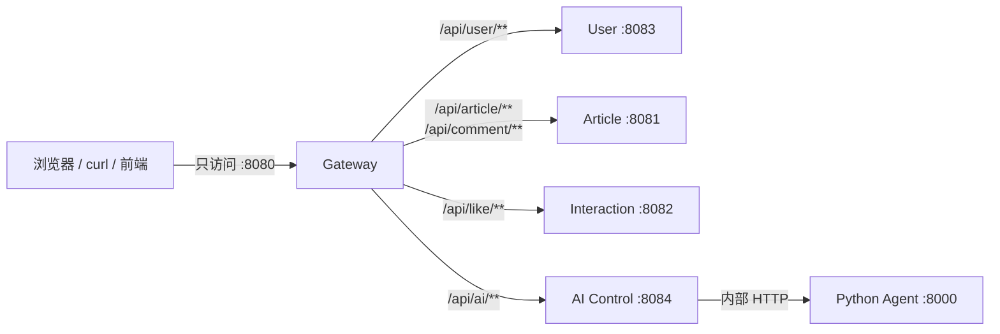
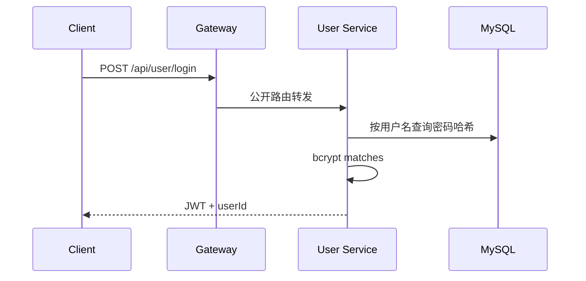
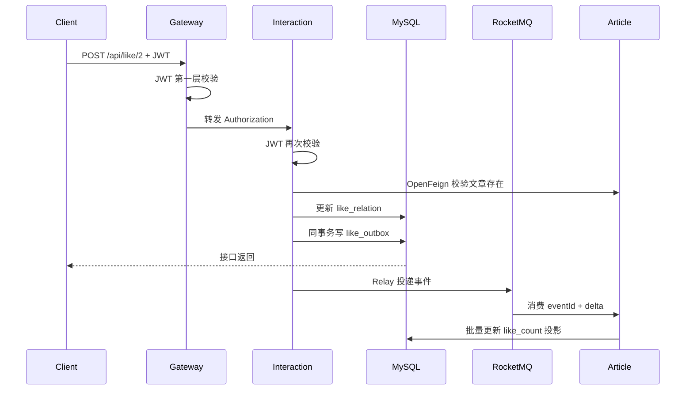
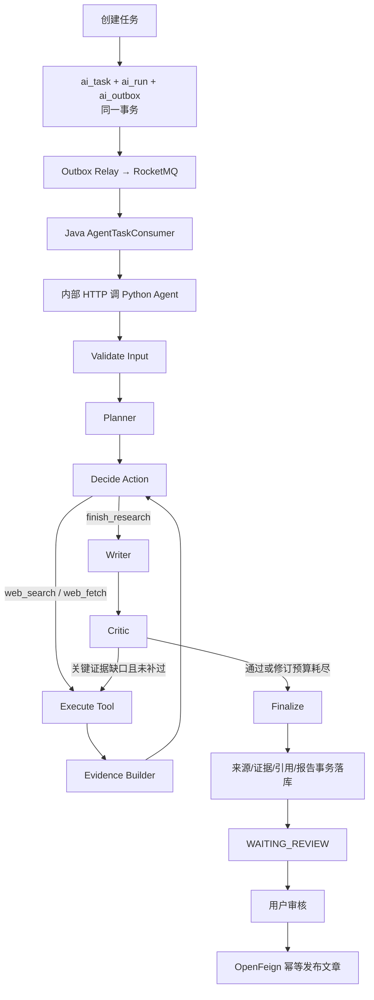

# XPlanet 零基础入门与项目导读

> 本文用于理解当前可运行的后端，以及 Phase 1～3 的 Research Workspace、动态工具循环和 Claim–Evidence–Critic 质量闭环。掌握当前链路后，再阅读 [`XPlanet-秋招版最终方案.md`](XPlanet-秋招版最终方案.md) 了解后续站内知识检索和评测收口。

> 适合第一次接触 Java 微服务、Redis、RocketMQ 和 Agent 的同学。建议不要一上来逐行读代码，先按本文把系统跑起来，再沿着一条请求追代码。

## 1. 先用一句话理解项目

XPlanet 是一个“开发者社区 + AI 研究 Agent”项目：用户可以阅读、发布、评论和点赞文章，也可以创建一个 AI 研究任务；Agent 完成研究后先进入人工审核，用户确认后再把报告发布成社区文章。

项目刻意解决两类工程问题：

1. 社区后端的热点读、并发写、缓存一致性和消息可靠性；
2. Agent 长任务的排队、进度、预算、崩溃恢复、证据追踪和人工审核。

它不是把很多技术随便堆在一起。每个组件都在解决一个明确问题。

## 2. 你真正访问的入口

外部客户端只访问：

```text
http://localhost:8080
```

8080 是 `xplanet-gateway`。Docker 模式下，8081～8084 和 Agent 8000 都不暴露给宿主机。



这样做的原因：

- 前端只记一个地址；
- 跨域、TraceId 和第一层 JWT 校验集中处理；
- 内部服务不直接暴露，攻击面更小；
- 以后增加统一限流、访问日志或灰度路由时有固定位置。

Gateway 不是唯一安全边界。下游服务仍会再次校验 JWT，并检查任务、报告或文章是否属于当前用户。

## 3. 项目由哪些模块组成

| 模块 | 端口 | 主要职责 | 为什么单独存在 |
|---|---:|---|---|
| `xplanet-gateway` | 8080 | 统一路由、CORS、TraceId、JWT 前置校验 | 隐藏内部服务，给客户端一个入口 |
| `xplanet-user` | 8083 | 用户查询、bcrypt 密码校验、签发 JWT | 身份能力边界清楚 |
| `xplanet-article` | 8081 | 文章、评论、缓存、热榜、点赞计数投影 | 社区内容的所有者 |
| `xplanet-interaction` | 8082 | 点赞关系状态机、点赞 Outbox | 高频互动写与文章读模型解耦 |
| `xplanet-ai` | 8084 | AI 任务、运行、Outbox、进度、报告、审核 | Java 控制平面，负责可靠性和权限 |
| `xplanet-agent` | 8000 | LangGraph 节点执行、研究、证据、写作、Critic | Python AI 生态更成熟，执行面可独立扩缩容 |
| `xplanet-common` | 无 | 统一响应、异常、JWT、鉴权、限流 | Java 服务复用的公共能力 |
| `xplanet-api` | 无 | 跨模块 DTO、Request、VO | 避免服务间 JSON 契约各写一份 |

基础设施：

| 组件 | 作用 | 不是用来做什么 |
|---|---|---|
| MySQL | 最终业务事实、Outbox、checkpoint、报告和证据 | 不负责实时推送 |
| Redis | 二级缓存、限流、热榜、Agent 实时进度 | 不作为 AI 任务唯一事实源 |
| RocketMQ | 点赞、缓存失效和 AI 长任务的异步传递 | 不保存最终业务状态 |
| Docker Compose | 本地一键组织全部组件 | 不是生产级编排平台 |

## 4. 目录应该怎么看

```text
xplanet/
├─ pom.xml                         Maven 总工程，列出所有 Java 模块
├─ xplanet-gateway/                统一入口
├─ xplanet-user/                   用户与登录
├─ xplanet-article/                文章、评论、缓存、投影
├─ xplanet-interaction/            点赞关系和点赞 Outbox
├─ xplanet-ai/                     AI Java 控制平面
├─ xplanet-agent/                  Python Agent 执行面
├─ xplanet-common/                 Java 公共能力
├─ xplanet-api/                    跨模块数据契约
├─ xplanet-web/                    无需 Node 的研究工作台（HTML/CSS/原生 JS）
├─ sql/init.sql                    新数据库的完整结构
├─ sql/migrations/                 历史数据库增量迁移
├─ docker/                         Dockerfile 和 Compose
├─ scripts/                        启动、迁移、smoke、故障测试
└─ docs/                           架构、实验和入门文档
```

一个典型 Java 请求的代码层次是：

```text
Controller → Service → Mapper → MySQL/Redis
```

- Controller：接 HTTP 参数，调用业务服务；
- Service：真正的业务规则和事务边界；
- Mapper：执行 SQL；
- Entity/Record：数据库数据结构；
- VO：返回给前端的数据；
- Request/DTO：接收或跨服务传输的数据。

## 5. 先把项目跑起来

### 5.1 必要软件

- JDK 17；
- Maven；
- Docker Desktop；
- PowerShell 5.1 或更高版本。

检查：

```powershell
java -version
mvn -version
docker version
docker compose version
```

### 5.2 设置本地密钥

```powershell
$env:TOKEN_SECRET="replace-with-a-random-secret-at-least-32-bytes"
$env:AGENT_INTERNAL_TOKEN=$env:TOKEN_SECRET
```

这两个值不能写死进 Git：

- `TOKEN_SECRET` 给 Gateway 和各业务服务校验用户 JWT；
- `AGENT_INTERNAL_TOKEN` 保护 Java AI 服务与 Python Agent 的内部接口。

### 5.3 全 Docker 启动

```powershell
.\scripts\start-docker.ps1
```

脚本会依次完成：

1. 启动 MySQL、Redis、RocketMQ；
2. 等待 MySQL 就绪；
3. 执行 Flyway 迁移；
4. 构建 Java 和 Python 镜像；
5. 启动全部应用；
6. 检查 Gateway、内部服务和 Agent 健康。

验证：

```powershell
Invoke-RestMethod http://localhost:8080/actuator/health
Invoke-RestMethod http://localhost:8080/api/article/2
```

Docker 模式下，下面这些端口访问失败是正确现象：

```text
localhost:8081
localhost:8082
localhost:8083
localhost:8084
```

### 5.4 自动验收

```powershell
.\scripts\smoke-test.ps1
.\scripts\test-agent-recovery.ps1
```

第一个脚本验证正常业务闭环；第二个脚本会故意让 Agent 在 checkpoint 后退出，再验证 MQ 重投和断点恢复。

## 6. 第一次手动调用 API

### 6.1 登录

```powershell
$body = @{ username="alice"; password="password" } | ConvertTo-Json
$login = Invoke-RestMethod -Method Post `
  -Uri "http://localhost:8080/api/user/login" `
  -ContentType "application/json" -Body $body
$token = $login.data.token
$headers = @{ Authorization = "Bearer $token" }
```

登录流程：



密码数据库中保存的是 bcrypt 哈希，不是明文。JWT 是带签名的身份凭证，不是加密后的密码。

### 6.2 读取文章

```powershell
Invoke-RestMethod http://localhost:8080/api/article/2
```

读路径：

```text
Gateway → Article Controller → Article Service
        → Caffeine L1 → Redis L2 → MySQL
```

为什么两级缓存：

- Caffeine 在当前 JVM 内，最快，但不同实例不共享；
- Redis 跨实例共享，稍慢，但能挡住大量数据库读取；
- 两层都没有才查询 MySQL。

重点源码：

- `xplanet-article/.../controller/ArticleController.java`
- `xplanet-article/.../service/impl/ArticleServiceImpl.java`
- `xplanet-article/.../cache/ArticleCacheManager.java`

### 6.3 点赞

```powershell
Invoke-RestMethod -Method Post `
  -Uri "http://localhost:8080/api/like/2" -Headers $headers
```

点赞不是直接给 `article.like_count + 1`：



关键概念：

- `like_relation` 是事实：用户到底有没有给文章点赞；
- `article.like_count` 是投影：为了读取快而保存的汇总数字；
- 重复点赞不改变状态，因此不会重复写 Outbox；
- Outbox 保证“状态变更”和“待发送事件”在同一个数据库事务里；
- MQ 至少一次投递，所以消费者还要用 eventId 幂等。

重点源码：

- `xplanet-interaction/.../service/LikeService.java`
- `xplanet-interaction/.../service/LikeOutboxPublisher.java`
- `xplanet-article/.../mq/LikeMessageConsumer.java`
- `xplanet-article/.../projection/LikeCountProjectionService.java`

### 6.4 创建 AI 研究任务

```powershell
$aiHeaders = @{
  Authorization = "Bearer $token"
  "Idempotency-Key" = [Guid]::NewGuid().ToString("N")
}
$aiBody = @{
  question="解释 XPlanet 的 Outbox 设计"
  maxSources=3
  maxToolCalls=5
  maxTokens=4000
  deadlineSeconds=120
} | ConvertTo-Json
$task = Invoke-RestMethod -Method Post `
  -Uri "http://localhost:8080/api/ai/tasks" `
  -Headers $aiHeaders -ContentType "application/json" -Body $aiBody
$taskId = $task.data.id
```

为什么必须有 `Idempotency-Key`：如果浏览器超时后重试，不能创建两个一样的付费任务。相同用户、相同 key、相同请求返回原任务；相同 key 用于不同请求会被拒绝。

查询任务：

```powershell
Invoke-RestMethod -Uri "http://localhost:8080/api/ai/tasks/$taskId" -Headers $headers
```

## 7. AI 长任务完整流程



Java 和 Python 为什么分开：

- Java 擅长业务状态、事务、权限、MQ 和稳定接口；
- Python 的 Agent、模型和数据处理生态成熟；
- 两者通过内部 HTTP 契约连接，可以分别扩容和测试。

Agent 节点：

| 节点 | 做什么 | 完成后保存什么 |
|---|---|---|
| Validate Input | 校验问题和预算 | 清洗后的问题 |
| Planner | 模型生成结构化研究步骤 | plan |
| Decide Action | 根据计划、现有证据和剩余预算选择下一动作 | action、决策次数 |
| Execute Tool | 执行 `web_search` 或 `web_fetch` | 工具结果、工具次数、模型用量 |
| Evidence Builder | 去重来源，把搜索摘要/抓取正文绑定为证据并计算片段 SHA-256 | sources、evidence |
| Writer | 输出显式 Claim，且每个 Claim 至少绑定一个已存在 Evidence | title、content、claims、citations |
| Critic | 结构化检查缺证据、错误引用、冲突与不确定项 | quality score、issues、可选补研究 query |
| Finalize | 结束机器执行 | 最终 checkpoint |

Critic 不是无限“自我反思”：第一次发现关键缺口时，只有工具预算尚未耗尽才允许执行一次定向 `web_search`；补研究后重写并再审一次，无论结果如何都进入人工审核。这样既保留 Agent 自主修复亮点，也避免成本和循环次数失控。

这里的三层关系要分清：`Source` 是网页身份与整份内容哈希，`Evidence` 是可定位片段及片段哈希，`Claim` 是报告中的明确论点；`Citation` 只负责把 Claim 和 Evidence 连接起来。索引存在不代表事实正确，所以离线词面支持率只作为回归门禁，最终仍保留 Critic 披露和人工审核。

重点源码：

- `xplanet-ai/.../service/AiTaskService.java`
- `xplanet-ai/.../outbox/AiOutboxPublisher.java`
- `xplanet-ai/.../mq/AgentTaskConsumer.java`
- `xplanet-ai/.../service/AgentTaskExecutionService.java`
- `xplanet-agent/src/xplanet_agent/workflow.py`

## 8. Checkpoint 为什么重要

假设 Agent 已经搜索完资料，写报告前进程崩溃。如果没有 checkpoint，只能从第一步重跑，浪费时间和模型费用。

当前做法：每个节点成功后，把可恢复状态通过内部接口保存到 MySQL `ai_run_step`。

```text
runId + nodeName + inputHash + stateVersion + checkpointJson
```

恢复时：

1. RocketMQ 因消息没有成功确认而重新投递；
2. Java 再次调用 Agent；
3. Agent 读取最近 checkpoint；
4. 校验 command hash，防止拿错任务状态；
5. 从 `nextNode` 继续；
6. 最多 3 次 attempt，仍失败则进入 `FAILED`。

`scripts/test-agent-recovery.ps1` 会在首个 `EXECUTE_TOOL` 结果已经保存后执行 `os._exit(17)`，随后关闭一次性故障开关。这不是模拟抛异常，而是真正终止 Agent 进程；恢复从 `EVIDENCE_BUILDER` 开始，所以已完成工具不会再调用。

## 9. 为什么同时使用 MySQL、Redis 和 MQ

初学者常问：“Redis 很快，为什么不全放 Redis？”

因为三者解决的问题不同：

```text
MySQL：这件事最终到底是什么状态？
Redis：怎样更快地读、限流或推实时进度？
MQ：怎样把耗时工作异步传给另一个消费者？
```

例如 AI 任务状态保存在 MySQL，浏览器实时进度放在 Redis Stream。即使 Redis 中的进度过期，任务事实和报告仍然存在。

## 10. 缓存更新为什么也使用 Outbox

更新文章后必须让其他实例的缓存失效。直接“更新数据库，然后发 MQ”存在漏洞：数据库成功后进程可能在发消息前崩溃。

当前流程：

```text
更新 article + 写两条 article_change_outbox
  → 同一 MySQL 事务
  → Relay 发送立即失效和延迟失效事件
  → MQ 广播
  → 各 Article 实例删除 L1/L2
```

两次失效用于缩小并发读旧值重新写回缓存的时间窗口。Outbox 用于保证进程崩溃后事件仍能重试。

## 11. Gateway 到底做了什么

### 11.1 路由

配置文件：`xplanet-gateway/src/main/resources/application.yml`。

```text
/api/user/**                → user
/api/article/**             → article
/api/comment/**             → article
/api/like/**                → interaction
/api/ai/**                  → ai
```

没有使用 Nacos。Docker 模式用容器名发现服务，本地模式用 `localhost` 默认值；服务规模还不需要动态注册中心。

### 11.2 JWT 前置校验

`GatewayAuthenticationFilter` 放行登录、公开文章/评论/用户 GET 和 CORS OPTIONS；其他 API 必须带有效 Bearer Token。

Gateway 拒绝时返回 HTTP 401，同时保留项目业务码：

```json
{"code":2001,"msg":"未登录","data":null}
```

### 11.3 TraceId

`GatewayTraceFilter` 接受安全的 `X-Trace-Id`，否则生成新 ID，并同时写入下游请求和客户端响应。当前完成的是入口传播基础；把它加入所有 Java 日志 MDC 和 MQ 消息仍是后续项。

### 11.4 CORS

浏览器从不同 Origin 请求 API 时会先发 OPTIONS 预检。Gateway 统一回答预检，业务服务不需要各自维护不同的跨域规则。

本地默认允许所有 Origin，部署到共享环境时必须收紧 `GATEWAY_ALLOWED_ORIGIN_PATTERN`。

## 12. OpenFeign、RocketMQ 和 Redis Stream 怎么选

| 场景 | 技术 | 原因 |
|---|---|---|
| 点赞前确认文章存在 | OpenFeign HTTP | 对方结果马上决定当前请求能否继续 |
| 报告确认后发布文章 | OpenFeign HTTP | 用户需要立即知道发布结果 |
| AI 研究任务 | RocketMQ | 耗时长，需要排队、重投和削峰 |
| 点赞计数投影 | RocketMQ | 允许最终一致，可批量落库 |
| Agent 实时步骤 | Redis Stream + SSE | 事件频繁、可过期，不应淹没 MQ |

判断方法：

- 当前请求必须马上拿到结果：同步 HTTP；
- 可以稍后完成并需要可靠重试：MQ；
- 高频、短生命周期的实时进度：Redis Stream/SSE。

## 13. 数据库表按业务理解

### 社区

- `user`：用户；
- `article`：文章和点赞计数投影；
- `comment`：评论；
- `like_relation`：用户—文章点赞事实；
- `like_outbox`：待发送点赞事件；
- `like_count_delta`：消费者幂等和待合并增量；
- `article_change_outbox`：缓存失效事件。

### AI

- `ai_task`：用户看到的任务事实；
- `ai_run`：某次执行；
- `ai_run_step`：节点和 checkpoint；
- `ai_outbox`：任务/取消命令；
- `source_document`：来源；
- `evidence_chunk`：证据片段；
- `ai_report`：报告；
- `report_citation`：结论与证据的引用关系；
- `model_usage`：模型 Token、延迟和成本；
- `ai_published_article`：报告到文章的唯一发布投影；
- `consumer_inbox`：消费者 eventId 去重。

## 14. 推荐源码阅读顺序

不要按文件夹字母顺序读。按请求流读：

1. `xplanet-gateway/.../GatewayAuthenticationFilter.java`；
2. `xplanet-user/.../UserController.java` 和 `xplanet-common/.../TokenService.java`；
3. `xplanet-article/.../ArticleController.java`；
4. `ArticleServiceImpl.java` 和 `ArticleCacheManager.java`；
5. `LikeController.java` 和 `LikeService.java`；
6. 点赞 Outbox Publisher、Consumer、Projection；
7. `AiTaskController.java` 和 `AiTaskService.java`；
8. AI Outbox、`AgentTaskConsumer`、`AgentTaskExecutionService`；
9. Python `workflow.py`；
10. checkpoint、结果落库、审核发布；
11. 最后再看 Compose、Flyway 和 CI。

每读一层都回答四个问题：

1. 输入是什么？
2. 输出是什么？
3. 失败会留下什么状态？
4. 重复执行会不会多写数据？

## 15. 常见故障怎么排查

### Gateway 访问失败

```powershell
docker logs --tail 100 xp-gateway
Invoke-RestMethod http://localhost:8080/actuator/health
Invoke-RestMethod http://localhost:8080/actuator/gateway/routes
```

### 返回 401/2001

- 是否先登录；
- 是否使用 `Authorization: Bearer <token>`；
- Gateway 和业务服务的 `TOKEN_SECRET` 是否一致；
- Token 是否过期。

### 创建 AI 任务后一直 QUEUED

```powershell
docker logs --tail 100 xp-ai
docker logs --tail 100 xp-agent
```

再查：

```sql
SELECT * FROM ai_outbox ORDER BY id DESC LIMIT 10;
SELECT * FROM ai_run ORDER BY id DESC LIMIT 10;
```

### 点赞接口成功但计数没立刻变化

点赞计数是异步投影，短时间延迟是正常的。检查 `like_outbox.status`、`like_count_delta.status` 和 Article 消费日志，而不是先手工改 `article.like_count`。

### 文章更新后仍读到旧值

检查：

- `article_change_outbox` 是否有立即/延迟两条事件；
- Relay 是否发送；
- ArticleCacheInvalidator 是否消费；
- Redis key 和本地 Caffeine 是否被清理。

## 16. 测试分别证明什么

```powershell
mvn -B -ntp clean test
.\.venv\Scripts\python.exe -m pytest xplanet-agent
.\scripts\smoke-test.ps1
.\scripts\test-agent-recovery.ps1
```

- Java 单测：业务规则、事务调用、路由过滤器的局部正确性；
- Python 单测：Agent 图、Provider、checkpoint 和评测结构；
- smoke：真实 MySQL、Redis、RocketMQ、Gateway、Java、Python 能否协作；
- recovery：真实进程退出后能否恢复。

“能编译”不等于“整个系统可用”，所以必须有后两类测试。

## 17. 面试时如何介绍

可以用三层表达：

### 30 秒

> XPlanet 是开发者社区与可追溯研究 Agent 的结合。外部通过 Gateway 统一访问，Java 负责社区业务和 AI 任务控制，Python LangGraph 在预算内动态选择搜索、抓取或结束。工具结果先 checkpoint 再推进，报告经过证据绑定和人工审核后幂等发布成文章。

### 重点亮点

1. 点赞关系是事实源，计数是异步投影，不依赖易丢的 Redis 缓冲；
2. 业务变更与 Outbox 同事务，消费者用 eventId 幂等；
3. Caffeine + Redis 解决热点读，缓存失效也做成可恢复事件；
4. 单 Agent 动态决策搜索/抓取，预算、去重、超时和安全抓取边界明确；
5. Java 控制面与 Python Agent 执行面分离；
6. 工具结果 checkpoint 后真实强退，从下一节点恢复；
7. Human-in-the-loop 控制发布副作用；
8. Gateway 统一入口，但下游仍独立鉴权，不盲目信任网关。

### 主动说明边界

- 默认 Agent 是离线可复现 Provider；真实 OpenAI 路径只做了模拟契约测试；
- 引用 ID 有效不代表证据一定在事实层面支持结论；
- MySQL、Redis、RocketMQ 目前是本地单机；
- 没有 Nacos、Seata、Dubbo 和 Kubernetes，因为当前规模没有对应需求；
- 完整 TraceId MDC、语义引用验证、RAG、Grafana 和高可用是后续方向。

## 18. 你接下来应该怎么学

第一天：启动项目，手动完成登录、读文章、点赞、创建 AI 任务。

第二天：沿文章详情请求读 Controller、Service、Cache、Mapper。

第三天：沿点赞请求理解状态机、事务、Outbox、MQ、投影。

第四天：沿 AI 任务理解状态机、Outbox、Java/Python 边界和 checkpoint。

第五天：自己制造一次错误，例如停止 Agent 或 RocketMQ，再结合表状态和日志定位。

真正掌握项目的标志不是背出组件名称，而是能解释：

- 为什么这里用同步 HTTP，那里用 MQ；
- 为什么 Redis 不能作为唯一事实；
- 为什么“发送成功”仍可能重复消费；
- 为什么 checkpoint 要在节点成功后保存；
- 为什么 Gateway 校验过 JWT，下游还要校验。

做到这些，你就已经从“会启动项目”进入“能解释工程设计”的阶段。
