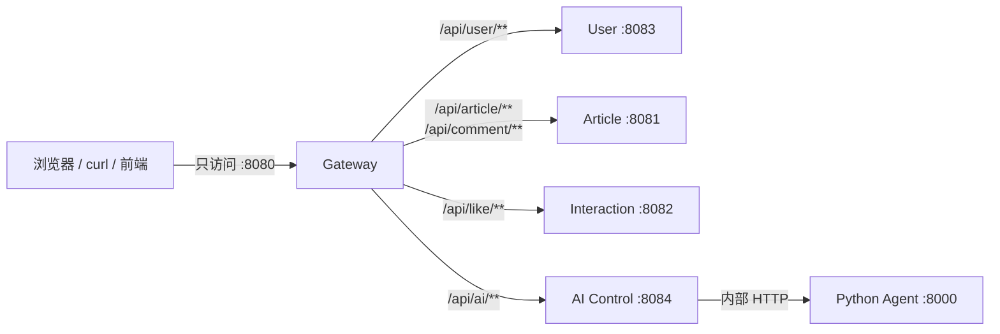
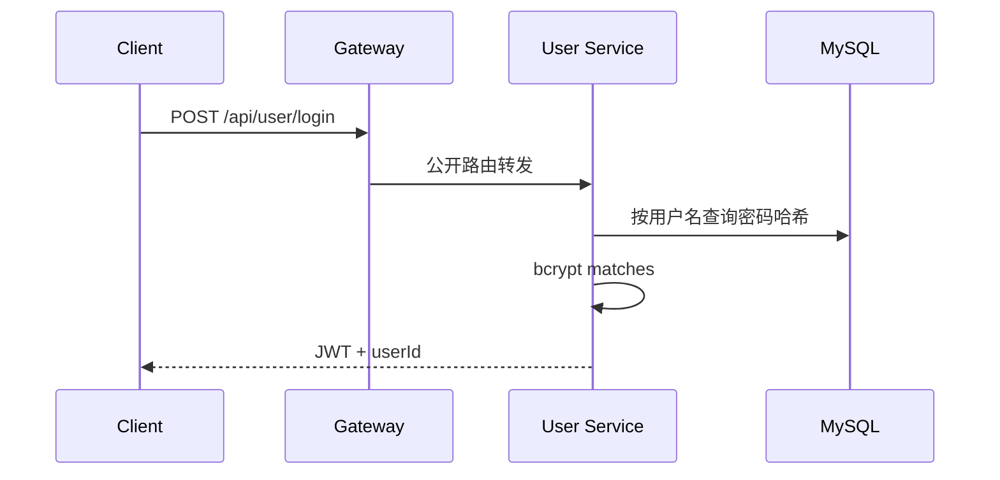
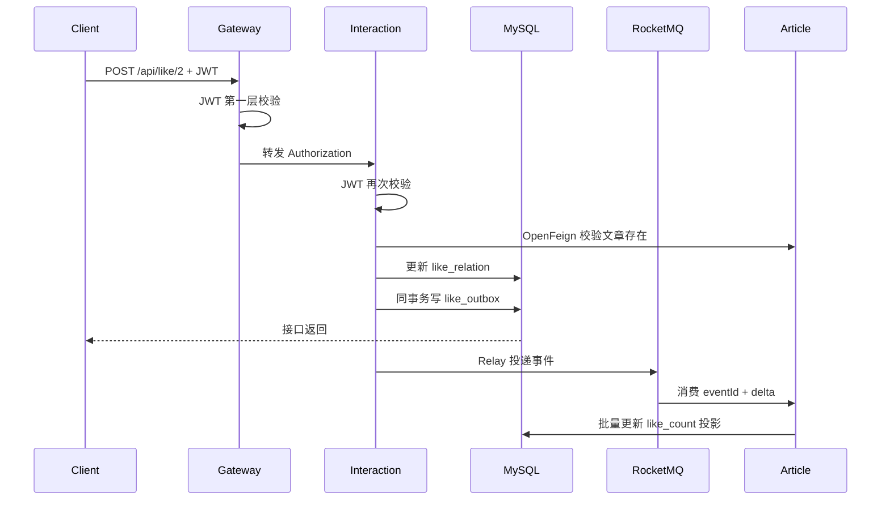
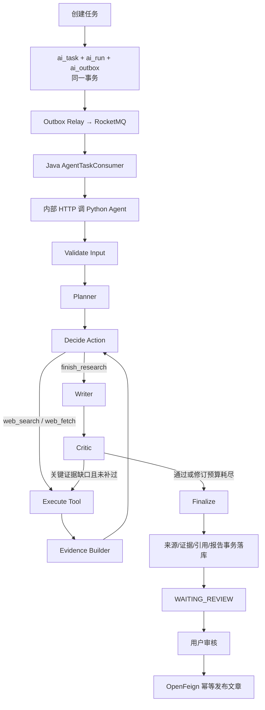

# XPlanet 零基础入门与项目导读

> 本文用于理解当前可运行的后端，以及 Research Workspace、动态工具循环、Claim–Evidence–Critic 和站内知识回流。掌握当前链路后，再阅读 [`CURRENT-SCOPE.md`](CURRENT-SCOPE.md) 了解完整范围、取舍与完成标准。

> 适合第一次接触 Java 微服务、Redis、RocketMQ 和 Agent 的同学。建议不要一上来逐行读代码，先按本文把系统跑起来，再沿着一条请求追代码。

## 0. 这份文档怎么用

这不是一份要求你逐行背代码的说明书。建议按下面三个目标使用：

| 目标 | 需要读到哪里 | 完成标准 |
|---|---|---|
| 30 分钟建立全貌 | 第 1～4、7、17 节 | 能用 1 分钟说清项目定位、模块和主流程 |
| 半天能够演示 | 第 5～6、15～16 节 | 能启动系统并演示登录、文章、点赞、研究、审核发布 |
| 2～5 天准备技术交流 | 第 7～14、18～21 节 | 能解释关键设计、失败场景、幂等边界和取舍 |

阅读时始终围绕三条主链路，不要按目录从头到尾逐文件扫描：

1. **文章读链路**：Gateway → Article → Caffeine/Redis → MySQL；
2. **点赞写链路**：Interaction 状态事实 → Outbox → RocketMQ → Article 计数投影；
3. **研究主链路**：AI 控制面 → Outbox/MQ → Python Agent → Evidence/Claim/Critic → 人工审核 → Article。

其中第三条是项目主线，建议投入约 60% 的学习时间；文章、点赞、鉴权和 Gateway 共同投入约 40%。

## 1. 先用一句话理解项目

XPlanet 是一个“开发者社区 + AI 研究 Agent”项目：用户可以阅读、发布、评论和点赞文章，也可以创建一个 AI 研究任务；Agent 完成研究后先进入人工审核，用户确认后再把报告发布成社区文章。

项目刻意解决两类工程问题：

1. 社区后端的热点读、并发写、缓存一致性和消息可靠性；
2. Agent 长任务的排队、进度、预算、崩溃恢复、证据追踪和人工审核。

它不是把很多技术随便堆在一起。每个组件都在解决一个明确问题。

## 2. 你真正访问的入口

外部客户端只访问 Gateway。默认是：

```text
http://localhost:8080
```

8080 是 `xplanet-gateway` 的默认宿主机端口；如果它被占用，`start-docker.ps1` 会自动尝试 18080，工作台也会自动探测 8080/18080。Docker 模式下，8081～8084 和 Agent 8000 都不暴露给宿主机。



这样做的原因：

- 前端只记一个地址；
- 跨域、TraceId 和第一层 JWT 校验集中处理；
- 内部服务不直接暴露，攻击面更小；
- 以后增加统一限流、访问日志或灰度路由时有固定位置。

Gateway 不是唯一安全边界。下游服务仍会再次校验 JWT，并检查任务、报告或文章是否属于当前用户。

## 3. 项目由哪些模块组成

| 模块 | 端口 | 主要职责 | 为什么单独存在 |
|---|---:|---|---|
| `xplanet-gateway` | 8080 | 统一路由、CORS、TraceId、JWT 前置校验 | 隐藏内部服务，给客户端一个入口 |
| `xplanet-user` | 8083 | 用户查询、bcrypt 密码校验、签发 JWT | 身份能力边界清楚 |
| `xplanet-article` | 8081 | 文章、评论、缓存、热榜、点赞计数投影 | 社区内容的所有者 |
| `xplanet-interaction` | 8082 | 点赞关系状态机、点赞 Outbox | 高频互动写与文章读模型解耦 |
| `xplanet-ai` | 8084 | AI 任务、运行、Outbox、进度、报告、审核 | Java 控制平面，负责可靠性和权限 |
| `xplanet-agent` | 8000 | LangGraph 节点执行、研究、证据、写作、Critic | Python AI 生态更成熟，执行面可独立扩缩容 |
| `xplanet-common` | 无 | 统一响应、异常、JWT、鉴权、限流 | Java 服务复用的公共能力 |
| `xplanet-api` | 无 | 跨模块 DTO、Request、VO | 避免服务间 JSON 契约各写一份 |

基础设施：

| 组件 | 作用 | 不是用来做什么 |
|---|---|---|
| MySQL | 最终业务事实、Outbox、checkpoint、报告和证据 | 不负责实时推送 |
| Redis | 二级缓存、限流、热榜、Agent 实时进度 | 不作为 AI 任务唯一事实源 |
| RocketMQ | 点赞、缓存失效和 AI 长任务的异步传递 | 不保存最终业务状态 |
| Docker Compose | 本地一键组织全部组件 | 不是生产级编排平台 |

## 4. 目录应该怎么看

```text
xplanet/
├─ pom.xml                         Maven 总工程，列出所有 Java 模块
├─ xplanet-gateway/                统一入口
├─ xplanet-user/                   用户与登录
├─ xplanet-article/                文章、评论、缓存、投影
├─ xplanet-interaction/            点赞关系和点赞 Outbox
├─ xplanet-ai/                     AI Java 控制平面
├─ xplanet-agent/                  Python Agent 执行面
├─ xplanet-common/                 Java 公共能力
├─ xplanet-api/                    跨模块数据契约
├─ xplanet-web/                    无需 Node 的研究工作台（HTML/CSS/原生 JS）
├─ sql/migrations/                 V004 完整基线 + 后续增量迁移
├─ docker/                         Dockerfile 和 Compose
├─ scripts/                        启动、迁移、smoke、故障测试
└─ docs/                           架构、实验和入门文档
```

一个典型 Java 请求的代码层次是：

```text
Controller → Service → Mapper → MySQL/Redis
```

- Controller：接 HTTP 参数，调用业务服务；
- Service：真正的业务规则和事务边界；
- Mapper：执行 SQL；
- Entity/Record：数据库数据结构；
- VO：返回给前端的数据；
- Request/DTO：接收或跨服务传输的数据。

## 5. 先把项目跑起来

### 5.1 必要软件

- JDK 17；
- Maven；
- Docker Desktop；
- PowerShell 5.1 或更高版本；
- Python 3.11 或更高版本（本地运行 Agent 或静态页面服务器时需要；全 Docker 启动不要求宿主机安装 Python）。

检查：

```powershell
java -version
mvn -version
docker version
docker compose version
python --version
```

### 5.2 设置本地密钥

```powershell
$env:TOKEN_SECRET="replace-with-a-random-secret-at-least-32-bytes"
$env:AGENT_INTERNAL_TOKEN=$env:TOKEN_SECRET
```

这两个值不能写死进 Git：

- `TOKEN_SECRET` 给 Gateway 和各业务服务校验用户 JWT；
- `AGENT_INTERNAL_TOKEN` 保护 Java AI 服务与 Python Agent 的内部接口。

### 5.3 全 Docker 启动

```powershell
.\scripts\start-docker.ps1
```

脚本会依次完成：

1. 启动 MySQL、Redis、RocketMQ；
2. 等待 MySQL 就绪；
3. 执行 Flyway 迁移；
4. 构建 Java 和 Python 镜像；
5. 启动全部应用；
6. 检查 Gateway、内部服务和 Agent 健康。

验证：

```powershell
Invoke-RestMethod http://localhost:8080/actuator/health
Invoke-RestMethod http://localhost:8080/api/article/2
```

Docker 模式下，下面这些端口访问失败是正确现象：

```text
localhost:8081
localhost:8082
localhost:8083
localhost:8084
```

### 5.4 自动验收

```powershell
.\scripts\smoke-test.ps1
.\scripts\test-agent-recovery.ps1
```

第一个脚本验证正常业务闭环；第二个脚本会故意让 Agent 在 checkpoint 后退出，再验证 MQ 重投和断点恢复。

## 6. 第一次手动调用 API

### 6.1 登录

```powershell
$body = @{ username="alice"; password="password" } | ConvertTo-Json
$login = Invoke-RestMethod -Method Post `
  -Uri "http://localhost:8080/api/user/login" `
  -ContentType "application/json" -Body $body
$token = $login.data.token
$headers = @{ Authorization = "Bearer $token" }
```

登录流程：



密码数据库中保存的是 bcrypt 哈希，不是明文。JWT 是带签名的身份凭证，不是加密后的密码。

### 6.2 读取文章

```powershell
Invoke-RestMethod http://localhost:8080/api/article/2
```

读路径：

```text
Gateway → Article Controller → Article Service
        → Caffeine L1 → Redis L2 → MySQL
```

为什么两级缓存：

- Caffeine 在当前 JVM 内，最快，但不同实例不共享；
- Redis 跨实例共享，稍慢，但能挡住大量数据库读取；
- 两层都没有才查询 MySQL。

重点源码：

- `xplanet-article/.../controller/ArticleController.java`
- `xplanet-article/.../service/impl/ArticleServiceImpl.java`
- `xplanet-article/.../cache/ArticleCacheManager.java`

### 6.3 点赞

```powershell
Invoke-RestMethod -Method Post `
  -Uri "http://localhost:8080/api/like/2" -Headers $headers
```

点赞不是直接给 `article.like_count + 1`：



关键概念：

- `like_relation` 是事实：用户到底有没有给文章点赞；
- `article.like_count` 是投影：为了读取快而保存的汇总数字；
- 重复点赞不改变状态，因此不会重复写 Outbox；
- Outbox 保证“状态变更”和“待发送事件”在同一个数据库事务里；
- MQ 至少一次投递，所以消费者还要用 eventId 幂等。

重点源码：

- `xplanet-interaction/.../service/LikeService.java`
- `xplanet-interaction/.../service/LikeOutboxPublisher.java`
- `xplanet-article/.../mq/LikeMessageConsumer.java`
- `xplanet-article/.../projection/LikeCountProjectionService.java`

### 6.4 创建 AI 研究任务

```powershell
$aiHeaders = @{
  Authorization = "Bearer $token"
  "Idempotency-Key" = [Guid]::NewGuid().ToString("N")
}
$aiBody = @{
  question="解释 XPlanet 的 Outbox 设计"
  provider="offline-demo"
  maxSources=3
  maxToolCalls=5
  maxTokens=4000
  deadlineSeconds=120
} | ConvertTo-Json
$task = Invoke-RestMethod -Method Post `
  -Uri "http://localhost:8080/api/ai/tasks" `
  -Headers $aiHeaders -ContentType "application/json" -Body $aiBody
$taskId = $task.data.id
```

为什么必须有 `Idempotency-Key`：如果浏览器超时后重试，不能创建两个一样的付费任务。相同用户、相同 key、相同请求返回原任务；相同 key 用于不同请求会被拒绝。

`provider` 为什么也写进任务：它是这次研究的执行契约。`offline-demo` 使用固定外部来源摘要和确定性 Writer，适合验证流程；`deepseek-tools` 使用服务端 DeepSeek Key 完成模型推理，并调用网页搜索与安全抓取工具。它会参与幂等请求对比，并随 MQ 命令持久化，因此任务重试时不会悄悄切换模式。

查询任务：

```powershell
Invoke-RestMethod -Uri "http://localhost:8080/api/ai/tasks/$taskId" -Headers $headers
```

## 7. AI 长任务完整流程



Java 和 Python 为什么分开：

- Java 擅长业务状态、事务、权限、MQ 和稳定接口；
- Python 的 Agent、模型和数据处理生态成熟；
- 两者通过内部 HTTP 契约连接，可以分别扩容和测试。

Agent 节点：

| 节点 | 做什么 | 完成后保存什么 |
|---|---|---|
| Validate Input | 校验问题和预算 | 清洗后的问题 |
| Planner | 模型生成结构化研究步骤 | plan |
| Decide Action | 根据计划、现有证据和剩余预算选择下一动作 | action、决策次数 |
| Execute Tool | 执行 `internal_search`、`web_search` 或 `web_fetch` | 工具结果、工具次数、模型用量 |
| Evidence Builder | 去重来源，把搜索摘要/抓取正文绑定为证据并计算片段 SHA-256 | sources、evidence |
| Writer | 输出显式 Claim，且每个 Claim 至少绑定一个已存在 Evidence | title、content、claims、citations |
| Critic | 结构化检查缺证据、错误引用、冲突与不确定项 | quality score、issues、可选补研究 query |
| Finalize | 结束机器执行 | 最终 checkpoint |

Critic 不是无限“自我反思”：第一次发现关键缺口时，只有工具预算尚未耗尽才允许执行一次定向 `web_search`；补研究后重写并再审一次，无论结果如何都进入人工审核。这样既保留 Agent 自主修复亮点，也避免成本和循环次数失控。

这里的三层关系要分清：`Source` 是网页身份与整份内容哈希，`Evidence` 是可定位片段及片段哈希，`Claim` 是报告中的明确论点；`Citation` 只负责把 Claim 和 Evidence 连接起来。索引存在不代表事实正确，所以离线词面支持率只作为回归门禁，最终仍保留 Critic 披露和人工审核。

站内知识回流流程：

```text
用户审核报告
  → AI 通过 OpenFeign 幂等发布 Article
  → 文章立即进入 MySQL FULLTEXT
  → 后续 Agent 选择 internal_search
  → Python 带 X-Agent-Token 调 Article 内部 TopK 接口
  → 文章片段转换为 Source + Evidence
  → 与 Web Evidence 一起进入 Writer 和 Critic
```

为什么 Python 不直接查 MySQL：Article 服务拥有文章规则，例如删除状态、TopK 上限和未来的检索实现；通过稳定 Provider/HTTP 契约，未来把 FULLTEXT 换成向量检索时 Agent 工作流不需要改。为什么当前不直接上向量库：5 条标注集的 Recall@5 已达到 100%，现阶段额外基础设施没有可量化收益。

重点源码：

- `xplanet-ai/.../service/AiTaskService.java`
- `xplanet-ai/.../outbox/AiOutboxPublisher.java`
- `xplanet-ai/.../mq/AgentTaskConsumer.java`
- `xplanet-ai/.../service/AgentTaskExecutionService.java`
- `xplanet-agent/src/xplanet_agent/workflow.py`

## 8. Checkpoint 为什么重要

假设 Agent 已经搜索完资料，写报告前进程崩溃。如果没有 checkpoint，只能从第一步重跑，浪费时间和模型费用。

当前做法：每个节点成功后，把可恢复状态通过内部接口保存到 MySQL `ai_run_step`。

```text
runId + nodeName + inputHash + stateVersion + checkpointJson
```

恢复时：

1. RocketMQ 因消息没有成功确认而重新投递；
2. Java 再次调用 Agent；
3. Agent 读取最近 checkpoint；
4. 校验 command hash，防止拿错任务状态；
5. 从 `nextNode` 继续；
6. 最多 3 次 attempt，仍失败则进入 `FAILED`。

`scripts/test-agent-recovery.ps1` 会在首个 `EXECUTE_TOOL` 结果已经保存后执行 `os._exit(17)`，随后关闭一次性故障开关。这不是模拟抛异常，而是真正终止 Agent 进程；恢复从 `EVIDENCE_BUILDER` 开始，所以已完成工具不会再调用。

## 9. 为什么同时使用 MySQL、Redis 和 MQ

初学者常问：“Redis 很快，为什么不全放 Redis？”

因为三者解决的问题不同：

```text
MySQL：这件事最终到底是什么状态？
Redis：怎样更快地读、限流或推实时进度？
MQ：怎样把耗时工作异步传给另一个消费者？
```

例如 AI 任务状态保存在 MySQL，浏览器实时进度放在 Redis Stream。即使 Redis 中的进度过期，任务事实和报告仍然存在。

## 10. 缓存更新为什么也使用 Outbox

更新文章后必须让其他实例的缓存失效。直接“更新数据库，然后发 MQ”存在漏洞：数据库成功后进程可能在发消息前崩溃。

当前流程：

```text
更新 article + 写两条 article_change_outbox
  → 同一 MySQL 事务
  → Relay 发送立即失效和延迟失效事件
  → MQ 广播
  → 各 Article 实例删除 L1/L2
```

两次失效用于缩小并发读旧值重新写回缓存的时间窗口。Outbox 用于保证进程崩溃后事件仍能重试。

## 11. Gateway 到底做了什么

### 11.1 路由

配置文件：`xplanet-gateway/src/main/resources/application.yml`。

```text
/api/user/**                → user
/api/article/**             → article
/api/comment/**             → article
/api/like/**                → interaction
/api/ai/**                  → ai
```

没有使用 Nacos。Docker 模式用容器名发现服务，本地模式用 `localhost` 默认值；服务规模还不需要动态注册中心。

### 11.2 JWT 前置校验

`GatewayAuthenticationFilter` 放行登录、公开文章/评论/用户 GET 和 CORS OPTIONS；其他 API 必须带有效 Bearer Token。

Gateway 拒绝时返回 HTTP 401，同时保留项目业务码：

```json
{"code":2001,"msg":"未登录","data":null}
```

### 11.3 TraceId

`GatewayTraceFilter` 接受安全的 `X-Trace-Id`，否则生成新 ID，并同时写入下游请求和客户端响应。当前完成的是入口传播基础；把它加入所有 Java 日志 MDC 和 MQ 消息仍是后续项。

### 11.4 CORS

浏览器从不同 Origin 请求 API 时会先发 OPTIONS 预检。Gateway 统一回答预检，业务服务不需要各自维护不同的跨域规则。

本地默认允许所有 Origin，部署到共享环境时必须收紧 `GATEWAY_ALLOWED_ORIGIN_PATTERN`。

## 12. OpenFeign、RocketMQ 和 Redis Stream 怎么选

| 场景 | 技术 | 原因 |
|---|---|---|
| 点赞前确认文章存在 | OpenFeign HTTP | 对方结果马上决定当前请求能否继续 |
| 报告确认后发布文章 | OpenFeign HTTP | 用户需要立即知道发布结果 |
| AI 研究任务 | RocketMQ | 耗时长，需要排队、重投和削峰 |
| 点赞计数投影 | RocketMQ | 允许最终一致，可批量落库 |
| Agent 实时步骤 | Redis Stream + SSE | 事件频繁、可过期，不应淹没 MQ |

判断方法：

- 当前请求必须马上拿到结果：同步 HTTP；
- 可以稍后完成并需要可靠重试：MQ；
- 高频、短生命周期的实时进度：Redis Stream/SSE。

## 13. 数据库表按业务理解

### 社区

- `user`：用户；
- `article`：文章和点赞计数投影；
- `comment`：评论；
- `like_relation`：用户—文章点赞事实；
- `like_outbox`：待发送点赞事件；
- `like_count_delta`：消费者幂等和待合并增量；
- `article_change_outbox`：缓存失效事件。

### AI

- `ai_task`：用户看到的任务事实；
- `ai_run`：某次执行；
- `ai_run_step`：节点和 checkpoint；
- `ai_outbox`：任务/取消命令；
- `source_document`：来源；
- `evidence_chunk`：证据片段；
- `ai_report`：报告；
- `report_citation`：结论与证据的引用关系；
- `model_usage`：模型 Token、延迟和成本；
- `ai_published_article`：报告到文章的唯一发布投影；
- `consumer_inbox`：消费者 eventId 去重。

## 14. 推荐源码阅读顺序

不要按文件夹字母顺序读。按请求流读：

### 14.1 第一遍：只读入口和配置

| 顺序 | 文件 | 只需要看什么 |
|---:|---|---|
| 1 | `pom.xml` | Java 17、Spring Boot/Cloud 版本和 Maven 模块 |
| 2 | `xplanet-gateway/src/main/resources/application.yml` | 四组路由、超时、CORS 和服务地址 |
| 3 | `xplanet-gateway/src/main/java/com/xplanet/gateway/filter/GatewayAuthenticationFilter.java` | 哪些路径公开，哪些路径要求 JWT |
| 4 | `xplanet-common/src/main/java/com/xplanet/common/auth/TokenService.java` | JWT 如何签发、解析和校验 |
| 5 | `sql/migrations/V004__baseline_schema.sql` | 社区事实表、Outbox 表和投影表 |
| 6 | `sql/migrations/V005__ai_control_plane.sql`～`V009__article_knowledge_fulltext.sql` | AI 表、checkpoint、发布投影、证据哈希和站内检索如何逐步加入 |
| 7 | `docker/docker-compose-app.yml` | 容器、环境变量、健康检查和内部网络 |

这一遍不研究实现细节，只要能在纸上画出“浏览器—Gateway—Java 服务—MQ—Python Agent—数据库”的关系。

### 14.2 第二遍：文章和鉴权链路

| 文件 | 重点方法或功能 |
|---|---|
| `xplanet-user/src/main/java/com/xplanet/user/controller/UserController.java` | `login`：bcrypt 校验后签发 JWT |
| `xplanet-article/src/main/java/com/xplanet/article/controller/ArticleController.java` | 详情、列表、热榜、发布、修改和删除入口 |
| `xplanet-article/src/main/java/com/xplanet/article/service/impl/ArticleServiceImpl.java` | `getDetail`、`publish`、`update`、`delete` 的业务与事务边界 |
| `xplanet-article/src/main/java/com/xplanet/article/cache/ArticleCacheManager.java` | L1/L2、空值、锁重建、Double Check、TTL 抖动和降级回源 |
| `xplanet-article/src/main/java/com/xplanet/article/outbox/ArticleChangeOutboxPublisher.java` | 数据库变更后的可靠缓存失效事件 |
| `xplanet-article/src/main/java/com/xplanet/article/mq/ArticleCacheInvalidator.java` | 多实例 L1 和共享 L2 如何失效 |

先跟一次 `GET /api/article/{id}`，再跟一次文章更新。读完后应能回答：“读为什么快，写后旧缓存为什么最终会消失？”

### 14.3 第三遍：点赞链路

| 文件 | 重点方法或功能 |
|---|---|
| `xplanet-interaction/src/main/java/com/xplanet/interaction/controller/LikeController.java` | 点赞、取消点赞 HTTP 入口 |
| `xplanet-interaction/src/main/java/com/xplanet/interaction/service/LikeService.java` | `like`/`cancel` 状态机，只有真实状态变化才产生 delta |
| `xplanet-interaction/src/main/java/com/xplanet/interaction/persistence/LikeRelationMapper.java` | 条件更新和 `INSERT IGNORE` 如何吸收并发重复请求 |
| `xplanet-interaction/src/main/java/com/xplanet/interaction/service/LikeOutboxPublisher.java` | 租约 claim、MQ 发送、指数退避重试 |
| `xplanet-article/src/main/java/com/xplanet/article/mq/LikeMessageConsumer.java` | 用数据库唯一 `event_id` 接收至少一次投递 |
| `xplanet-article/src/main/java/com/xplanet/article/projection/LikeCountProjectionService.java` | `SKIP LOCKED` 取批次、按文章合并 delta、事务更新计数并标记已应用 |

这里要分清三份数据：`like_relation` 是用户是否点赞的事实，`like_outbox` 是待发送事件，`article.like_count` 是方便读取的最终一致投影。

### 14.4 第四遍：AI 主链路（学习重点）

| 文件 | 重点方法或功能 |
|---|---|
| `xplanet-ai/src/main/java/com/xplanet/ai/controller/AiTaskController.java` | 创建、查询、取消任务和 SSE 入口 |
| `xplanet-ai/src/main/java/com/xplanet/ai/service/AiTaskService.java` | 用户级请求幂等、预算归一化、任务/run/Outbox 同事务 |
| `xplanet-ai/src/main/java/com/xplanet/ai/outbox/AiOutboxPublisher.java` | AI 命令可靠投递 |
| `xplanet-ai/src/main/java/com/xplanet/ai/mq/AgentTaskConsumer.java` | 接收命令并进入执行服务 |
| `xplanet-ai/src/main/java/com/xplanet/ai/service/AgentTaskExecutionService.java` | Java 调 Python、状态迁移、结果/异常处理和指标 |
| `xplanet-agent/src/xplanet_agent/workflow.py` | LangGraph 节点、条件边和恢复路由，整个 Agent 的核心 |
| `xplanet-agent/src/xplanet_agent/providers.py` | 离线与 DeepSeek Provider 契约，Planner/Decision/Writer/Critic 的模型边界、单语输出约束与一次 JSON 格式修复重试 |
| `xplanet-agent/src/xplanet_agent/tools.py` | 站内检索、Web 搜索、网页抓取与 SSRF 防护 |
| `xplanet-ai/src/main/java/com/xplanet/ai/service/AiCheckpointService.java` | checkpoint 的 run 校验与落库 |
| `xplanet-ai/src/main/java/com/xplanet/ai/service/AiResultPersistenceService.java` | Source、Evidence、Citation、报告如何校验后事务落库 |
| `xplanet-ai/src/main/java/com/xplanet/ai/service/AiReportReviewService.java` | 人工批准、失败可重试和幂等发布 |
| `xplanet-article/src/main/java/com/xplanet/article/search/ArticleKnowledgeSearchService.java` | 已发布文章如何参与后续 Agent 站内检索 |

读 `workflow.py` 时不要先陷入每个字段。先只标出九个节点和四条条件路由，再分别追 `execute_tool`、`_checkpoint`、`_after_critic` 三处。

### 14.5 第五遍：用测试反向理解边界

| 测试 | 最值得观察的行为 |
|---|---|
| `xplanet-interaction/src/test/java/com/xplanet/interaction/service/LikeServiceTest.java` | 重复点赞不重复产生事件 |
| `xplanet-article/src/test/java/com/xplanet/article/projection/LikeCountProjectionServiceTest.java` | delta 合并、零和批次、非法负数保护 |
| `xplanet-ai/src/test/java/com/xplanet/ai/service/AiTaskServiceTest.java` | 幂等 key 复用与冲突 |
| `xplanet-ai/src/test/java/com/xplanet/ai/service/AiCheckpointServiceTest.java` | checkpoint 只能属于当前 run |
| `xplanet-agent/tests/test_workflow.py` | 工具循环、预算、Critic 补研究和恢复 |
| `scripts/smoke-test.ps1` | 整套系统真实协作的验收口径 |
| `scripts/test-agent-recovery.ps1` | 进程强退后不重复执行已完成工具 |

每读一层都回答四个问题：

1. 输入是什么？
2. 输出是什么？
3. 失败会留下什么状态？
4. 重复执行会不会多写数据？

## 15. 常见故障怎么排查

### Gateway 访问失败

```powershell
docker logs --tail 100 xp-gateway
Invoke-RestMethod http://localhost:8080/actuator/health
Invoke-RestMethod http://localhost:8080/actuator/gateway/routes
```

### 返回 401/2001

- 是否先登录；
- 是否使用 `Authorization: Bearer <token>`；
- Gateway 和业务服务的 `TOKEN_SECRET` 是否一致；
- Token 是否过期。

### 创建 AI 任务后一直 QUEUED

```powershell
docker logs --tail 100 xp-ai
docker logs --tail 100 xp-agent
```

再查：

```sql
SELECT * FROM ai_outbox ORDER BY id DESC LIMIT 10;
SELECT * FROM ai_run ORDER BY id DESC LIMIT 10;
```

### 点赞接口成功但计数没立刻变化

点赞计数是异步投影，短时间延迟是正常的。检查 `like_outbox.status`、`like_count_delta.status` 和 Article 消费日志，而不是先手工改 `article.like_count`。

### 文章更新后仍读到旧值

检查：

- `article_change_outbox` 是否有立即/延迟两条事件；
- Relay 是否发送；
- ArticleCacheInvalidator 是否消费；
- Redis key 和本地 Caffeine 是否被清理。

## 16. 测试分别证明什么

```powershell
mvn -B -ntp clean test
.\.venv\Scripts\python.exe -m pytest xplanet-agent
.\scripts\smoke-test.ps1
.\scripts\test-agent-recovery.ps1
```

- Java 单测：业务规则、事务调用、路由过滤器的局部正确性；
- Python 单测：Agent 图、Provider、checkpoint 和评测结构；
- smoke：真实 MySQL、Redis、RocketMQ、Gateway、Java、Python 能否协作；
- recovery：真实进程退出后能否恢复。

“能编译”不等于“整个系统可用”，所以必须有后两类测试。

## 17. 如何分层讲解项目

可以用三层表达：

### 一句话定位

> XPlanet 是开发者社区与可追溯研究 Agent 的结合。外部通过 Gateway 统一访问，Java 负责社区业务和 AI 任务控制，Python LangGraph 在预算内动态选择搜索、抓取或结束。工具结果先 checkpoint 再推进，报告经过证据绑定和人工审核后幂等发布成文章。

### 重点亮点

1. 点赞关系是事实源，计数是异步投影，不依赖易丢的 Redis 缓冲；
2. 业务变更与 Outbox 同事务，消费者用 eventId 幂等；
3. Caffeine + Redis 解决热点读，缓存失效也做成可恢复事件；
4. 单 Agent 动态决策搜索/抓取，预算、去重、超时和安全抓取边界明确；
5. Java 控制面与 Python Agent 执行面分离；
6. 工具结果 checkpoint 后真实强退，从下一节点恢复；
7. Human-in-the-loop 控制发布副作用；
8. Gateway 统一入口，但下游仍独立鉴权，不盲目信任网关。

### 主动说明边界

- 默认 Agent 是离线可复现 Provider；`deepseek-tools` 已完成一次受限预算的真实在线闭环验收，但一次验收不等同于事实正确率、容量或 SLA；
- 引用 ID 有效不代表证据一定在事实层面支持结论；
- MySQL、Redis、RocketMQ 目前是本地单机；
- 没有 Nacos、Seata、Dubbo 和 Kubernetes，因为当前规模没有对应需求；
- 完整 TraceId MDC、向量语义检索、Grafana 和高可用是后续方向；当前站内检索有意使用可测、零额外基础设施的 MySQL FULLTEXT。

## 18. 你接下来应该怎么学

第一天：启动项目，手动完成登录、读文章、点赞、创建 AI 任务。

第二天：沿文章详情请求读 Controller、Service、Cache、Mapper。

第三天：沿点赞请求理解状态机、事务、Outbox、MQ、投影。

第四天：沿 AI 任务理解状态机、Outbox、Java/Python 边界和 checkpoint。

第五天：自己制造一次错误，例如停止 Agent 或 RocketMQ，再结合表状态和日志定位。

真正掌握项目的标志不是背出组件名称，而是能解释：

- 为什么这里用同步 HTTP，那里用 MQ；
- 为什么 Redis 不能作为唯一事实；
- 为什么“发送成功”仍可能重复消费；
- 为什么 checkpoint 要在节点成功后保存；
- 为什么 Gateway 校验过 JWT，下游还要校验。

做到这些，你就已经从“会启动项目”进入“能解释工程设计”的阶段。

## 19. 快速学习路线与时间分配

### 19.1 只有 2 小时

1. 用 20 分钟读第 1～4 节并画架构图；
2. 用 25 分钟实际登录、读文章、点赞和创建研究任务；
3. 用 45 分钟只读 `AiTaskService.java`、`workflow.py`、`AiResultPersistenceService.java` 和 `AiReportReviewService.java`；
4. 用 20 分钟读 `LikeService.java` 与 `LikeCountProjectionService.java`；
5. 用 10 分钟口述第 17 节的一句话和三个亮点。

### 19.2 有 1 天

上午跑通系统，按 14.1～14.3 阅读 Gateway、文章缓存和点赞；下午按 14.4 阅读 AI 主链路；晚上结合第 21 节逐题口述，答不出的题再回到对应源码。

### 19.3 有 3～5 天

| 天数 | 学习任务 | 必须产出 |
|---:|---|---|
| 第 1 天 | 启动、操作工作台、理解模块 | 自己画一张架构图和一次请求时序图 |
| 第 2 天 | 文章缓存、鉴权、Gateway | 能解释穿透/击穿/雪崩、Double Check 和缓存失效 |
| 第 3 天 | 点赞、Outbox、MQ、投影 | 能从重复请求、重复消息、进程崩溃三个角度说明幂等 |
| 第 4 天 | Agent 图、工具、Evidence/Critic、checkpoint | 能白板画出 Agent 状态图和恢复过程 |
| 第 5 天 | 测试、故障实验、技术表达 | 完成 3 分钟项目介绍和第 21 节问答 |

不要把时间平均分给所有文件。Entity、简单 Mapper、getter/setter 和配置样板只需知道位置；时间应集中在状态变化、事务、去重、恢复和设计取舍上。

## 20. 面向技术交流的项目介绍模板

### 20.1 30 秒版本

> XPlanet 是一个可追溯技术研究 Agent 与开发者知识社区。Java/Spring 负责用户、任务事实、可靠消息、审核发布和社区互动，Python/LangGraph 负责有界工具决策、证据构建、写作和 Critic。研究结果不是直接展示，而是绑定 Source、Evidence 和 Citation，经人工审核后幂等发布为文章，并回流到下一次站内检索。

### 20.2 2 分钟版本

> 用户通过 Spring Cloud Gateway 登录并创建研究任务。AI 服务把任务、运行记录和 Outbox 在一个 MySQL 事务中提交，Relay 再经 RocketMQ 投递给消费者，避免数据库成功但消息丢失。消费者调用 Python LangGraph Agent；Agent 在工具次数、来源数、Token 和截止时间预算内，动态选择站内检索、Web 搜索、网页抓取或结束。工具结果构造成带哈希的 Evidence，Writer 生成显式 Claim/Citation，Critic 检查缺证据、冲突和错误引用，并最多触发一次定向补研究。每个节点完成后保存 checkpoint，进程崩溃后从下一节点恢复。结果经 Java 再校验并事务落库，用户审核后通过 OpenFeign 幂等发布为文章，新文章又能进入后续站内检索。社区侧还实现了 Caffeine + Redis 两级缓存，以及“点赞关系事实 + Outbox + MQ + 批量计数投影”的最终一致链路。

### 20.3 建议重点讲的四个亮点

1. **Agent 可控且可恢复**：不是固定流水线，也不是无限循环；工具、Token、来源、截止时间和补研究都有上限，节点 checkpoint 支持强退恢复。
2. **结果可追溯**：Source、Evidence、Claim、Citation 分层，Python 与 Java 双重校验，错误引用不能进入最终报告。
3. **AI 与业务形成闭环**：报告要经过 Human-in-the-loop，发布副作用幂等；文章又成为 `internal_search` 的知识来源。
4. **可靠后端托底**：任务和点赞都用本地事务 + Outbox + 至少一次消息 + 消费端唯一键，缓存失效也能在故障后补发。

介绍时必须主动说明：默认离线 Provider 用于可复现验收；`deepseek-tools` 已完成一次受限预算的真实在线闭环验收，但这不等同于联网事实正确率、稳定性或成本基线。不要把离线 100% 指标说成真实联网事实正确率，也不要编造 QPS 或生产 SLA。

## 21. 高频问题与参考回答

### 21.1 项目与架构

**Q1：这个项目到底解决什么问题？**

A：它解决“技术研究结果难追溯、长任务不可靠、研究成果与社区内容割裂”三个问题。Agent 给出带 Evidence/Citation 的报告；Java 控制面保证任务、进度、恢复和审核发布；发布文章继续进入站内检索，形成知识回流。

**Q2：为什么 Java 和 Python 要拆开，会不会过度设计？**

A：两边职责不同。Java 管事务、权限、MQ、任务状态和发布副作用；Python 使用 LangGraph 和模型/搜索生态执行 Agent。它们通过小而稳定的内部 HTTP 契约连接，可分别测试和扩缩容。当前不是按“语言”随意拆分，而是控制面与执行面的边界。

**Q3：为什么需要 Gateway？直接调用服务不行吗？**

A：Gateway 给客户端统一入口，并集中处理路由、CORS、TraceId 和第一层 JWT 校验。内部服务仍再次鉴权和校验资源归属，所以 Gateway 不是唯一安全边界。当前根路径 `/` 没有页面路由，直接访问出现 404 不代表 Gateway 故障，应访问健康检查或 `/api/**`。

**Q4：为什么没有 Nacos、Dubbo、Seata 和 Kubernetes？**

A：当前只有固定数量服务，Docker DNS/环境变量已能定位服务；少量同步调用用 OpenFeign 更直接；跨服务一致性通过本地事务、Outbox、幂等和最终一致性处理，不需要把多个数据库事务锁在一起；本地单机项目也没有 Kubernetes 的真实运维需求。组件应由问题驱动，而不是越多越好。

**Q5：OpenFeign 和 RocketMQ 怎么选择？**

A：当前请求必须立刻依赖对方结果时用 OpenFeign，例如校验文章存在、审核后发布文章；耗时长、可排队、允许最终一致且需要重试时用 RocketMQ，例如 AI 任务和点赞计数投影。

### 21.2 Agent

**Q6：为什么说这是 Agent，而不只是按顺序调用几次模型？**

A：`decide_action` 会根据研究计划、已有证据、已用工具和剩余预算动态选择 `internal_search`、`web_search`、`web_fetch` 或结束，LangGraph 条件边根据状态决定下一节点。固定的是安全边界和结束条件，不是工具顺序。

**Q7：怎样避免 Agent 无限循环和成本失控？**

A：限制最大来源数、工具调用数、Token、总截止时间；查询和 URL 去重；每次动作前后都做 guard；Critic 最多触发一次补研究；超过预算就转入 Writer/Finalize 或失败状态。

**Q8：Planner、Writer、Critic 分别做什么？**

A：Planner 把问题形成结构化研究步骤；Writer 只基于已持久化候选证据生成 Claim 和 Citation；Critic 检查缺证据、引用错误、冲突和不确定项。拆分后每一层输入输出明确，便于验证和恢复。

**Q9：Source、Evidence、Claim、Citation 有什么区别？**

A：Source 表示来源文档身份；Evidence 是来源中的可定位片段并保存内容哈希；Claim 是报告中的明确论点；Citation 是 Claim 到 Evidence 的关联。这样可以定位每个结论依据，而不是只在文末堆 URL。

**Q10：引用存在是否说明回答一定正确？**

A：不能。引用索引有效只证明 Claim 指向一个真实存在的 Evidence。证据是否真的支持结论，还需要 Writer 约束、Critic 检查、离线评测和人工审核。项目明确不把词面支持率等同于联网事实正确率。

**Q11：为什么 Critic 只允许补研究一次？**

A：无限反思容易增加延迟和成本，也可能不收敛。一次定向补研究能体现针对关键证据缺口的自修复，同时给执行设置确定上界；最终风险由人工审核承接。

**Q12：Checkpoint 保存什么，为什么在节点完成后保存？**

A：保存状态版本、command hash、已完成节点、下一节点、计划、工具结果、Evidence、用量等可恢复状态。节点完成后再保存表示该节点副作用已完成；恢复时从 `nextNode` 继续，避免重复工具调用。command hash 和当前 run 校验防止串任务。

**Q13：Agent 进程在工具执行后崩溃怎么办？**

A：如果工具节点结果已经 checkpoint，MQ 消息重投后 Java 再调用 Agent，Agent 读取 schema v4 checkpoint，从 Evidence Builder 或下一节点继续，不重复已经完成的工具。最多尝试 3 次，超过后进入 `FAILED`。

**Q14：为什么进度用 Redis Stream，不直接用 RocketMQ？**

A：步骤进度频繁、短生命周期、允许过期，适合 Redis Stream 加 SSE；任务命令需要可靠投递和故障重试，适合 RocketMQ；最终状态和报告必须进 MySQL。三者不能互相替代。

**Q15：网页抓取有哪些安全问题？**

A：主要是 SSRF、恶意重定向、超大响应和非预期内容。`HttpDocumentFetcher` 校验协议、端口、凭据、DNS 解析后的公网地址和每次重定向，并限制内容类型与响应大小；搜索结果只是候选，抓取后才升级成 Evidence。

**Q16：为什么当前站内检索用 MySQL FULLTEXT，不上向量库？**

A：当前标注规模小，MySQL ngram FULLTEXT 的 Recall@5 已满足现有门槛，且无需新增基础设施。只有同义表达召回在更大评测集上低于门槛时，才有数据支持引入 Embedding 和向量数据库。

### 21.3 后端可靠性与并发

**Q17：Transactional Outbox 解决什么问题？**

A：它解决数据库提交和消息发送无法原子完成的问题。业务状态与 Outbox 同一个本地事务；后台 Relay 在提交后发送，发送失败可重试。即使进程在提交后崩溃，待发送事件仍保留在数据库。

**Q18：Outbox 是否能保证消息只发送一次？**

A：不能，通常保证至少一次。发送成功后、标记已发送前崩溃会再次发送，所以消费者仍必须用 `eventId` 唯一约束或业务唯一键幂等。可靠投递与幂等消费缺一不可。

**Q19：点赞为什么不直接 `article.like_count + 1`？**

A：用户—文章关系才是事实，计数只是读优化。直接加一难处理重复请求、取消、消息重投和并发。当前只有 `like_relation` 状态真实变化才产生 `+1/-1` 事件，再异步批量投影计数。

**Q20：`actionId` 是怎样去重的，为什么不用 Redis `SETNX`？**

A：事件进入 `like_count_delta` 时执行 `INSERT IGNORE`，`event_id` 有数据库唯一约束，去重与持久化增量在同一次数据库写中完成。短 TTL 的 Redis `SETNX` 可能过期、丢数据，且与数据库更新不原子，不能作为最终幂等保证。

**Q21：为什么点赞消费后还要先落 delta，再批量更新文章计数？**

A：先落 delta 把每个事件变成可恢复事实；批处理时用 `FOR UPDATE SKIP LOCKED` 领取事件，按 articleId 合并整数增量，在同一事务里更新计数并标记事件。这样能吸收重复消息、合并写压力，并避免进程崩溃导致增量静默丢失。

**Q22：乱序点赞消息会不会导致错误？**

A：生产端只有关系状态真实变化才生成 `+1/-1`，每个 eventId 只应用一次；计数投影使用整数加法，增量可交换，因此同一批或不同批乱序不会改变最终和。但它保证的是计数最终一致，不用于还原某一时刻的关系顺序，关系真相仍查 `like_relation`。

**Q23：Outbox 多实例 Relay 怎样避免抢到同一事件？**

A：Relay 先用条件更新 claim，并写入 `locked_by` 与 `locked_until` 租约，只有更新成功的实例发送。实例崩溃后租约过期，其他实例可以重新领取；因此仍可能重复发送，最终由消费者幂等吸收。

**Q24：两级缓存解决什么问题？**

A：Caffeine L1 避免热点请求频繁访问网络；Redis L2 在实例之间共享。空值短缓存防穿透，Redisson 锁加 Double Check 防热点击穿，TTL 随机抖动降低雪崩概率，锁获取失败则短暂等待后读 L2，仍失败时直接回源降级。

**Q25：文章更新为什么不是只删一次缓存？**

A：并发读可能在第一次删除后把旧数据库值重新写回缓存。当前文章变更与立即/延迟失效 Outbox 同事务，Relay 通过 MQ 广播；立即失效清掉旧值，延迟失效缩小旧值回填窗口，同时让多实例 L1 都能收到通知。

**Q26：Gateway 已经验 JWT，为什么下游还要验？**

A：内部服务可能被错误暴露，也可能收到伪造的内部请求；只信 Gateway 会形成单点安全边界。下游再次验签并检查任务/文章归属，可以防止横向越权。Gateway 校验负责尽早拦截，下游校验负责最终业务授权。

**Q27：AI 任务的 `Idempotency-Key` 和 MQ 的 `eventId` 有什么不同？**

A：`Idempotency-Key` 面向客户端请求，防止超时重试创建两个研究任务，作用域是用户加请求内容；`eventId` 面向内部消息，防止同一业务事件因至少一次投递被重复应用。它们位于不同边界，不能互相替代。

**Q28：审核发布时 Article 服务挂了怎么办？**

A：AI 服务先把报告状态提交为 `APPROVED`，再同步调用 Article。调用失败时报告仍保持已批准，用户可以重试；Article 使用 `reportId` 的唯一发布投影保证重复请求返回同一文章，成功后 AI 再标记 `PUBLISHED`。

### 21.4 测试、边界与改进

**Q29：单元测试都绿了，为什么还要 smoke test？**

A：单测多验证单个类和局部规则，不能证明 MySQL 事务、Redis、RocketMQ、Gateway、Java/Python HTTP 契约能协同。Smoke 覆盖真实基础设施链路；recovery test 还会真实终止 Agent，验证 checkpoint 和重投。

**Q30：项目当前最大的边界是什么？**

A：联网 Provider 已完成一次小预算链路验收，但尚无真实联网评测集、成本/延迟统计和稳定性基线；MySQL、Redis、RocketMQ 是单机；没有完整多用户容量基线；TraceId 还未贯穿全部日志和 MQ；FULLTEXT 只在小规模标注集验证。说明边界比虚构生产指标更可信。

**Q31：如果继续优化，优先做什么？**

A：先补真实联网评测集和成本/延迟指标，再根据证据决定改进：语义召回不足再上向量检索；出现真实吞吐瓶颈再做多用户压测、线程池和批量参数调优；需要部署治理再引入注册中心或编排平台，而不是先堆组件。

**Q32：你在这个项目中最难解决的问题是什么？**

A：可以选择“长任务崩溃恢复”作答：难点不是保存一个状态字符串，而是确定节点副作用与 checkpoint 的提交顺序、校验 checkpoint 属于当前 command/run、让 MQ 重投能从下一节点继续，并用真实强退测试证明工具不会重复执行。回答时要结合 `workflow.py`、`AiCheckpointService.java` 和 `test-agent-recovery.ps1`。

## 22. 判断自己是否真正掌握

不看文档，完成下面六件事即可认为已经能独立讲清项目：

1. 画出完整架构图，并说明每个箭头是 HTTP、MQ、Redis Stream 还是数据库访问；
2. 从 `POST /api/like/{articleId}` 讲到 `article.like_count` 更新；
3. 从创建 AI 任务讲到人工审核发布和知识回流；
4. 解释一次客户端重试、一次 MQ 重投、一次 Agent 强退分别由哪层处理；
5. 说清项目为什么没有引入 Nacos、Dubbo、Seata、向量库和多 Agent；
6. 主动说明当前验证范围和不能宣称的指标。

如果其中某项卡住，不需要重新通读项目，只回到第 14 节对应的 2～4 个核心文件，再结合相关测试阅读一次。
