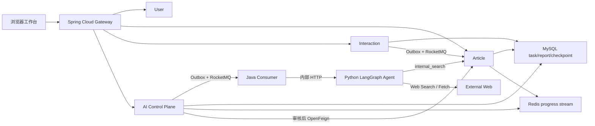

# XPlanet Research 当前系统范围与设计基线

> 本文只描述当前可运行基线，不保留实施阶段草案。

## 1. 项目定位

**XPlanet Research 是面向开发者的可追溯技术研究 Agent 与知识社区。**

用户提交技术问题后，Agent 在预算内动态调用站内知识、Web 搜索和网页抓取工具，将结果整理成可定位 Evidence；Writer 输出显式 Claim/Citation，Critic 检查缺证据、错误引用和冲突并最多触发一次补研究。用户审核报告后可幂等发布为社区文章，文章立即进入后续站内检索。

Java/Spring 平台负责身份、任务事实、可靠消息、审核发布和社区互动；Python/LangGraph 负责 Agent 决策、工具、证据质量和评测。项目主线是 Agent 研究闭环，后端是保证闭环可靠运行的控制面。

## 2. 当前架构



应用服务中只有 Gateway 8080 暴露到宿主机；MySQL、Redis 和 RocketMQ 端口仍为本地混合开发保留。其余业务服务和 Agent 在 Docker 网络内通信；下游服务仍独立校验 JWT 或内部 Token，不把 Gateway 当作唯一安全边界。

## 3. Agent 主流程

```text
Validate Input
  → Planner
  → Decide Action
  → internal_search / web_search / web_fetch
  → Evidence Builder
  → Decide Action（预算内循环）
  → Writer（Claim → Evidence）
  → Critic
      ├─ 通过 → Finalize
      └─ 关键缺口且未补过 → 一次定向补研究 → Writer → Critic
  → Java 事务落库
  → WAITING_REVIEW
  → 用户审核并幂等发布
  → 新文章进入 internal_search
```

下一工具由结构化 `ToolAction` 决定，不是固定三步。工具次数、来源数、Token、截止时间、查询/URL 去重和 Critic 补研究次数都有硬上限。

## 4. 核心数据与可靠性

| 目标 | 当前实现 |
|---|---|
| 任务不丢 | `ai_task + ai_run + ai_outbox` 同一 MySQL 事务 |
| MQ 故障恢复 | 带租约 Outbox Relay、退避重试、Broker 恢复后补发 |
| 消息幂等 | `consumer_inbox(eventId)` 与业务唯一键 |
| 工具不重复 | schema v4 checkpoint 保存完整节点状态和下一节点 |
| 报告可追溯 | Source → Evidence（片段哈希）→ Claim → Citation |
| 错误引用不落库 | Python 校验 + Java 事务校验/回滚 |
| 发布副作用受控 | Human-in-the-loop + `ai_published_article(reportId)` 唯一投影 |
| 知识回流 | MySQL ngram FULLTEXT + 内部 Token TopK API |
| 点赞可靠 | `like_relation` 事实 + Outbox + eventId 去重 + delta 批量投影 |
| 缓存一致性 | Caffeine/Redis Cache Aside + 锁回源 + 可靠双失效事件 |

只有 schema v4 checkpoint 可以恢复。v1～v3 属于开发阶段历史格式，最终切换时数据库中不存在需要继续执行的旧任务，因此已删除兼容分支，避免新代码长期背负无效状态模型。

## 5. 保留组件与不引入组件

保留：

- Gateway：统一外部入口、CORS、TraceId 和 JWT 前置校验；
- OpenFeign：少量需要立即结果的 Java 服务间调用；
- RocketMQ：点赞投影和 AI 长任务的可靠异步削峰；
- Redis：二级缓存、固定窗口限流、热榜和 SSE 进度流；
- MySQL：业务事实、Outbox、checkpoint、报告与最小全文索引；
- LangGraph：显式节点、条件路由和可恢复状态图。

不引入：

- Nacos：Docker DNS/环境变量已满足当前固定服务规模；
- Dubbo：同步调用数量少，HTTP/OpenFeign 契约更直接；
- Seata：本地事务 + Outbox + 幂等已覆盖跨服务最终一致性；
- 向量数据库：当前 5 条标注 Recall@5 已达 100%，尚无数据证明额外基础设施收益；
- 多 Agent：当前瓶颈是证据质量和可靠恢复，不是角色数量；
- Kubernetes/监控全家桶：当前单机可复现环境没有对应运维需求。

## 6. 当前可验证结果

| 验证 | 最终记录 |
|---|---:|
| Java 测试 | 105 项（清理后以最新运行结果为准） |
| Python 测试 | 29 项（含只接受 schema v4） |
| 离线评测 | 30/30 完成 |
| Citation 索引有效率 | 100% |
| 确定性词面 Claim Support | 100% |
| Internal Recall@5 | 100%（5/5） |
| MQ 暂停恢复 | Outbox 保留并在 Broker 恢复后补发 |
| checkpoint 强退 | 2 次 attempt，已完成工具未重复 |
| Docker smoke | 登录→研究→审核→幂等发布→站内召回通过 |
| 浏览器 E2E | 工作台、时间线、Evidence/Critic、发布入口通过 |

机器结果见 [`evaluation-results.json`](evaluation-results.json)，实验边界见 [`EXPERIMENTS.md`](EXPERIMENTS.md)。离线 100% 不等于联网事实正确率；真实 OpenAI/Web Search 尚未在真实密钥与成本授权下验收。

## 7. 当前文档职责

| 文档 | 用途 |
|---|---|
| `README.md` | 启动、入口和能力总览 |
| `ARCHITECTURE.md` | 当前模块、数据与可靠性设计 |
| `BEGINNER-GUIDE.md` | 新手从请求流理解项目 |
| 本文 | 最终范围、取舍和完成定义 |
| `EXPERIMENTS.md` | 当前可复现实验和边界 |
| `evaluation-results.md/json` | 评测摘要与机器结果 |
| `TECHNICAL-GUIDE.md` | 技术原理、设计取舍与常见问题 |
| `VERIFICATION-GUIDE.md` | 5 分钟功能巡检路线 |
| `HA-AND-DEGRADE.md` | 明确标注的未来高可用演进 |

## 8. Definition of Done

- 外部用户只通过 Gateway 完成登录、研究、查看、取消和发布；
- Agent 动态选择 Web 与站内工具，所有预算有界；
- Claim 有可定位 Evidence，错误引用不能落库；
- Critic 最多补研究一次，不会无限反思；
- checkpoint、MQ 重投和发布均有自动化幂等/恢复测试；
- 新发布文章能够被后续任务召回；
- Java、Python、Compose、smoke 和浏览器 E2E 均通过；
- 文档不引用旧架构 QPS、虚构准确率或未经授权的真实模型结果；

## 9. 后续变更原则

当前基线不以组件数量为目标继续扩张。只有数据证明存在瓶颈时才增加：

- 同义表达召回低于门槛时替换为 Embedding + 向量检索；
- 可并行子任务显著降低延迟时增加有界 worker；
- 真实部署出现动态实例治理需求时增加注册中心；
- 有真实 API Key、成本授权和评测集时验收联网 Provider；
- 有多用户压测脚本与完整观测时建立 QPS/P95/P99 容量基线。
