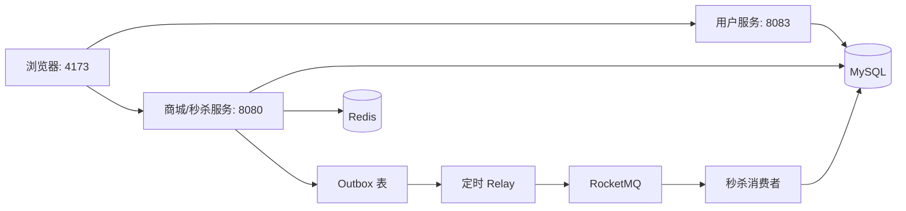
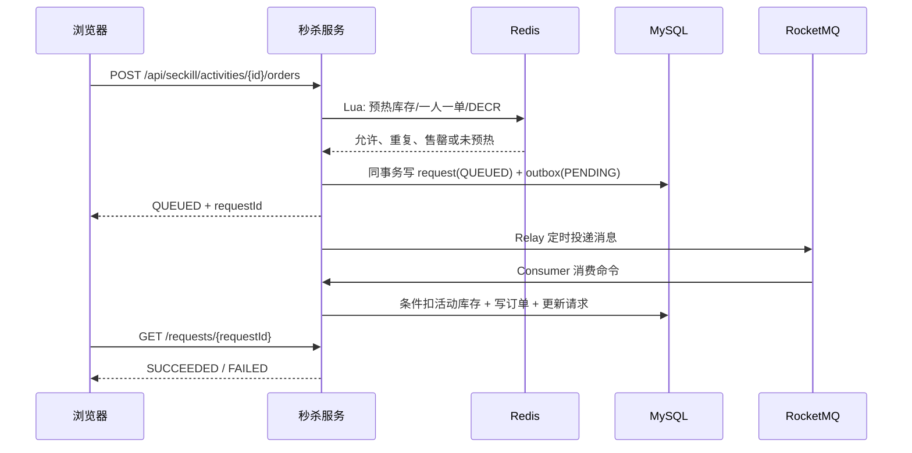

# XPlanet 乐购商城与高并发秒杀：学习与面试手册

> 适用对象：第一次接触 Spring Boot、Redis、消息队列和高并发设计的同学。
> 
> 本文只描述仓库当前真实实现，不把模拟支付、未实现的物流/优惠券/售后包装成生产能力。

## 1. 一分钟项目介绍

XPlanet 是一个**轻量商城 + 高并发限量购**项目。普通商品链路提供注册登录、浏览搜索、购物车、模拟支付结算和订单查询；秒杀链路把“高并发下不超卖、消息不丢、重复请求不重复下单”作为重点，使用 Redis Lua 做原子准入，使用 Transactional Outbox 保证业务数据与待发送消息一起落库，使用 RocketMQ 异步创建订单，最后依靠 MySQL 条件扣减和唯一约束兜底。

一句话回答“为什么既有普通订单又有秒杀”：**商城要有完整用户体验，而秒杀的写入路径必须独立设计，不能把普通下单接口简单放大。**

## 2. 简历怎么写

### 2.1 推荐项目标题与技术栈

```text
XPlanet 乐购商城——高并发限量购系统
技术栈：Spring Boot、MyBatis-Plus、MySQL、Redis、RocketMQ、Spring AOP、Docker、静态 Web 前端
```

### 2.2 项目描述（一行版）

```text
实现包含商品搜索、购物车、普通订单结算与限量秒杀的轻量商城；围绕秒杀库存一致性、可靠消息投递和幂等消费构建异步下单闭环。
```

### 2.3 简历核心亮点（选四条）

1. **商城与秒杀双链路：**实现注册登录、商品筛选搜索、购物车和订单快照；普通下单通过 MySQL 事务与 `stock >= quantity` 条件更新保障库存不超卖，秒杀写路径独立为异步队列化处理。
2. **Redis Lua 原子准入：**将活动库存检查、一人一单标记和库存递减合并为一段 Lua 脚本执行，快速拒绝超卖和重复请求，降低秒杀流量对数据库的直接冲击。
3. **Transactional Outbox 可靠投递：**在同一数据库事务中写入秒杀请求和 Outbox 事件；定时 Relay 投递 RocketMQ，失败按退避策略重试，避免“订单请求已保存但消息丢失”。
4. **最终一致性与幂等消费：**消费者使用 `event_id` 和 `(activity_id,user_id)` 唯一约束去重，落单前执行数据库条件扣库存；重复消息或唯一键冲突时回补库存并复用既有订单。

### 2.4 面试中不能夸大的内容

- 不要写“真实支付”，当前是 `PAID` 的本地模拟支付；
- 不要写具体 QPS、99 线延迟或“百万级并发”，除非自己完成了对应压测并保留结果；
- 不要说 Redis 是最终库存账本。Redis 只是高并发准入层，MySQL 条件更新才是最终防超卖保护；
- 当前 Token 为教学用 HMAC 实现，密钥仍在代码中；生产应转为配置中心/密钥管理和成熟 JWT 库。

## 3. 先看什么：新手阅读路线

按下面顺序阅读，一次只沿着一条链路走，不要一开始试图读完所有文件。

| 阶段 | 文件 | 要回答的问题 |
| --- | --- | --- |
| 1. 总览 | `README.md`、`docs/SECKILL-DESIGN.md` | 系统包含什么，普通订单与秒杀订单有什么区别？ |
| 2. 数据 | `sql/init.sql`、`sql/commerce-migration.sql` | 有哪些表，哪些唯一键在保护什么？ |
| 3. 登录 | `xplanet-user/.../UserController.java`、`User.java` | 密码怎么存，Token 怎么签发？ |
| 4. 普通商城 | `MallController.java` → `MallService.java` → `ProductMapper.java` | 搜索、加购、结算如何走到数据库？ |
| 5. 秒杀入口 | `SeckillController.java` → `SeckillService.java` → `RedisReservationService.java` | 为什么 Lua 能先挡住大多数请求？ |
| 6. 可靠消息 | `SeckillSubmissionTxService.java` → `OutboxRelay.java` | 为什么要先写 Outbox，为什么要重试？ |
| 7. 异步落单 | `OrderConsumer.java`、`ActivityMapper.java` | RocketMQ 至少一次投递怎么做到不重复下单？ |
| 8. 横切能力 | `AuthInterceptor.java`、`TokenUtil.java`、`RateLimitAspect.java` | 用户身份如何传递，限流为什么用 Lua？ |
| 9. 前端 | `xplanet-seckill-web/index.html` | 用户能看到的每一个按钮调用了哪个 API？ |

建议实践：启动项目后，在浏览器开发者工具 Network 面板依次点击“登录 → 搜索 → 加购物车 → 结算 → 秒杀”，将一个请求一路跟进到 Controller、Service、Mapper 和数据表。

## 4. 系统架构与模块职责



- `xplanet-user`：注册、BCrypt 校验密码、签发 Token；
- `xplanet-seckill`：名字保留自最初秒杀模块，现在同时承载商品、购物车、普通订单与秒杀接口；
- `xplanet-common`：统一响应、业务异常、Token、用户上下文、AOP 限流；
- `xplanet-api`：秒杀消息与 VO，避免服务间/层间随意复制对象；
- MySQL：商品、购物车、普通订单、秒杀请求、秒杀订单和 Outbox 的持久化账本；
- Redis：秒杀预热库存、买家集合、登录接口固定窗口限流计数；
- RocketMQ：削峰和异步传递秒杀创建订单命令；
- `xplanet-seckill-web`：无 Node 构建依赖的静态商城页面。

## 5. 数据模型：先理解“谁是账本”

| 表 | 作用 | 关键字段/约束 |
| --- | --- | --- |
| `user` | 用户、密码哈希 | `username` 唯一，`password_hash` 保存 BCrypt 哈希 |
| `product` | 普通商品库存 | `stock`、`sales`、`price`、`status` |
| `cart_item` | 用户购物车 | `(user_id, product_id)` 唯一，防同一商品重复行 |
| `normal_order` | 普通订单头 | `order_no` 唯一、总价、状态 |
| `normal_order_item` | 下单时的商品快照 | 商品名、价格、数量，防商品后续变价影响历史订单 |
| `seckill_activity` | 秒杀活动和最终可用库存 | `available_stock` 是秒杀最终库存字段 |
| `seckill_request` | 秒杀请求状态机 | `(activity_id,user_id)` 唯一，状态为 `QUEUED/SUCCEEDED/FAILED` |
| `seckill_order_outbox` | 待投递/重试的消息 | `event_id` 唯一、`PENDING/RETRY/SENT` |
| `seckill_order` | 秒杀订单 | `event_id` 唯一与 `(activity_id,user_id)` 唯一 |

普通订单和秒杀订单都使用数据库条件扣减：

```sql
UPDATE product
SET stock = stock - :quantity, sales = sales + :quantity
WHERE id = :productId AND status = 1 AND stock >= :quantity;
```

受影响行数为 1 才能继续；为 0 说明库存不足或商品不可售。这个写法把“读库存、判断、扣库存”合在单条 SQL 内，避免并发下先读后写造成超卖。

## 6. 普通商城链路：从登录到结算

### 6.1 注册与登录

1. 前端提交用户名、密码、昵称；
2. `UserController.register` 检查用户名唯一，调用 `BCryptPasswordEncoder.encode` 保存哈希；
3. 登录时按用户名查用户，用 `matches(明文, 哈希)` 校验，而不是比较明文密码；
4. `TokenUtil.issue` 产生 `base64(userId.expireAt).base64(HMAC-SHA256签名)`；
5. 后续请求携带 `Authorization: Bearer <token>`；`AuthInterceptor` 校验签名和过期时间，写入 `ThreadLocal` 的 `UserContext`；
6. 请求结束后 `afterCompletion` 清理 `ThreadLocal`，避免 Tomcat 线程复用时串用户。

### 6.2 搜索与商品浏览

`GET /api/mall/products?keyword=耳机&category=数码` 进入 `MallService.products`，通过 MyBatis-Plus 拼接 `status=1`、关键词 `LIKE` 和分类条件。当前数据量较小，使用普通 `LIKE`；如果商品量很大，可进一步设计倒排索引、Elasticsearch 或 MySQL 全文索引。

### 6.3 加购物车

`POST /api/mall/cart` 首先确认商品存在、上架且库存足够，然后按 `(user_id,product_id)` 查询：已有记录则累加数量，没有则插入。数据库的唯一键用于最终防重；在高并发同一用户重复加购的极端情况，生产实现还应捕获唯一键冲突后重试查询/更新。

### 6.4 普通结算

`POST /api/mall/orders/checkout` 在 `@Transactional` 中执行：

1. 读取当前用户购物车；为空则返回业务错误；
2. 逐项读取商品价格和状态；
3. 逐项执行条件扣库存 SQL；任一项失败就抛异常，整个事务回滚；
4. 写入 `normal_order`，写入每项 `normal_order_item` 快照；
5. 清空购物车；
6. 返回订单给前端。

为什么先扣库存再写订单仍安全？它们都在同一数据库事务中。如果写订单或写订单项失败，扣库存也会一起回滚。这里的状态 `PAID` 是前端展示模拟支付成功，真实支付应将“创建待支付订单、调用支付渠道、支付回调幂等更新”拆开。

## 7. 秒杀链路：必须能够讲清楚的主线

### 7.1 一张流程图



### 7.2 活动自动预热

`SeckillWarmupScheduler` 每 30 秒扫描有效活动，并调用 `RedisReservationService.warm`。它采用 `setIfAbsent`：**只在 Redis 没有库存键时初始化**，不会重置已经扣减的库存，也不会清空买家集合。

为什么不能每次定时把数据库库存重新写 Redis？如果秒杀进行中这样做，会把 Redis 中已经减少的库存恢复，甚至清空“一人一单”标记，导致重复购买或超卖。

### 7.3 Lua 原子准入

Lua 脚本使用两个 Key：

```text
xp:seckill:stock:{activityId}   当前可准入库存
xp:seckill:buyers:{activityId}  已成功准入的用户集合
```

脚本顺序是：库存键不存在返回未预热 → 已在买家集合返回重复 → 库存小于等于 0 返回售罄 → `DECR` 后 `SADD` 返回允许。Redis 对单个 Lua 脚本串行执行，因此这几步不会被其他请求插入。

脚本返回值：`0` 允许、`1` 售罄、`2` 重复、`-1` 未预热。

### 7.4 为什么 Redis 扣过后还需要 MySQL 条件扣减

Redis 的作用是快速过滤流量和预占名额；它可能因为故障、过期、人工操作或数据同步问题出现偏差。消费者仍要执行：

```sql
UPDATE seckill_activity
SET available_stock = available_stock - 1
WHERE id = :activityId AND available_stock > 0 AND status = 1;
```

只有影响 1 行才创建订单。如果失败，秒杀请求标记 `FAILED`，并通过 Lua `SREM + INCR` 回补 Redis 预占。**MySQL 是最终事实来源，Redis 是高性能准入缓存。**

### 7.5 Transactional Outbox 解决什么问题

如果代码先写 `seckill_request` 再直接发 MQ，会出现“数据库成功、发送 MQ 前宕机”，请求永久停在排队中；如果先发 MQ 再写数据库，消费者可能收到不存在的请求。

本项目在 `SeckillSubmissionTxService.save` 的同一个本地事务中写入：

- `seckill_request`：状态为 `QUEUED`；
- `seckill_order_outbox`：保存 `eventId`、序列化消息、状态 `PENDING`。

事务提交后，`OutboxRelay` 每秒扫描 `PENDING/RETRY`，同步投递 RocketMQ；成功改 `SENT`，失败改 `RETRY` 并按 `min(60, 2^retryCount)` 秒退避重试。这样 MQ 短暂不可用不会直接丢单。

### 7.6 消费幂等怎么做

RocketMQ 是至少一次投递，网络超时、消费者重试都可能收到同一条消息多次。消费者有三层保护：

1. 先按 `event_id` 查询已有秒杀订单，存在即直接返回；
2. `seckill_order.event_id` 唯一，数据库最终拒绝重复事件；
3. `seckill_order(activity_id,user_id)` 唯一，保证同一活动一人一单。

若在已经条件扣库后插入订单时碰到唯一键冲突，代码会回补一次数据库库存、查询既有订单并把请求置为成功。这是对“重复/不同事件消息”的补偿。

### 7.7 为什么前端必须轮询状态

秒杀接口返回 `QUEUED` 只表示“Redis 已准入且请求 + Outbox 已持久化”，不代表订单已创建。MQ 消费、数据库扣减都在之后异步发生。因此前端持有 `requestId` 轮询 `GET /api/seckill/requests/{requestId}`，直到 `SUCCEEDED` 或 `FAILED`。请求 ID 作为字符串返回，避免 JavaScript `Number` 对 64 位 Snowflake ID 的精度截断。

## 8. 知识点速记

### Spring / Spring Boot

- IoC：对象由 Spring 容器创建和注入，例如 Controller 注入 Service；
- `@Transactional`：方法内数据库操作使用同一连接/事务，异常时回滚；注意同类内部自调用不会经过代理，故秒杀提交事务被拆到 `SeckillSubmissionTxService` 独立 Bean；
- AOP：`@RateLimit` 不侵入业务代码，切面拦截带注解的方法；
- `@Scheduled`：定时预热活动、扫描 Outbox；
- `@RestController`：对象经 Jackson 序列化成 JSON；64 位业务 ID 应序列化字符串给 JS。

### MySQL

- 索引：`username`、`event_id`、`order_no` 等唯一索引既是查询优化，也是最终一致性约束；
- 事务：普通结算中的扣库存、订单、订单项、清购物车要么全部成功，要么全部回滚；
- 乐观条件更新：不显式加锁，而是用 `WHERE stock >= quantity` 判断竞争结果；
- 订单快照：历史订单保存下单时的名称和价格，不依赖之后变化的商品表。

### Redis

- `String`：秒杀可用库存与限流计数；
- `Set`：秒杀已准入用户，实现快速的一人一单判断；
- Lua：将多条 Redis 命令做成不可分割的原子操作；
- Redis 与数据库不做强一致的双写，依靠最终数据库校验和失败补偿维持业务正确性。

### RocketMQ / 可靠消息

- 消息队列的价值：削峰、异步化、解耦；
- 至少一次语义：可能重复，消费者必须幂等；
- Outbox：本地事务成功后再可靠地“补发”消息；
- 重试不等于无限重试：当前有退避上限，生产还应加入最大次数、告警和死信处理。

### 安全与工程化

- BCrypt：每次哈希包含盐，不能用普通 SHA-256 直接保存密码；
- 无状态 Token：每个服务实例可自行验签，利于水平扩展；
- `ThreadLocal`：保存一次请求内的 userId，必须清理；
- CORS：前端 4173 与后端 8080/8083 跨域，浏览器会先发 `OPTIONS` 预检，后端需放行 `PUT/DELETE` 与 `Authorization` 头；
- Docker Compose：隔离 MySQL 13306、Redis 16379、RocketMQ 19876，避免与旧项目端口/NameServer 互相干扰。

## 9. 高频面试问答

### Q1：为什么不直接在 MySQL 中扣库存？

可以，且普通订单就是这么做的。但秒杀瞬时大量请求会竞争同一行记录，数据库连接、锁和 CPU 压力急剧上升。Redis Lua 在内存中快速筛掉售罄和重复请求，将少量已准入请求异步交给数据库；最终仍由 MySQL 条件扣减保证正确性。

### Q2：Redis 扣库存后，数据库扣库存失败怎么办？

将 `seckill_request` 标记 `FAILED`，再执行 Lua 回补：只有用户确实在买家集合中才 `SREM` 并 `INCR`。这样避免重复回补。失败原因可由前端查询到。

### Q3：Outbox 与 RocketMQ 事务消息有什么区别？

Outbox 是应用层模式：业务表和事件表写入同一 MySQL 本地事务，再由独立 Relay 投递。优点是实现直观、可审计、与消息中间件弱耦合；缺点是有轮询延迟和 Outbox 表维护成本。RocketMQ 事务消息由 Broker 协调半消息和事务回查，适合已深度依赖 RocketMQ 的场景。这里选择 Outbox 以清晰展示“业务变更与事件同生共死”。

### Q4：Outbox 已写入，但 Relay 发消息后进程宕机、还没更新 `SENT` 怎么办？

Relay 重启后会再次投递，故可能重复；消费者通过 `event_id` 唯一键幂等处理。可靠投递通常追求“至少一次 + 幂等”，而不是难以实现的端到端恰好一次。

### Q5：一人一单在哪里保证？

Redis Set 是快速前置拦截；`seckill_request(activity_id,user_id)` 和 `seckill_order(activity_id,user_id)` 的数据库唯一键才是最终约束。前者防止重复创建请求，后者防止重复创建订单。

### Q6：为什么 `@Transactional` 要拆到单独的 Service？

Spring 声明式事务依赖代理。一个类的方法直接调用本类另一个 `@Transactional` 方法属于自调用，绕过代理，事务注解可能失效。将落库方法放到独立 Bean，由外部代理调用可确保事务生效。

### Q7：普通订单也会超卖吗？

不会，因为扣库存 SQL 把判断和扣减合成原子条件更新；多个事务并发执行时，只有库存仍足够的更新能影响 1 行。不能先 `SELECT stock` 再在 Java 中判断并 `UPDATE`，否则会出现竞态。

### Q8：购物车为什么不能当订单？

购物车是可变的意向数据；订单要保存下单时的商品名称、价格、数量和金额。否则商品改名、变价、下架后，历史订单无法准确展示或对账。

### Q9：固定窗口限流有什么缺点？

窗口边界前后都允许打满，短时间内可能达到约两倍限额；本项目登录接口用它是因为简单且易讲。更平滑可选滑动窗口、漏桶或令牌桶。

### Q10：Token 为什么不能放在代码里？

当前硬编码密钥仅用于教学。生产密钥泄露后攻击者能伪造 Token；应通过环境变量、配置中心或 KMS 注入，并支持轮换、撤销和更短的访问令牌有效期。

### Q11：如果用户点击两次“提交订单”呢？

当前普通结算通过事务与库存条件更新保证不超卖，但还没有为普通结算单独实现 idempotency key；生产应由前端携带一次性提交令牌/请求幂等键，后端用唯一约束或幂等记录确保同一结算只生成一个订单。这是可以主动说明的后续优化点。

### Q12：秒杀服务为什么既要 Redis 又要 MQ？

Redis 解决“能否立即准入”的高并发判定，MQ 解决“把已准入请求平滑、可靠地交给订单创建”的异步削峰。它们职责不同，不能互相替代。

## 10. 面试时的三分钟讲述模板

“我做的是一个轻量商城和高并发限量购系统。用户侧有注册登录、商品搜索、购物车、模拟支付结算和订单查询。普通订单用 MySQL 事务包住库存扣减、订单快照和清空购物车，扣库存使用 `stock >= quantity` 的条件更新来防超卖。

项目重点是秒杀：活动开始前把可用库存预热到 Redis。请求进入时由 Lua 一次完成库存判断、一人一单判断和库存递减，只有通过准入的请求才会访问 MySQL。随后我在一个本地事务中同时写秒杀请求和 Outbox，Relay 定时把 Outbox 投递 RocketMQ。消费者再做数据库条件扣库存、创建订单、更新请求状态。

我没有假设 MQ 恰好投递一次，所以用 eventId 唯一键和活动-用户唯一键保证消费幂等；如果 Redis 预占成功但数据库最终扣减失败，会标记失败并回补 Redis。前端不会把排队中当成功，而是根据 requestId 查询最终 `SUCCEEDED/FAILED`。这个项目让我重点理解了高并发库存、可靠消息和最终一致性的取舍。”

## 11. 可继续优化，但不要在已完成项中冒充

1. 普通结算加幂等键与防重复提交；
2. 支付渠道回调、订单取消和库存归还；
3. 商品详情、分页、库存预警与后台管理；
4. Outbox 租约/多实例抢占、最大重试次数、死信与告警；
5. 成熟 JWT 库、密钥外置、刷新 Token、权限模型；
6. 针对 Redis/MQ/MySQL 的多用户压测与可复现压测报告；
7. 缓存商品详情、数据库索引与读写分离等容量优化。

## 12. 自测清单

```powershell
# 基础构建
mvn test

# 基础服务健康检查
Invoke-RestMethod http://localhost:8083/actuator/health
Invoke-RestMethod http://localhost:8080/actuator/health

# 浏览器验收
# http://localhost:4173：alice/password → 搜索 → 加购 → 结算 → 我的订单 → 秒杀
```

正式面试前至少自己完整演示一次，并能打开以下文件解释关键代码：

- `MallService.java`：普通订单事务；
- `RedisReservationService.java`：Lua 原子准入；
- `SeckillSubmissionTxService.java`：请求 + Outbox 同事务；
- `OutboxRelay.java`：可靠投递重试；
- `OrderConsumer.java`：幂等、条件扣库存和补偿；
- `UserController.java`：BCrypt 注册登录；
- `AuthInterceptor.java`：Token 到 `UserContext` 的请求链路。
