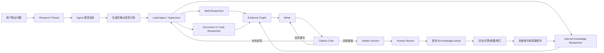
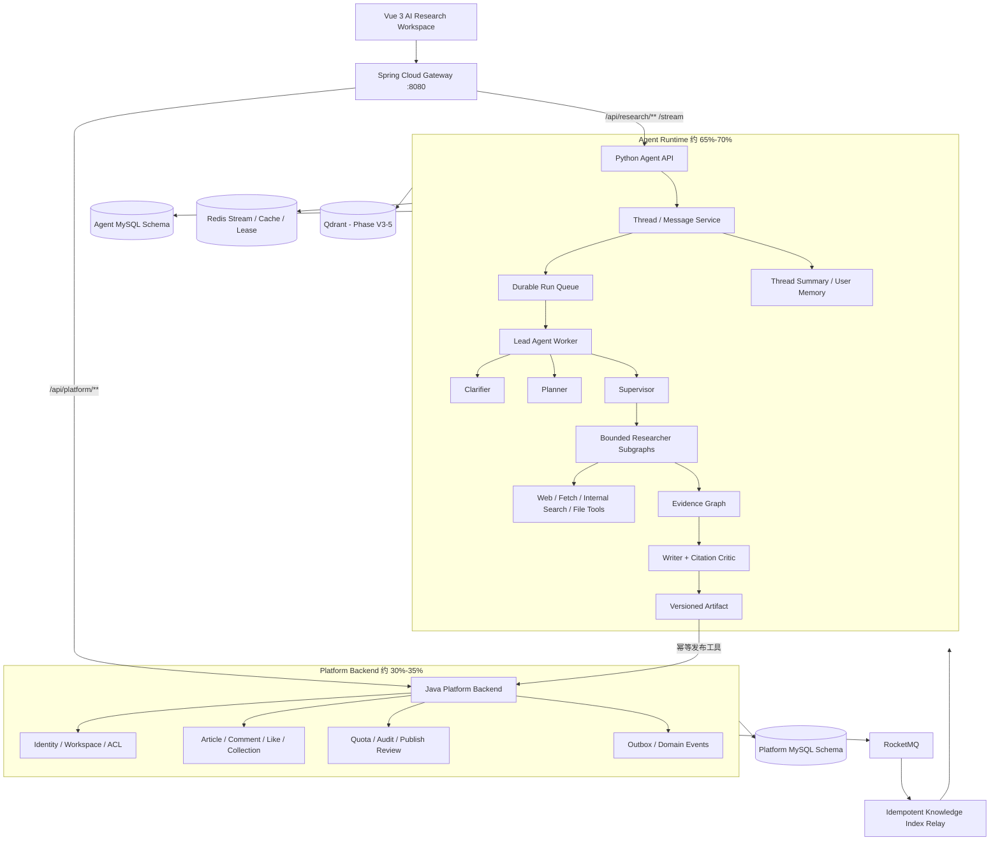
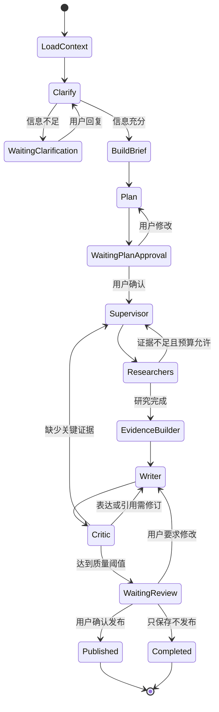

# XPlanet Agent-first v3 总体重构与实施方案

> 文档状态：v3 目标架构基线，待实施
>
> 形成日期：2026-07-20
>
> 代码基线：`9fbb15c`
>
> 适用范围：XPlanet 产品、前端、Java 平台后端、Python Agent Runtime、数据与部署
>
> 优先级：本文高于旧版 `XPlanet-Research整体优化改进方案.md`；旧文档只作为 v1/v2 实施记录和历史证据

## 0. 结论先行

XPlanet v3 不再定义为“社区后端 + AI 研究任务”，而定义为：

> **面向开发者的可追溯 AI 研究与知识共创平台。用户在 Research Thread 中与 Agent 多轮协作，Agent 自动澄清目标、制定计划、并行使用互联网和站内知识工具、构建证据、生成并修订报告；审核后的 Artifact 发布为社区知识，评论、点赞和修订又成为后续检索与质量评估信号。**

核心转变：

1. 用户的第一业务对象从 `Article` 变为 `Research Thread`；
2. 社区从独立 CRUD 产品变为 Agent 的知识库、发布层和人类反馈层；
3. Python 从“被 Java 同步调用的研究函数”变为独立、持久、可恢复的 Agent Runtime；
4. Java 从“拥有 Agent 每个节点状态的控制面”收缩为身份、权限、发布、互动、额度和领域事件平台；
5. Agent 能力目标占产品功能、演示时间和简历叙事的 65%～70%，传统后端占 30%～35%；
6. 不以堆 Agent 数量和中间件数量证明复杂度，以真实工具循环、证据质量、恢复能力和知识反馈闭环证明价值。

---

## 1. 文档使用规则

### 1.1 事实标签

| 标签 | 含义 |
|---|---|
| `现状` | 当前仓库已经存在并经代码核对 |
| `目标` | v3 确定实施，但尚未完成 |
| `可选` | 只有数据或需求证明收益后引入 |
| `不采用` | 当前阶段明确不实施 |
| `迁移期` | 新旧链路并存，只用于平滑切换 |

### 1.2 后续修改规则

每个阶段必须遵守：

1. 先声明本阶段不变量、数据所有权和失败场景；
2. 实现最小纵向闭环，不并行铺开无验收能力；
3. 先执行局部测试，再执行全量测试和真实环境验收；
4. 测试通过后才能进入下一阶段；
5. 同步本文实施状态、README、架构图、新手导读和实验记录；
6. 每个阶段独立 Git commit 并推送；
7. 未真实调用模型、搜索或 RAG 的能力不得写为已实现；
8. 旧实现只有在新链路通过等价验收后才能删除。

---

## 2. 当前系统审计

### 2.1 已经值得保留的能力

| 能力 | 当前价值 | v3 处理 |
|---|---|---|
| Gateway 统一入口 | 路由、CORS、TraceId、JWT 前置校验 | 保留并增加 Agent Thread/SSE 路由 |
| bcrypt + JWT | 基础身份闭环 | 保留；Python Runtime 增加同源 Token 校验 |
| 文章、评论、点赞 | 已形成社区知识承载和反馈基础 | 保留，但从产品中心退到 Knowledge/Feedback 层 |
| 点赞状态机 + Outbox + MQ + 幂等投影 | 可证明的最终一致性案例 | 保留，作为反馈事件可靠性能力 |
| 缓存失效 Outbox | 多实例缓存一致性基础 | 保留 |
| AI 任务幂等、预算、取消、状态机 | 长任务治理基础 | 拆分后复用概念，不直接照搬所有实现 |
| checkpoint 强退恢复测试 | 已证明恢复方向正确 | 保留测试思想，checkpoint 所有权迁到 Agent Runtime |
| 来源—证据—引用模型 | 可追溯报告基础 | 扩展为 Claim—Evidence Graph 和 Artifact Version |
| Redis Stream + SSE | 实时进度能力 | 保留，事件协议升级为 Thread/Run 事件 |
| 离线评测和 smoke/recovery | 可重复验收基础 | 扩展为真实工具、质量、安全和前端 E2E 评测 |

### 2.2 产生“后端与 Agent 撕裂感”的根因

#### GAP-01：产品主入口不是 Agent

当前 `xplanet-web/index.html` 只有文章、评论和点赞，没有 Research Thread、对话、计划确认、节点时间线、工具调用、来源面板和 Artifact 编辑器。用户看不到 Agent 是如何工作的。

#### GAP-02：LangGraph 是固定流水线，不是真正的自适应研究循环

当前 Planner 生成固定三步；联网路径在 `OpenAIWebResearchProvider.research()` 的一次调用内同时完成搜索和成文；Writer/Critic 对联网结果的作用有限。图存在，但模型没有根据中间证据持续决定下一工具和下一研究方向。

#### GAP-03：Agent 内部状态由 Java 反向托管

当前 Python 每个节点通过 HTTP 回调 Java 保存 checkpoint、写进度和检查取消。Agent 的 Thread、Message、ToolCall、Checkpoint 和 Artifact 没有形成同一 Runtime 内的状态边界。

#### GAP-04：长任务入口是同步桥接

当前 RocketMQ 消息由 Java 消费后同步 HTTP 调用 Python，直到完整报告返回才确认。这让 MQ Consumer 生命周期与长时间模型/搜索调用绑定，扩容、超时、取消和运行观测都不自然。

#### GAP-05：没有多轮 Thread

现有 `ai_task` 只有一个问题和一次当前运行，不支持：

- Agent 主动澄清；
- 用户确认或修改研究计划；
- 基于上一版报告继续追问；
- 只重写指定章节；
- 一个 Thread 中存在多个 Run 和多个 Artifact Version；
- 会话级上下文压缩和长期记忆。

#### GAP-06：社区只有 Agent→文章的单向出口

当前报告可以发布为文章，但文章不能成为 Agent 的站内检索工具，评论、点赞、收藏和修订也没有进入检索排序或评测。

#### GAP-07：评测只能证明结构闭包

当前评测可以证明 citation 指向存在的 evidenceRef，但明确不能证明证据在语义和事实上支持 Claim；也没有真实搜索质量、任务完成度、工具效率、安全攻击和人工修改率指标。

#### GAP-08：技术叙事仍以后端组件为中心

README 第一屏从缓存、点赞、MQ 开始，Agent 位于后半部分。即使代码中已有 Agent，面试官首先感知到的仍是传统社区后端。

### 2.3 粗略规模信号

当前仓库约有：

- Java 生产代码 115 个文件、约 4271 行；
- Java 测试 27 个文件、约 1706 行；
- Python Agent 源码和测试约 1148 行；
- `xplanet-ai` Java 模块本身约 2097 行源码和测试。

行数不能直接等价于功能比例，但它验证了当前 Agent 智能执行深度仍小于控制面和社区后端。v3 不要求机械删除 Java 代码，而要求新增功能、主流程、展示和面试重点都优先落在 Agent Runtime。

---

## 3. 外部项目结论与本项目取舍

### 3.1 Open Deep Research

官方实现将研究划分为 Scope → Research → Write，并在 Research 阶段使用 Supervisor、并行 Researcher、独立上下文和结构化工具，而不是把研究封装成一次模型调用。

XPlanet 采用：

- 澄清与 Research Brief；
- Supervisor + 有界并行 Researcher；
- 结构化输出；
- 子图和上下文隔离；
- 离线/在线评测。

### 3.2 GPT Researcher

该项目围绕“生成有来源的完整研究报告”组织 Planner、Crawler/Researcher、Publisher、实时前端和导出能力，产品目标单一。

XPlanet 采用：

- 所有组件围绕 Research Artifact 服务；
- 来源采集、摘要、过滤、聚合和写作边界明确；
- 前端实时展示研究过程；
- 报告作为可编辑、可发布的产品对象。

### 3.3 DeerFlow

DeerFlow 2.0 以 Thread Workspace 为中心，Lead Agent 通过 Tools、Skills 和 Subagents 工作；文件、上传、输出、记忆和上下文压缩属于同一运行环境。

XPlanet 采用：

- Thread/Workspace 作为首要产品对象；
- Lead Agent 统一拥有最终输出；
- 子 Agent 只处理有边界的研究主题；
- 工具、记忆、Artifact 和 Trace 属于 Agent Runtime；
- 渐进加载工具/技能，避免一次向上下文塞入所有能力。

XPlanet 暂不采用：

- 第一阶段不开放 Bash 和任意文件写；
- 第一阶段不做通用 Super Agent；
- 第一阶段不引入任意 MCP Server；
- 没有安全隔离前不做宿主机代码执行。

### 3.4 OpenAI Agents SDK 的编排原则

Manager-as-tools 适合由一个 Lead Agent 统一面对用户并综合专业 Agent 输出；Handoff 适合把会话控制权交给专业 Agent。

XPlanet 选择：

- 默认使用 Lead Agent + Researchers-as-tools；
- Researcher 不直接面向用户，只返回结构化 Finding；
- 只有以后引入代码审查、数据分析等独立交互模式时才考虑 Handoff；
- 统一 Trace 覆盖模型、工具、Agent、Guardrail 和人工中断。

---

## 4. v3 产品目标

### 4.1 目标用户

第一目标用户是需要完成技术调研、方案比较、故障分析和面试准备的开发者，不做无限泛化的通用助手。

### 4.2 四类首发任务

1. 技术选型比较：例如 OpenFeign、Dubbo、gRPC 的适用边界；
2. 架构调研：例如点赞最终一致性或 Agent checkpoint 方案；
3. 项目/代码研究：结合站内项目文章和上传材料形成报告；
4. 面试知识沉淀：把研究结果整理成可追问、可发布的项目说明。

### 4.3 核心业务闭环



### 4.4 “Agent 65%+”的可验证定义

不按中间件数量计算，按以下标准验收：

| 维度 | 目标 |
|---|---:|
| 7 分钟项目演示 | Agent 研究与审核发布不少于 5 分钟 |
| README 首屏能力 | Agent、工具、证据、Artifact 占主要位置 |
| v3 新增 Story Points | Agent Runtime、AI 工作台和评测不少于 65% |
| 面试亮点 | 7 个主要亮点中至少 5 个属于 Agent |
| 用户主导航 | Research 为首页；Knowledge/Community 为第二入口 |
| 核心对象 | Thread、Run、ToolCall、Evidence、Artifact 多于传统 CRUD 对象 |

### 4.5 非目标

- 不做通用聊天机器人；
- 不靠十几个 Prompt 包装类制造“多 Agent”；
- 不追求无人监督发布；
- 不声称离线样例等于真实研究质量；
- 不在 v3 MVP 引入 Nacos、Dubbo、Seata、Kubernetes；
- 不在没有真实数据前实施复杂推荐系统；
- 不在没有隔离环境前开放任意代码执行。

---

## 5. 目标总体架构



### 5.1 部署边界

目标部署单元：

| 单元 | 主要职责 | 是否外部暴露 |
|---|---|---:|
| `xplanet-web` | AI 工作台和知识社区 | 经 Gateway/静态服务 |
| `xplanet-gateway` | 统一入口、CORS、Trace、前置鉴权 | 是，8080 |
| `xplanet-agent` API | Thread、Message、Run、SSE、Artifact | 否，由 Gateway 路由 |
| `xplanet-agent-worker` | LangGraph 执行、工具和 checkpoint | 否 |
| Java Platform | 用户、Workspace、文章、互动、额度、发布 | 否 |
| MySQL | 平台事实与 Agent 事实，逻辑 schema 隔离 | 否 |
| Redis | 进度、缓存、运行租约 | 否 |
| RocketMQ | 平台领域事件和可靠索引事件 | 否 |
| Qdrant | 站内知识向量检索，Phase V3-5 引入 | 否 |

### 5.2 Java 模块是否立即合并

目标架构将 `user/article/interaction` 视为一个逻辑 Platform Backend，但第一阶段不做大规模物理合并。

原因：

- 立即合并会制造大量包迁移和回归，与 Agent 主线无关；
- 当前服务已经有测试和可运行链路；
- 产品融合不要求所有代码运行在一个进程；
- 等 Agent 主流程稳定后，再按部署复杂度决定是否合并为模块化单体。

Phase V3-7 才评估物理合并，判定标准是维护成本，而不是“微服务数量看起来是否高级”。

---

## 6. 状态与数据所有权

### 6.1 双层状态原则

Platform 只拥有业务事实；Agent Runtime 拥有执行事实。双方不得共同更新同一张表。

#### Agent Runtime 拥有

| 聚合/表 | 用途 |
|---|---|
| `agent_thread` | 多轮研究会话、标题、所有者、状态 |
| `agent_message` | 用户/Agent/工具消息，支持顺序和重放 |
| `agent_run` | 一次执行、模型配置、预算、租约、终态 |
| `agent_checkpoint` | LangGraph 状态快照和下一恢复节点 |
| `agent_step` | 节点状态、耗时、父子关系 |
| `agent_tool_call` | 工具输入摘要、输出引用、错误和成本 |
| `research_plan` | 计划版本、主题、用户是否确认 |
| `research_finding` | 子 Agent 的结构化发现 |
| `source_document` | 来源元数据、哈希、抓取时间和快照引用 |
| `evidence_chunk` | 证据内容、locator、来源绑定和评分 |
| `claim_evidence` | Claim 与 Evidence 的支持/反驳关系 |
| `artifact` | 报告、对比表、方案等产物 |
| `artifact_version` | 人工/Agent 修订版本和差异来源 |
| `agent_memory` | 有作用域、来源、置信度和过期时间的记忆 |
| `agent_usage` | 模型、工具、Token、费用和延迟 |

#### Java Platform 拥有

| 聚合/表 | 用途 |
|---|---|
| `user` | 身份、密码和基础资料 |
| `workspace` / `workspace_member` | 协作空间和 ACL |
| `article` | 已发布知识内容 |
| `comment` | 人类讨论和质疑 |
| `like_relation` / `collection` | 反馈与个人沉淀 |
| `publish_projection` | Artifact 到 Article 的幂等映射 |
| `quota` | 用户并发、Token、搜索次数和费用上限 |
| `audit_log` | 审核、发布和高风险操作 |
| `domain_outbox` | 发布、反馈、删除、重建索引事件 |

### 6.2 当前表迁移映射

| 当前表 | v3 目标 | 迁移方式 |
|---|---|---|
| `ai_task` | `agent_thread` + `agent_run` | 保留旧 ID 映射，迁移已完成任务 |
| `ai_run` | `agent_run` | 增加租约、配置快照和父 Run |
| `ai_run_step` | `agent_step` + `agent_checkpoint` | 分离轨迹与大状态快照 |
| `source_document` | Agent Runtime 同名表 | 转移所有权，不与 Java 共写 |
| `evidence_chunk` | Agent Runtime 同名表 | 增加 claim relation 和 verification |
| `ai_report` | `artifact` + `artifact_version` | 支持多类型产物和多轮修订 |
| `report_citation` | `claim_evidence` | 支持 SUPPORTS/REFUTES/CONTEXT |
| `model_usage` | `agent_usage` | 增加 trace/run/tool 维度 |
| `ai_outbox` | 迁移期保留，最终删除任务命令用途 | 平台领域事件使用统一 Outbox |
| `ai_published_article` | `publish_projection` | 保留唯一幂等约束 |

### 6.3 数据库与迁移工具

- 继续复用 MySQL 实例，不为了 LangGraph 单独引入 PostgreSQL；
- Platform 表继续由 Flyway 管理；
- Agent 表放入独立逻辑 schema，目标由 Alembic/SQLAlchemy 管理；
- Compose 启动时按 Platform Flyway → Agent Alembic 顺序执行；
- 不允许 Java Mapper 直接写 Agent schema；
- 不允许 Python 直接写 Platform 文章/用户表，只能调用 Platform API。

---

## 7. Agent Runtime 详细设计

### 7.1 Agent 拓扑

只保留真正有独立目标、工具或上下文的 Agent：

| Agent | 输入 | 工具 | 输出 |
|---|---|---|---|
| Lead Agent | Thread、用户消息、记忆、预算 | Researcher tools、Artifact tools | 用户响应和最终 Artifact |
| Clarifier | 对话和任务类型 | 无或轻量知识查询 | 结构化 Research Brief / 澄清问题 |
| Planner | Research Brief | 站内主题预检 | 结构化计划和 Research Topics |
| Web Researcher | 单个 Topic | web_search、web_fetch | Findings + Sources + Evidence |
| Internal Researcher | 单个 Topic | internal_search、get_article | 站内 Findings + Evidence |
| Document Researcher | 上传文件和 Topic | list/read/search_document | 文件 Findings + Evidence |
| Writer | 计划、Findings、Evidence | artifact_read/write | Artifact Draft |
| Citation Critic | Claims、Evidence、来源 | evidence_verify | 通过、补研究或定向重写决定 |

Clarifier、Planner、Writer、Critic 可以是图节点，不必全部包装成独立自治 Agent。Researcher 才需要独立上下文和工具循环。

### 7.2 完整状态图



### 7.3 真正的 Researcher 工具循环

```text
读取 Topic、已有 Findings 和剩余预算
  → 模型决定下一动作
  → 调用 search / fetch / internal_search / read_document
  → 保存 Source 和 Evidence，不把整页文本永久塞入消息历史
  → 总结当前发现和缺口
  → 继续调用工具，或输出 ResearchComplete
```

硬边界：

- 每个 Run 最多 3 个并行 Researcher；
- 每个 Researcher 最大 8 次工具调用；
- 单 URL 最大内容和超时固定；
- 相同规范化 URL 不重复抓取；
- 全局来源、Token、费用和 deadline 预算共享；
- 工具返回必须结构化，不能把异常文本伪装成来源；
- Researcher 只返回 Finding，不生成最终面向用户的完整报告。

### 7.4 Provider 重构

当前 Provider 的 `research(command)` 需要拆分为：

```text
ModelProvider.generate(messages, tools, output_schema, budget)
SearchTool.search(query, limit)
FetchTool.fetch(url)
EmbeddingProvider.embed(texts)
Reranker.rerank(query, candidates)
```

Provider 只负责模型协议、重试、用量和错误分类，不负责完整研究业务。

### 7.5 Thread 与上下文工程

- 原始消息持久化，但不会每轮全部注入模型；
- 当前 Run 使用最近消息 + Thread Summary + 相关 Artifact/Memory；
- 子 Agent 只接收自己的 Topic、预算和已知证据摘要；
- 大网页、文件和中间结果存入 Source/Evidence/Artifact，不进入长期对话；
- 每个 Run 完成后生成可追溯摘要，记录摘要来源消息范围；
- Context 超预算时先压缩已完成子任务，不裁剪系统规则和当前用户请求。

### 7.6 Memory

MVP 只实现两层：

1. Thread Summary：同一研究会话内的短期上下文；
2. User Preference Memory：例如偏好 Java、希望中文回答、引用优先官方资料。

每条长期记忆必须带：

- 来源 Thread/Message；
- scope（用户/Workspace）；
- confidence；
- created/updated/expire time；
- 用户删除能力。

不把模型生成的研究结论自动当作用户事实写入记忆。

---

## 8. Tools、RAG 与知识反馈闭环

### 8.1 MVP 工具

| 工具 | 作用 | 首阶段权限 |
|---|---|---|
| `web_search` | 获取候选网页 | 只读 |
| `web_fetch` | 抓取并规范化网页正文 | 只读、SSRF 防护 |
| `internal_search` | 检索站内文章和已发布 Artifact | 只读 |
| `get_article` | 读取指定文章、版本和元数据 | 只读 |
| `search_document` | 检索用户已上传资料 | 只读 |
| `publish_artifact` | 人工确认后发布 | 有副作用，必须审批 |

MVP 不开放 shell、任意 Python、数据库 SQL 和文件写工具。

### 8.2 站内知识索引

索引输入：

- 已发布且未删除文章；
- 已通过审核的 Artifact Version；
- 标题、正文、标签、作者和发布时间；
- 评论只作为反馈，不默认进入知识正文。

索引流程：

```text
Platform 文章发布/更新/删除事务
  → Domain Outbox
  → RocketMQ ARTICLE_KNOWLEDGE_CHANGED
  → 带 eventId 的幂等 Index Relay
  → 分块、Embedding、Qdrant upsert/delete
  → index_projection 保存版本和状态
```

检索：关键词召回 + 向量召回 + Rerank；结果必须带 articleId、version、chunk locator 和更新时间。

Qdrant 只在 Phase V3-5 引入；此前使用 MySQL 关键词检索或固定本地语料验证协议，避免提前增加组件。

### 8.3 反馈如何使用

点赞、收藏、评论和修订只能作为软信号：

- 点赞/收藏提高候选内容先验，但不能证明事实正确；
- 高质量质疑评论可以触发重新评估；
- 作者修订使旧向量版本失效；
- 举报或删除必须立即从检索中下线；
- 排序公式和权重必须可解释、可回放。

### 8.4 Evidence Graph

每个 Claim 必须关联至少一个 Evidence：

```text
Claim
  ├─ SUPPORTS → Evidence → Source + locator
  ├─ REFUTES  → Evidence → Source + locator
  └─ CONTEXT  → Evidence → Source + locator
```

Citation Critic 至少验证：

- Evidence ID 存在；
- Evidence 属于本 Run 可见来源；
- locator 可定位；
- Claim 与 Evidence 的语义支持度达到阈值；
- 高风险结论是否有多个独立来源；
- 最终报告引用的版本与审核时一致。

---

## 9. 前端产品方案

### 9.1 技术栈

目标使用 Vue 3 + TypeScript + Vite；当前单文件静态页在 Phase V3-2 被替换，不继续扩展。

### 9.2 信息架构

```text
/research                  Thread 列表和新建入口（首页）
/research/:threadId        AI Research Workspace
/knowledge                 站内知识库/社区
/articles/:articleId       文章详情和反馈
/artifacts/:artifactId     Artifact 阅读、版本和发布
/settings/models           模型、搜索与预算配置（后置）
```

### 9.3 Research Workspace 布局

```text
┌──────────────┬─────────────────────────────┬─────────────────────┐
│ Thread 列表   │ 对话 / 计划 / Agent 输出      │ 运行时间线 / 证据     │
│ 历史与搜索    │ 用户可继续追问和定向修改       │ Sources / Tool Calls │
│              │ Artifact 编辑与版本差异        │ Token / Cost / Trace │
└──────────────┴─────────────────────────────┴─────────────────────┘
```

必须可见：

- 当前状态和取消按钮；
- Agent 的 Research Brief；
- 计划确认/修改；
- 每个 Researcher 的主题、状态和发现数量；
- 工具名、查询摘要、耗时和结果状态；
- 来源、证据、引用和定位；
- 报告版本、人工修改和发布；
- 失败原因、重试和恢复提示。

不得展示内部 Prompt、Token、API Key 和未经清理的工具原始异常。

### 9.4 SSE 事件协议

统一事件：

```text
thread.message.delta
run.status.changed
plan.created
plan.approval.required
agent.started
agent.completed
tool.started
tool.completed
tool.failed
evidence.added
artifact.delta
artifact.completed
run.failed
run.completed
```

事件必须包含：`eventId`、`threadId`、`runId`、`sequence`、`timestamp`、`traceId`、`type` 和最小 payload。断线后使用 `Last-Event-ID` 恢复；完整事实仍从 REST 查询，不把 SSE 当数据库。

---

## 10. Java Platform 目标

### 10.1 保留的后端亮点

- Gateway 统一入口和下游复验；
- JWT、Workspace ACL 和资源所有权；
- 文章二级缓存及可靠失效；
- 点赞状态机、Outbox 和幂等投影；
- Artifact 幂等发布；
- 额度、审计和领域事件；
- 真实故障注入和最终一致性测试。

### 10.2 `xplanet-ai` 的最终去向

当前模块分三类迁移：

| 当前能力 | 目标归属 |
|---|---|
| Task/Run/Checkpoint/Progress | Python Agent Runtime |
| Source/Evidence/Report/Usage | Python Agent Runtime |
| 用户权限、额度、审核发布 | Java Platform |
| Agent 命令 Outbox | 迁移期保留，最终由 Agent durable run queue 取代 |
| 发布文章 OpenFeign | 移到 Platform 内部 publish API/服务 |
| Micrometer 平台指标 | Java 保留；Agent 指标用 Python OpenTelemetry/Prometheus |

最终删除：

- Java→Python 的同步长任务执行桥；
- Python→Java 的逐节点 checkpoint 回调；
- Java 对 Agent 内部状态 JSON 的保存和解释；
- 两边重复的 Run 状态判断。

### 10.3 Durable Run Queue

Agent API 创建 Message/Run 后返回 `202 Accepted`。Python Worker 使用 Agent schema 中的租约队列：

1. `QUEUED` Run 落库；
2. Worker 使用 `FOR UPDATE SKIP LOCKED` 领取；
3. 写 `locked_by`、`locked_until`、attempt；
4. LangGraph checkpoint 每个关键边界提交；
5. Worker 心跳续租；
6. 进程退出后租约过期，其他 Worker 从 checkpoint 恢复；
7. 超过最大尝试次数进入 `FAILED`，保留明确错误分类。

这样复用 MySQL，不额外引入 Celery/RabbitMQ；RocketMQ 专注平台领域事件，而不是承担 Agent 每一步编排。

---

## 11. API 与通信边界

### 11.1 面向用户的 Agent API

```text
POST   /api/research/threads
GET    /api/research/threads
GET    /api/research/threads/{threadId}
POST   /api/research/threads/{threadId}/messages
GET    /api/research/threads/{threadId}/events
POST   /api/research/runs/{runId}/cancel
POST   /api/research/plans/{planId}/approve
POST   /api/research/plans/{planId}/revise
GET    /api/research/artifacts/{artifactId}
POST   /api/research/artifacts/{artifactId}/revise
POST   /api/research/artifacts/{artifactId}/publish
```

### 11.2 Agent 调用 Platform 的工具 API

```text
GET  /internal/platform/users/{userId}/preferences
POST /internal/platform/knowledge/search
GET  /internal/platform/articles/{articleId}
POST /internal/platform/artifacts/{artifactId}/publish
POST /internal/platform/quotas/reserve
POST /internal/platform/quotas/settle
```

内部调用使用短期服务凭证、用户上下文、TraceId 和幂等键；不复用用户原始 Bearer Token 作为永久内部凭证。

### 11.3 同步与异步选择

| 场景 | 协议 | 原因 |
|---|---|---|
| 用户创建 Thread/发消息 | REST | 需要立即确认持久化结果 |
| 实时文本和进度 | SSE | 单向、高频、浏览器原生重连 |
| Agent 查询文章/额度 | 内部 HTTP | 短调用，需要即时结果 |
| 文章发布/反馈/删除事件 | RocketMQ + Outbox | 跨服务可靠传播和重试 |
| Agent 内部调度 | MySQL lease queue | 与 checkpoint 同所有权，避免额外队列 |
| Artifact 发布 | 同步幂等 HTTP + Platform 本地事务 | 用户需要明确发布结果 |

---

## 12. 可靠性、不变量与失败处理

### 12.1 核心不变量

1. 用户消息成功返回后必须能从数据库读取；
2. 一个 Run 同一时刻最多被一个有效租约 Worker 执行；
3. checkpoint 提交后重启不能重复产生有副作用工具结果；
4. 每个 ToolCall 有唯一 ID，重试使用同一幂等键；
5. Artifact 引用只能指向本 Thread 可见的 Evidence；
6. 未经用户确认的 Artifact 不能发布；
7. 同一 Artifact Version 最多发布成一篇 Article；
8. 删除/下线文章最终必须从站内检索消失；
9. SSE 丢失不影响数据库事实；
10. 任意预算耗尽必须进入明确终态，不能无限循环。

### 12.2 错误分类

```text
MODEL_RATE_LIMIT
MODEL_AUTH_FAILED
MODEL_INVALID_OUTPUT
SEARCH_RATE_LIMIT
SEARCH_UNAVAILABLE
FETCH_TIMEOUT
FETCH_BLOCKED
TOOL_INVALID_RESULT
BUDGET_EXHAUSTED
DEADLINE_EXCEEDED
USER_CANCELLED
CHECKPOINT_CONFLICT
PUBLISH_REJECTED
INTERNAL_DEPENDENCY_FAILED
```

只有瞬时错误重试；认证失败、预算耗尽、用户取消和安全拒绝不盲目重试。

### 12.3 背压

- 每用户同时运行数默认 2；
- 每 Workspace 有队列上限；
- Worker 有全局并发信号量；
- 子 Agent 并发最多 3；
- 模型和搜索 Provider 分别限流；
- 超出额度返回明确排队或拒绝状态；
- 不使用无限线程池和无限 Redis Stream。

---

## 13. 安全方案

### 13.1 Web 工具

- 拒绝 localhost、RFC1918、链路本地、云元数据和非 HTTP(S) 地址；
- DNS 解析前后都检查 IP，防 DNS rebinding；
- 限制重定向次数、MIME、响应大小和耗时；
- 网页内容标记为 untrusted context；
- 网页指令不能覆盖系统规则或工具权限；
- 保存规范化 URL、最终 URL、抓取时间和内容哈希。

### 13.2 工具权限

- 工具注册表声明 `READ_ONLY` 或 `SIDE_EFFECT`；
- 有副作用工具必须要求显式 Human Approval；
- 工具参数使用 Pydantic Schema 校验；
- 每个工具独立超时、重试和预算；
- 不向子 Agent暴露其任务不需要的工具；
- 日志和 Trace 默认脱敏。

### 13.3 Prompt 与数据

- System/Developer/User/Tool 内容分层；
- 站内文章、网页和文件都视为不可信数据；
- 不把 API Key、JWT、内部 Token 写入模型上下文；
- 用户可以删除 Thread、Artifact 和 Memory；
- 敏感 Trace 内容默认不上传第三方平台；
- 上传文件后续引入时做大小、类型和恶意内容检查。

---

## 14. 可观测性与评测

### 14.1 Trace 层级

```text
Trace(thread/run)
  ├─ Agent Span
  ├─ Model Span
  ├─ Tool Span
  ├─ Subagent Span
  ├─ Checkpoint Span
  ├─ Guardrail Span
  └─ Publish Span
```

Gateway `X-Trace-Id` 贯穿 Agent HTTP、Platform HTTP、领域事件和日志；Agent 内部另使用 `runId/spanId` 表达父子关系。

### 14.2 运行指标

- Run 成功、失败、取消和恢复次数；
- 队列等待时间和运行耗时；
- 每节点/Agent/工具耗时；
- 模型 Token、费用、重试和限流；
- 搜索查询数、抓取成功率、重复 URL 率；
- Evidence 数、来源域数量和引用覆盖率；
- checkpoint 次数、大小和恢复耗时；
- Artifact 人工修改比例和发布率。

### 14.3 质量评测

从现有结构评测升级为：

| 指标 | 方法 |
|---|---|
| Task Completion | 是否覆盖 Research Brief 的必答项 |
| Citation Validity | 引用是否存在且可定位 |
| Claim Support | Evidence 是否在语义上支持 Claim |
| Source Quality | 官方/一手来源占比、时效和独立性 |
| Coverage | 计划 Topic 是否均有结论或明确缺口 |
| Contradiction Handling | 是否识别冲突来源并说明 |
| Tool Efficiency | 有效 ToolCall / 总 ToolCall |
| Budget Compliance | Token、搜索、时间是否越界 |
| Human Edit Rate | 发布前人工改动比例 |
| Safety | Prompt 注入、SSRF、越权用例通过率 |

评测分三层：

1. 离线确定性协议测试；
2. 经批准的固定在线数据集；
3. 人工盲评或 LLM-as-judge + 人工抽检。

任何质量数字必须记录模型、Prompt、搜索 Provider、日期、数据集和成本。

---

## 15. 组件决策表

| 组件/能力 | 决策 | 原因 |
|---|---|---|
| LangGraph | 保留并深化 | 显式状态、条件路由、中断和恢复符合长研究任务 |
| FastAPI | 保留 | Agent API、SSE 和 Python 生态适配 |
| Java/Spring | 保留并收缩边界 | 身份、权限、发布、反馈和可靠领域事件成熟 |
| Gateway | 保留 | 单一入口和跨域/Trace 基础 |
| MySQL | 保留 | 已有可靠事实库；Agent 使用独立 schema |
| Redis | 保留 | Stream、缓存和轻量租约 |
| RocketMQ | 保留但调整用途 | 平台领域事件、索引和反馈；不编排 Agent 节点 |
| Qdrant | Phase V3-5 新增 | 站内知识 RAG 有明确检索需求后再引入 |
| Vue 3 + TypeScript | Phase V3-2 新增 | 构建真正 AI Workspace |
| OpenTelemetry | Phase V3-6 引入 | 跨 Python/Java/HTTP/MQ Trace |
| LangSmith/第三方 Trace | 可选 | 仅在数据策略允许时用于研发 |
| Nacos | 不采用 | 当前固定部署和实例规模没有收益 |
| Dubbo | 不采用 | Python 跨语言和服务规模不匹配 |
| Seata | 不采用 | 用本地事务、Outbox、幂等和补偿 |
| Kubernetes | 不采用 | Compose 足够完成本地和面试演示 |
| Elasticsearch | 不采用 | 当前全文规模不足；先 MySQL + Qdrant |
| 任意 MCP | 后置 | 先完成原生工具、安全模型和评测 |
| Sandbox/Bash | 后置 | 隔离和安全成本高，不是研究 MVP 必需 |

---

## 16. 分阶段实施计划

### Phase V3-0：目标基线与防回退

状态：`方案完成，待提交`

任务：

- [x] 形成 Agent-first v3 总体方案；
- [x] README 标记当前 v2 能力和 v3 目标，避免把目标写成已实现；
- [x] 建立 v3 Feature Matrix 和迁移任务编号；
- [x] 保留现有 smoke/recovery 作为不可回退基线；
- [x] 确定新 API 和数据库命名规范。

验收：所有后续工作只引用本文；旧文档明确为历史；当前 93 Java、10 Python 和真实 smoke/recovery 不回退。

### Phase V3-1：Agent Runtime 状态所有权基础

目标：先建立唯一、可靠的 Agent 状态边界，再在其上开发产品和智能能力，避免产生第二套过渡状态。

任务：

- [ ] 建立独立 Agent schema 和 Alembic；
- [ ] 新建 Thread、Message、Run、Checkpoint、Step、Artifact 最小数据模型；
- [ ] 实现 Durable Run Queue + lease worker；
- [ ] 实现 LangGraph MySQL checkpointer adapter；
- [ ] Python Agent API 直接提供 Thread/Message/Run/SSE；
- [ ] Gateway 新增 `/api/research/**` 路由和 SSE 超时配置；
- [ ] Python 校验用户 JWT 和 Thread 所有权；
- [ ] checkpoint、step 和 progress 直接写 Agent schema/Redis；
- [ ] 建立新旧任务 ID 映射和迁移期开关；
- [ ] 新增 Worker 强退、租约过期和 checkpoint 恢复测试；
- [ ] 保留旧链路作为迁移回退。

验收：Python Runtime 不依赖 Java 的逐节点 checkpoint/progress 接口也能创建、执行、取消和恢复离线 Run；旧链路仍可通过开关运行；两套链路不共同写同一张事实表。

### Phase V3-2：Agent 产品纵向切片

目标：用户第一次打开项目就进入 Research Workspace，并完成一次多轮 Thread→Artifact→发布。

任务：

- [ ] 初始化 Vue 3 + TypeScript 前端；
- [ ] 实现 Clarify→Plan→用户确认→离线 Research→Artifact；
- [ ] 支持取消、SSE 重连和历史 Thread；
- [ ] 展示计划、节点、Evidence 和 Artifact；
- [ ] 支持基于 Artifact 继续追问和生成新版本；
- [ ] Artifact 人工确认后调用 Platform 幂等发布；
- [ ] 增加浏览器 E2E 和完整纵向 smoke。

验收：新用户只通过 8080，在一个页面完成登录、创建 Thread、确认计划、观察时间线、查看证据、继续追问和发布文章；浏览器刷新后状态不丢失。

### Phase V3-3：真实单 Agent 工具循环

目标：移除“Provider 一次调用包办研究”的假 Agent 路径。

任务：

- [ ] Provider 拆成 Model/Search/Fetch 接口；
- [ ] Planner 使用结构化模型输出；
- [ ] 实现 ReAct Researcher 循环；
- [ ] 接入 `web_search` 和安全 `web_fetch`；
- [ ] Writer 与 Citation Critic 分别调用模型；
- [ ] 保存 ToolCall、Finding、Claim 和 Evidence；
- [ ] 实现预算、错误分类和工具重试；
- [ ] 增加 mocked Provider 合同测试和经批准的在线 smoke。

验收：Trace 中可以看到模型为什么搜索、搜索了什么、读取了哪个来源、哪些证据支持哪些 Claim；工具调用有上限，失败不产生伪来源。

### Phase V3-4：Supervisor 与有界并行研究

目标：对复杂任务进行真正的主题拆分和上下文隔离。

任务：

- [ ] Lead Agent 将计划转为独立 Topics；
- [ ] 最多并发 3 个 Researcher；
- [ ] 子 Agent 独立上下文和预算；
- [ ] Findings 结构化聚合、去重和冲突标记；
- [ ] Critic 可触发补研究或定向重写；
- [ ] 增加上下文摘要和中间结果外置；
- [ ] 增加并发、超时、取消和部分失败测试。

验收：至少一个固定任务产生两个以上并行 Topic；一个 Researcher 失败不必然丢弃其他结果；总并发、ToolCall、Token 和 deadline 均受控。

### Phase V3-5：站内知识 RAG 与社区反馈闭环

目标：社区成为 Agent 能力，而不是报告出口。

任务：

- [ ] 新增文章知识变更领域事件；
- [ ] 建立幂等索引投影；
- [ ] 引入 Qdrant 和 embedding adapter；
- [ ] 实现关键词 + 向量 + rerank；
- [ ] 增加 `internal_search` / `get_article` 工具；
- [ ] 点赞、收藏、修订形成可解释软信号；
- [ ] 删除/下线文章可恢复地移出索引；
- [ ] 增加站内检索评测集。

验收：Agent 可以引用站内文章的具体版本和 locator；发布后最终可检索；删除后最终不可检索；MQ 重投不产生重复向量。

### Phase V3-6：质量、安全和可观测性

目标：从“能跑”提升到“可解释、可评测、可防护”。

任务：

- [ ] Claim—Evidence 语义支持评测；
- [ ] Prompt 注入测试集；
- [ ] SSRF/DNS rebinding/超大响应测试；
- [ ] OpenTelemetry 跨 Gateway/Agent/Platform/MQ；
- [ ] Agent Trace 和成本面板；
- [ ] 在线固定数据集与人工评分；
- [ ] 恢复、Provider 限流、工具超时和索引故障注入；
- [ ] 前端 Playwright E2E。

验收：质量结论有真实数据集和配置；安全用例自动执行；一次 Run 可以从 Trace 定位到模型、工具、Evidence、checkpoint 和发布事件。

### Phase V3-7：清理与发布准备

目标：只保留一套有效架构。

任务：

- [ ] 删除旧静态前端；
- [ ] 删除旧 AI Task 同步桥和废弃表/DTO；
- [ ] 删除 Python→Java checkpoint/progress 回调和任务命令 Outbox；
- [ ] 迁移历史 Task/Report，Java 只保留发布、额度和平台事件；
- [ ] 评估 Java 服务物理合并；
- [ ] 统一 README、架构、新手导读、API 和实验记录；
- [ ] 完成一键启动、演示数据和录屏脚本；
- [ ] 输出简历版、面试版和技术详版材料。

验收：新环境按文档启动；不存在两套入口、两套 Agent 状态或互相冲突的文档；完整演示不需要手工改数据库。

---

## 17. 优先级任务编号

### P0：决定产品是否成立

| 编号 | 任务 |
|---|---|
| `AF-P0-001` | Agent-owned Thread/Run/Checkpoint 和 durable worker |
| `AF-P0-002` | Vue Research Workspace 和 Thread 主流程 |
| `AF-P0-003` | Thread/Message/Run/Artifact 最小模型 |
| `AF-P0-004` | 澄清、计划确认和多轮继续研究 |
| `AF-P0-005` | Provider 拆分和真实 Researcher 工具循环 |
| `AF-P0-006` | ToolCall/Finding/Claim/Evidence 可视化 |
| `AF-P0-007` | Artifact 版本、人工修订和幂等发布 |

### P1：形成 Agent 技术深度

| 编号 | 任务 |
|---|---|
| `AF-P1-001` | Supervisor + 最多 3 个并行 Researcher |
| `AF-P1-002` | 上下文摘要、子 Agent 隔离和预算 |
| `AF-P1-003` | Citation Critic 和补研究循环 |
| `AF-P1-004` | 安全 Web Fetch 和工具 Guardrail |
| `AF-P1-005` | Run/Agent/Model/Tool Trace |

### P2：形成业务融合壁垒

| 编号 | 任务 |
|---|---|
| `AF-P2-001` | 站内知识索引和 Qdrant |
| `AF-P2-002` | Internal Researcher |
| `AF-P2-003` | 发布/更新/删除幂等索引事件 |
| `AF-P2-004` | 社区反馈质量信号 |
| `AF-P2-005` | Thread Memory 和用户偏好 |
| `AF-P2-006` | 真实质量评测和人工修改率 |

### 17.1 目标代码结构

后续不是继续把所有逻辑堆入当前 `workflow.py`，而按领域、应用、运行时和适配器分层：

```text
xplanet-agent/
├─ src/xplanet_agent/
│  ├─ api/
│  │  ├─ thread_routes.py
│  │  ├─ run_routes.py
│  │  ├─ artifact_routes.py
│  │  └─ sse_routes.py
│  ├─ domain/
│  │  ├─ thread.py
│  │  ├─ run.py
│  │  ├─ evidence.py
│  │  ├─ artifact.py
│  │  └─ errors.py
│  ├─ application/
│  │  ├─ thread_service.py
│  │  ├─ run_service.py
│  │  ├─ artifact_service.py
│  │  └─ publish_service.py
│  ├─ runtime/
│  │  ├─ lead_graph.py
│  │  ├─ researcher_graph.py
│  │  ├─ worker.py
│  │  ├─ checkpointer.py
│  │  ├─ context.py
│  │  └─ budgets.py
│  ├─ agents/
│  │  ├─ clarifier.py
│  │  ├─ planner.py
│  │  ├─ supervisor.py
│  │  ├─ researcher.py
│  │  ├─ writer.py
│  │  └─ critic.py
│  ├─ tools/
│  │  ├─ registry.py
│  │  ├─ web_search.py
│  │  ├─ web_fetch.py
│  │  ├─ internal_search.py
│  │  └─ publish.py
│  ├─ providers/
│  │  ├─ model.py
│  │  ├─ search.py
│  │  ├─ embedding.py
│  │  └─ reranker.py
│  ├─ infrastructure/
│  │  ├─ mysql/
│  │  ├─ redis/
│  │  ├─ qdrant/
│  │  └─ platform_client.py
│  ├─ evaluation/
│  └─ observability/
├─ migrations/
├─ tests/
│  ├─ unit/
│  ├─ graph/
│  ├─ contract/
│  ├─ integration/
│  └─ evaluation/
└─ pyproject.toml
```

规则：

- `domain` 不依赖 FastAPI、SQLAlchemy、Redis 或模型 SDK；
- `application` 编排用例，不直接拼 HTTP/SQL；
- `runtime` 负责 LangGraph、worker、checkpoint 和上下文；
- `agents` 只定义角色目标、输出 Schema 和决策逻辑；
- `tools/providers/infrastructure` 都通过接口替换；
- API 只做鉴权、校验、调用 application 和响应映射；
- 禁止再次出现一个 Provider 方法包办规划、搜索、写作和引用。

### 17.2 Phase V3-1 首批文件级任务顺序

1. 新增 Agent domain models 和 migration，不改变旧入口；
2. 实现 repository、transaction 和 lease queue；
3. 实现 MySQL checkpointer 与最小离线 graph；
4. 实现 worker 强退恢复测试；
5. 新增 Thread/Message/Run API；
6. Gateway 增加新路由；
7. 新增 SSE 和取消；
8. 完成新旧链路并行 smoke；
9. 测试通过后才开始 Vue Workspace。

---

## 18. 测试矩阵

| 层级 | 必测内容 |
|---|---|
| Python 单元 | 状态路由、预算、工具 Schema、错误分类、Evidence 约束 |
| Graph 测试 | 澄清中断、计划修改、补研究、重写、取消、恢复 |
| Provider 合同 | 模型工具调用、结构化输出、搜索结果、用量和错误映射 |
| Java 单元 | ACL、额度、发布幂等、领域事件和索引投影 |
| API 合同 | Gateway/Agent/Platform JWT、错误码、Trace 和幂等键 |
| 数据集评测 | Completion、Support、Source Quality、Coverage、Safety |
| 集成 | MySQL、Redis、RocketMQ、Qdrant、Agent、Platform 协作 |
| Chaos | Worker 强退、模型限流、搜索超时、MQ 停止、索引重投 |
| 前端 E2E | 登录、Thread、SSE 重连、计划确认、取消、修订、发布 |
| 性能 | 并发 Thread、SSE 连接、队列等待、单 Run 成本和检索延迟 |

每一阶段至少具备：局部测试、全量回归、真实纵向 smoke。不能用 Mock 结果证明真实网络质量，不能用 HTTP 200 证明业务成功。

---

## 19. 主要风险与应对

| 风险 | 表现 | 应对 |
|---|---|---|
| 改造范围过大 | 同时改前端、状态、工具、RAG导致长期不可运行 | 每阶段保持纵向可演示，旧链路到 Phase V3-7 才删除 |
| 多 Agent 只有名字 | 多个类都只是不同 Prompt | 只有独立目标、上下文或工具的 Researcher 才算 Agent |
| 上下文爆炸 | 并行来源和消息超过窗口 | 子 Agent 隔离、Finding 结构化、中间结果外置、摘要 |
| 工具不可靠 | 搜索/抓取超时或返回脏数据 | 类型化工具、错误分类、超时、重试、域/IP限制 |
| 引用看似正确 | ID 存在但不支持 Claim | 语义支持评测、冲突来源、人工抽检 |
| 成本失控 | 并行 Agent 反复搜索 | 全局预算、每 Agent 上限、去重和提前停止 |
| 状态迁移重复 | Java/Python 双写产生分叉 | 新 schema 单写，迁移期只做 ID 映射和结果对比 |
| RAG 垃圾回流 | 低质量文章反复被 Agent 引用 | 审核、版本、质量信号、来源权重和删除传播 |
| 安全风险 | Prompt 注入、SSRF、越权发布 | 工具隔离、网络规则、审批、ACL、自动安全测试 |
| 面试过度宣传 | 把计划写成已实现 | 文档事实标签、实验记录和可复现命令 |

---

## 20. 面试叙事目标

### 20.1 30 秒版本

> XPlanet 是面向开发者的可追溯研究 Agent 平台。用户在 Thread 中确认研究计划后，Lead Agent 会按主题并行调用 Web、站内知识和文档 Researcher，所有结论都绑定可定位 Evidence；Writer 和 Citation Critic 会根据证据补研究或定向修订。运行状态和 checkpoint 持久化，进程崩溃能够恢复。审核后的 Artifact 幂等发布为社区文章，文章反馈和版本又进入后续站内检索与评测，形成研究—发布—反馈—再研究闭环。

### 20.2 五个核心亮点

1. 多轮 Thread + 人工计划确认，不是一次性问答；
2. Supervisor + 有界并行 Researcher + 真正 Tool Loop；
3. Claim—Evidence Graph + Citation Critic；
4. Agent-owned checkpoint、租约 Worker 和故障恢复；
5. 社区知识 RAG 与人类反馈闭环。

后端亮点作为支撑：JWT/ACL、幂等发布、Outbox/MQ、缓存一致性和可靠反馈投影。

### 20.3 重点困难

- 如何让多 Agent 并行但不让上下文和成本失控；
- 如何证明引用真正支持结论，而不只验证引用 ID；
- 如何在 Worker/MQ/模型失败时恢复且不重复副作用；
- 如何让社区内容进入 RAG 又不形成低质量自我污染；
- 如何划分 Java 业务事实和 Python 执行事实，避免双写。

---

## 21. Definition of Done

任一 v3 任务完成必须同时满足：

1. 目标用户行为和不变量明确；
2. 数据所有者唯一；
3. API/事件 Schema 版本化；
4. 正常、重复、取消、超时和恢复路径有测试；
5. 前端能展示该能力或有明确非 UI 理由；
6. Trace/日志能定位失败边界；
7. 配置、Compose、迁移和文档同步；
8. 相关旧代码在新链路验收后删除；
9. 实验数字带条件和边界；
10. Git commit/push 完成后才进入下一任务。

---

## 22. 架构决策记录

| ADR | 决策 | 状态 | 理由 |
|---|---|---|---|
| V3-ADR-001 | Research Thread 是第一产品对象，Article 是发布 Artifact | 已接受 | 消除社区与 Agent 产品割裂 |
| V3-ADR-002 | Lead Agent 拥有最终输出，Researcher 作为有界工具 | 已接受 | 统一用户体验并控制多 Agent 复杂度 |
| V3-ADR-003 | Python 拥有 Agent 执行事实，Java 拥有平台业务事实 | 已接受 | 避免 checkpoint/progress 双向耦合和双写 |
| V3-ADR-004 | Agent 使用 MySQL lease queue，不新增任务 Broker | 已接受 | 与 checkpoint 同所有权，控制基础设施数量 |
| V3-ADR-005 | RocketMQ 用于平台领域事件和知识索引传播 | 已接受 | 保留可靠异步能力，但不编排内部图节点 |
| V3-ADR-006 | 当前 Java 服务先逻辑归组，物理合并后置 | 已接受 | 优先投入 Agent 主线，减少无价值迁移 |
| V3-ADR-007 | Qdrant 到站内 RAG 阶段才引入 | 已接受 | 先验证协议和用户价值，再承担新组件成本 |
| V3-ADR-008 | 不开放 Shell/任意 MCP 作为 MVP | 已接受 | 研究主线不需要高风险能力 |
| V3-ADR-009 | 所有发布工具必须 Human Approval + 幂等 | 已接受 | 防止 Agent 未授权产生公开副作用 |
| V3-ADR-010 | 质量评测必须从索引闭包升级到 Claim Support | 已接受 | 可追溯不等于事实支持 |

---

## 23. 参考项目

- Open Deep Research：<https://github.com/langchain-ai/open_deep_research>
- Deep Research from Scratch：<https://github.com/langchain-ai/deep_research_from_scratch>
- GPT Researcher：<https://github.com/assafelovic/gpt-researcher>
- DeerFlow：<https://github.com/bytedance/deer-flow>
- DeerFlow Backend Architecture：<https://github.com/bytedance/deer-flow/blob/main/backend/README.md>
- OpenAI Agents SDK - Agent orchestration：<https://openai.github.io/openai-agents-python/multi_agent/>
- OpenAI Agents SDK - Sessions：<https://openai.github.io/openai-agents-python/sessions/>
- OpenAI Agents SDK - Tracing：<https://openai.github.io/openai-agents-python/tracing/>

这些项目只作为架构模式参考；XPlanet 不复制其全部组件，而按开发者研究、社区知识和现有 Java 可靠性基础做取舍。

---

## 24. 变更记录

| 版本 | 日期 | 变更 |
|---|---|---|
| v3.0 | 2026-07-20 | 完成 Agent-first 重新定位、现状审计、目标架构、状态所有权、Agent 图、Tools/RAG/Memory、前端、平台边界、可靠性、安全、评测、迁移阶段和验收标准 |
