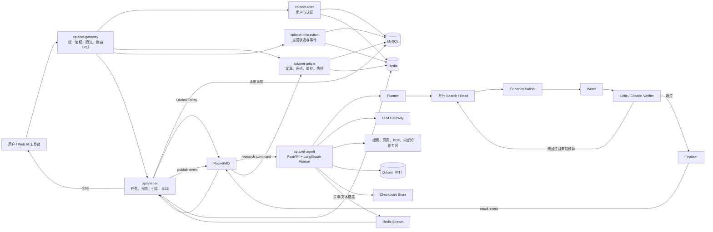
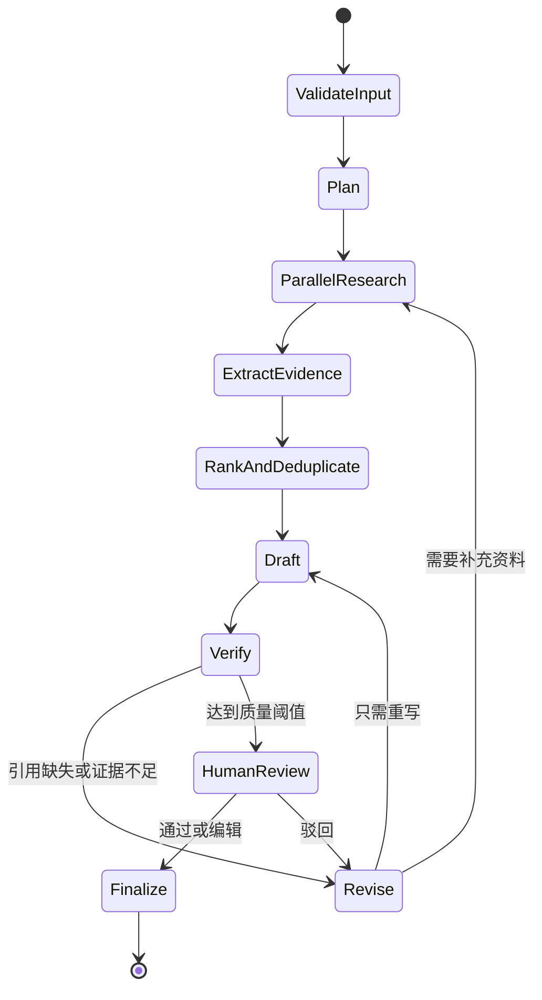

# XPlanet Research 整体优化改进方案

> 文档状态：架构基线 v1.4（实施中）
> 基线日期：2026-07-16  
> 适用范围：当前 XPlanet Java 项目及计划新增的 AI Agent 能力  
> 当前阶段：只确定方案和实施顺序，不代表目标能力已经完成

## 0. 文档规则

### 0.1 文档定位

本文是后续优化和改造的主文档，用于统一：

- 产品定位与简历叙事；
- 当前代码事实与已知风险；
- 目标架构和技术选型；
- 服务、数据和通信边界；
- 分阶段任务、验收标准和取舍；
- 后续方案变更记录。

代码现状以仓库实际实现为准，本文中的目标架构以“计划”“目标”“待实施”标识。旧版 `README.md`、`docs/ARCHITECTURE.md`、面试手册中的性能数字和设计描述，不得在未复测、未对照代码的情况下继续作为事实引用。

### 0.2 后续更新规则

每次实施或调整方案时同步完成以下动作：

1. 修改本文对应章节和实施状态表；
2. 在文末变更记录中写明日期、原因、影响范围；
3. 实现完成后再把状态从“计划”改为“已实现”；
4. 执行相应测试并记录结果，不能用“编译成功”替代行为验证；
5. 若改变服务边界、数据所有权或通信方式，新增一条架构决策记录；
6. 最后同步 README、架构文档、部署文档和面试材料，避免文档与代码再次漂移。

### 0.3 事实标签

| 标签 | 含义 |
|---|---|
| 已实现 | 当前代码中已经存在，并经代码核对 |
| 待修复 | 当前存在，但有正确性、可靠性或安全问题 |
| 计划 | 已确定要实现，但尚未落地 |
| 可选 | 只有在规模或展示价值足够时才引入 |
| 不采用 | 当前阶段明确不引入 |

---

## 1. 最终项目定位

### 1.1 项目名称

**XPlanet Research：面向开发者的可追溯 AI 深度研究与知识社区**

### 1.2 一句话介绍

用户输入技术问题后，系统自动完成问题规划、并行检索、资料解析、证据提取、报告生成和引用校验，并通过可恢复的 Agent 工作流实时展示执行过程；用户确认后可将研究报告发布到社区，继续形成评论、点赞、热榜和个人知识库沉淀。

### 1.3 核心业务闭环

```text
提出技术问题
  → Agent 拆解研究计划
  → 并行搜索网页/PDF/内部文章
  → 提取并排序证据
  → 生成带引用报告
  → Critic 校验结论与证据
  → 用户审核或要求修改
  → 发布为社区文章
  → 评论/点赞/收藏/热榜
  → 优质内容进入知识库供后续 RAG 使用
```

这个闭环把原有社区后端变成 AI 产品的平台底座，避免形成“社区项目 + 聊天 Demo”的拼接项目。

### 1.4 简历侧重点

- AI 应用或 Agent 岗位：AI 约 60%，后端约 40%；
- Java 后端岗位：后端约 60%，AI 约 40%；
- 两种简历使用同一套代码，只调整描述顺序和面试重点；
- 未实现能力只描述为“设计方案”或“演进方向”，不得写成已完成。

---

## 2. 当前架构基线

### 2.1 已实现模块

| 模块 | 端口 | 当前职责 | 状态 |
|---|---:|---|---|
| `xplanet-common` | - | 响应、异常、鉴权、限流、公共常量 | 已实现，待完善 |
| `xplanet-api` | - | Java 服务间 DTO/VO 契约 | 已实现 |
| `xplanet-user` | 8083 | 用户查询、简化登录和 Token 签发 | 已实现，待修复安全问题 |
| `xplanet-article` | 8081 | 文章、评论、热榜、二级缓存、点赞消息消费 | 已实现，部分链路待修复 |
| `xplanet-interaction` | 8082 | 点赞/取消、Redis 状态、RocketMQ 生产 | 已实现，可靠性待重构 |
| `xplanet-web` | 静态页 | 社区功能演示 | 已实现，计划升级 |

基础设施为 MySQL、Redis、RocketMQ，文章热点读使用 Caffeine + Redis 二级缓存，Redisson 用于缓存重建锁。

仓库根 POM 当前不包含可运行的 `xplanet-gateway` 源模块；目录中只有历史 `target` 构建产物，不能把网关描述为当前已实现组件。

### 2.2 当前真实优势

1. 文章详情采用 Caffeine L1 + Redis L2，覆盖空值缓存、TTL 抖动和热点重建锁；
2. 文章修改使用 Cache Aside、事务提交后通知、多实例 L1 广播和延迟二次删除思路；
3. 点赞使用 Redis 快速业务状态、RocketMQ 异步化和 Redis Hash 聚合计数；
4. Redis Lua 实现轻量固定窗口限流；
5. 用户服务不可用时，文章展示能使用缓存或兜底作者名；
6. 工程规模较小，适合继续演进，而不需要推倒重做。

### 2.3 当前已确认问题

#### P0：正确性、可靠性和安全

| 编号 | 问题 | 影响 | 目标处理 |
|---|---|---|---|
| CUR-P0-01 | 点赞生产端异步发送失败只记录日志，但接口已返回成功 | Redis 状态与数据库永久不一致 | 数据库状态迁移 + Outbox |
| CUR-P0-02 | 生产端 orderly，消费者却是 `CONCURRENTLY` | 当前设计不能保证同用户顺序 | 重构为源端状态机后让计数事件可交换；旧方案修复前不能宣称顺序保证 |
| CUR-P0-03 | 消费端先更新 `article_like`，再写 Redis 缓冲；后一步失败后重试会因状态相同直接返回 | 点赞总数可能永久少算 | 使用持久化事件投影和 Inbox 去重 |
| CUR-P0-04 | Redis `RENAME` 后实例崩溃，没有扫描和恢复临时 flushing key | 聚合增量可能滞留 | 使用持久化投影表或实现可恢复批次协议 |
| CUR-P0-05 | 登录不校验密码，Token 密钥硬编码 | 仅能作为 Demo，不能当生产鉴权 | 已完成 PasswordEncoder/bcrypt、标准 JWT/JWS 和外部密钥；刷新/撤销机制按需后续实现 |
| CUR-P0-06 | 前端把服务端标题、摘要、评论等插入 `innerHTML` | 存储型 XSS 风险 | 已完成动态文本统一转义和动态 ID 数值约束；Vue升级后继续依赖框架默认转义 |
| CUR-P0-07 | 全 Docker 模式下 RocketMQ broker 注册地址和 article→user 默认地址不正确 | 容器应用无法稳定互通 | 分离 host/container 配置并增加启动检查 |

#### P1：工程质量和性能

| 编号 | 问题 | 影响 | 目标处理 |
|---|---|---|---|
| CUR-P1-01 | `UserClient` 直接 `new RestTemplate()`，没有显式超时 | 依赖故障可能拖住业务线程 | 已完成类型化 OpenFeign、连接/读取超时和 Docker 地址；熔断/TraceId 待后续完成 |
| CUR-P1-02 | 缓存重建锁显式 lease=3s，旧文档却称看门狗续期 | 文档与实际锁语义不符 | 使用看门狗或基于实测设置租约，并修正文档 |
| CUR-P1-03 | 文章事务内先删缓存，提交后的 MQ 发送与第二删串联 | MQ 抛异常时第二删可能不执行；回滚会造成无效删除 | Outbox/延迟消息，拆开失败边界 |
| CUR-P1-04 | 限流信任任意 `X-Forwarded-For` | 客户端可伪造 IP | 已完成可信代理开关：默认使用 RemoteAddr，仅在受控代理部署显式开启后读取转发头 |
| CUR-P1-05 | 评论一次加载全部数据，未校验父评论是否属于当前文章 | 数据串联错误和大列表性能问题 | 约束校验、分页、固定两级模型 |
| CUR-P1-06 | 热榜全表扫描；代码没有时间衰减；浏览数没有可靠更新 | 文档描述和实际排名逻辑不一致 | 事件增量 + 周期校准 + 明确评分公式 |
| CUR-P1-07 | Redis 点赞实时计数只写不读 | 无效复杂度，前端仍读取数据库计数 | 删除或接入统一计数读模型 |
| CUR-P1-08 | 业务错误普遍返回 HTTP 200 | 监控和压测容易把失败当成功 | 逐步规范 HTTP 状态与业务码边界 |

#### P2：清理和可维护性

- 当前没有业务测试类，Maven 绿色只能证明编译；
- Spring Cloud、Spring Cloud Alibaba BOM 当前没有实际依赖使用；
- `hutool-all` 未在 Java 代码使用；
- 存在未使用的缓存 Key、错误码和没有真正赋值的 `traceId`；
- 静态页面直接配置三个服务地址，缺少统一入口；
- 旧文档包含未复核的高 QPS、顺序消费、实时计数、时间衰减等表述；
- 历史 `xplanet-gateway/target` 产物应在确认无用后清理，但不能把删除动作与功能改造混在一起。

---

## 3. 已接受的架构决策

| 决策号 | 决策 | 状态 | 原因 |
|---|---|---|---|
| ADR-001 | 社区与 Agent 合并为一个“研究→发布→沉淀”产品 | 已接受 | 形成单一业务闭环 |
| ADR-002 | Java 负责业务控制平面，Python 负责 Agent 执行平面 | 已接受 | 复用现有后端，同时使用成熟 AI 生态 |
| ADR-003 | 新增 `xplanet-ai` Java 服务和 `xplanet-agent` Python 服务 | 已接受 | 分离任务治理与智能执行，可独立扩缩容 |
| ADR-004 | Java 间短调用使用 HTTP 声明式客户端；不使用 Dubbo | 已接受 | 服务少、存在 Python、无明确私有 RPC 性能瓶颈 |
| ADR-005 | AI 长任务使用 RocketMQ，不用同步 HTTP 等待 | 已接受 | 需要削峰、重试、背压和故障隔离 |
| ADR-006 | 进度事件使用 Redis Stream，浏览器使用 SSE | 已接受 | 进度频率高，不让 token/步骤事件淹没 MQ |
| ADR-007 | Agent 使用显式状态图、checkpoint 和有界重试 | 已接受 | 支持中断恢复、可观察和人工审核 |
| ADR-008 | MySQL 是业务事实源，Redis 是缓存/进度/限流，不作为唯一持久化事实 | 已接受 | 降低跨系统一致性风险 |
| ADR-009 | AI 任务和点赞事件使用 Transactional Outbox + 消费 Inbox | 已接受 | 在不引入分布式事务的前提下实现至少一次可靠投递 |
| ADR-010 | MVP 不引入 Nacos、Seata、Dubbo、Kubernetes | 已接受 | 当前没有对应规模和一致性需求 |
| ADR-011 | Gateway、Qdrant、MinIO、监控平台按阶段引入 | 已接受 | 先完成核心闭环，再增加运维复杂度 |
| ADR-012 | 不在 Agent MVP 同时升级 Spring Boot 大版本 | 已接受 | 控制变量，避免迁移风险掩盖业务问题 |

### 3.1 OpenFeign 与 HTTP Service Client

当前 Spring Boot 2.7 基线下，Java→Java 的短同步查询可先采用 OpenFeign，并配置连接/读取超时、错误解码、TraceId、熔断和有限重试。Spring Boot 升级到 Spring Framework 6 之后，再评估迁移到 HTTP Service Client。

OpenFeign只是 HTTP 客户端依赖，不是新的部署服务，也不要求立即引入 Nacos。MVP 可通过环境变量和 Docker DNS 配置服务地址。

### 3.2 为什么不采用 Dubbo

- 当前同步调用量少，没有经过测量的 RPC 性能瓶颈；
- Python Agent 使 HTTP/JSON 或标准流式协议的跨语言成本更低；
- 引入 Dubbo还会带来注册、元数据、协议和治理复杂度；
- AI 长任务本身不适合长时间同步 RPC；
- 如果未来演进为大量纯 Java 服务并出现明确的同步调用性能瓶颈，再通过压测重新评估。

### 3.3 为什么不采用 Seata

系统没有订单、库存、余额必须同步提交的强一致交易。跨服务流程通过本地事务、Outbox、幂等消费者和补偿实现最终一致性，避免分布式事务扩大锁范围和故障面。

---

## 4. 目标整体架构



### 4.1 目标模块与端口

| 模块 | 端口 | 类型 | 目标职责 |
|---|---:|---|---|
| `xplanet-gateway` | 8080 | Java，可后置 | 统一入口、鉴权上下文、可信代理头、限流、TraceId、SSE 路由 |
| `xplanet-user` | 8083 | Java | 用户、密码、Token、个人配置 |
| `xplanet-article` | 8081 | Java | 文章、评论、缓存、热榜、AI 报告发布投影 |
| `xplanet-interaction` | 8082 | Java | 点赞状态机、关系事实、事件 Outbox |
| `xplanet-ai` | 8084 | Java，新建 | AI 任务状态机、报告、来源、引用、成本、SSE |
| `xplanet-agent` | 8000 | Python，新建 | Agent 图执行、模型、工具、checkpoint、评测适配 |
| `xplanet-web` | 5173/静态产物 | Vue 3 + TypeScript，P1 | 研究工作台、步骤时间线、证据面板、报告编辑、社区页面 |

### 4.2 数据所有权

第一阶段仍可共享一个 MySQL 实例，但必须按表明确所有者，不允许多个服务随意修改同一张表。

| 服务 | 拥有的数据 |
|---|---|
| user | `user`、认证相关表 |
| article | `article`、`comment`、热榜投影、文章缓存失效 Outbox |
| interaction | `article_like`、`like_outbox` |
| ai | `ai_task`、`ai_run`、`ai_report`、`source_document`、`evidence_chunk`、`report_citation`、`model_usage`、`ai_outbox` |
| article 投影 | `like_count_delta`、`consumer_inbox`，用于可靠更新文章点赞总数 |

跨服务不能直接依赖对方数据表作为稳定接口。MVP如果为了开发效率进行只读查询，必须在代码和文档中标记为待移除的过渡方案。

### 4.3 相比原项目的组件变化

| 类别 | 组件 | 是否新增部署单元 | 阶段 |
|---|---|---:|---|
| 保留 | `xplanet-user`、`xplanet-article`、`xplanet-interaction` | 否 | 当前 |
| 保留 | MySQL、Redis、RocketMQ、Caffeine、Redisson | 否 | 当前 |
| 新增 | `xplanet-ai` Java 任务控制服务 | 是 | Phase 1 |
| 新增 | `xplanet-agent` Python Agent Worker | 是 | Phase 1 |
| 新增 | LangGraph状态图、模型网关、搜索/网页/PDF工具层 | 否，属于 Agent 内部组件 | Phase 1 |
| 新增 | AI任务、运行、来源、证据、引用、成本、Outbox/Inbox 表 | 否，复用 MySQL | Phase 1 |
| 新增 | Redis Stream进度通道和 SSE 接口 | 否，复用 Redis 和 Java 服务 | Phase 1 |
| 新增 | Qdrant向量数据库 | 是 | Phase 2 |
| 重建 | `xplanet-gateway` 源模块 | 是 | Phase 4 |
| 升级 | Vue 3 + TypeScript AI 工作台 | 是，构建后可静态部署 | Phase 4 |
| 可选 | MinIO、OpenTelemetry、Prometheus/Grafana、LLM Trace平台 | 是 | Phase 4/5 |

OpenFeign只是在 Java 服务中增加的声明式 HTTP 客户端依赖，不是一个部署组件；Outbox、Inbox、Checkpoint、模型网关和评测模块首先作为应用内部能力实现，不为每个概念单独拆服务。

---

## 5. 通信协议和调用边界

| 调用 | 协议 | 同步性 | 规则 |
|---|---|---|---|
| 浏览器→Gateway/服务 | REST/JSON | 同步 | 普通 CRUD 和查询 |
| 浏览器←AI 任务服务 | SSE | 流式 | 任务步骤、有限文本片段、状态变化 |
| Java→Java | OpenFeign/HTTP | 同步 | 只用于短、可超时查询；必须配置超时和降级 |
| Java→Agent 管理接口 | HTTP | 同步 | 只用于健康检查等短请求，不执行研究任务 |
| AI 服务→Agent Worker | RocketMQ | 异步 | 任务命令、取消、重试 |
| Agent→AI 服务 | RocketMQ | 异步 | 最终结果、失败结果、人工审核请求 |
| Agent→Redis Stream | Redis Stream | 流式 | 高频进度，设置长度和 TTL 上限 |
| Agent→模型/工具 | HTTP Streaming/MCP | 同步或流式 | 超时、域名白名单、预算和审计 |

所有跨服务事件统一包含：

```json
{
  "eventId": "uuid",
  "eventType": "AI_TASK_REQUESTED",
  "schemaVersion": 1,
  "taskId": 1001,
  "runId": "uuid",
  "aggregateVersion": 3,
  "occurredAt": "2026-07-16T12:00:00Z",
  "traceId": "...",
  "payload": {}
}
```

消费者必须通过 `eventId` 或业务唯一键实现幂等，不能假设 RocketMQ 只投递一次。

---

## 6. AI Agent 核心设计

### 6.1 Agent 状态图



循环必须同时受以下条件限制：

- 最大修订次数；
- 单任务最大 Token；
- 单任务最大工具调用次数；
- 总执行超时；
- 最低可接受来源数量和引用覆盖率。

### 6.2 节点职责

| 节点 | 输入 | 输出 | 关键约束 |
|---|---|---|---|
| ValidateInput | 用户问题、附件 | 标准化目标、安全标签 | 防 Prompt 注入、敏感操作分类 |
| Planner | 目标、预算 | 子问题、搜索计划 | 输出结构化 JSON，不直接写长文 |
| Researcher | 子问题 | 搜索结果 | 并行数受控，记录查询词和来源 |
| Reader | URL/PDF | 清洗正文、元数据 | SSRF 防护、大小和超时限制 |
| Evidence Builder | 正文 | 结论、证据片段、来源关系 | 每条证据保留 sourceId 和定位 |
| Rank/Deduplicate | 证据 | 去重和排序后的证据集 | 来源质量、相关性和时效性评分 |
| Writer | 计划、证据 | 带引用草稿 | 不允许生成没有 evidenceId 的关键引用 |
| Critic | 草稿、证据 | 问题列表和质量分 | 检查引用支持性而非只检查格式 |
| Human Review | 草稿、风险动作 | 审批、编辑或驳回 | 发布等有副作用动作必须人工确认 |
| Finalizer | 审核结果 | 最终报告和发布事件 | 结果不可变版本化 |

### 6.3 降低幻觉

1. 先形成证据集合，再生成报告；
2. 每个关键结论绑定 `evidenceId`；
3. 引用校验器判断来源是否真的支持结论；
4. 对来源冲突进行显式呈现，不强行合并成确定答案；
5. 低置信度内容必须标记；
6. 无可靠来源时允许回答“证据不足”；
7. 保存抓取时间、原 URL、标题、作者、发布日期和内容哈希；
8. 对模型输出进行 JSON Schema 校验，失败后执行有限修复。

### 6.4 Checkpoint 与恢复

每个节点完成后保存可序列化状态，至少包含：

- `taskId`、`runId`、当前节点和状态版本；
- 已完成子问题；
- 搜索查询和来源 ID；
- 已提取证据 ID；
- 草稿版本；
- Token、工具调用次数和剩余预算；
- 错误类型、重试次数和下次重试时间。

恢复原则：

- 从最近成功 checkpoint 恢复；
- 节点通过 `runId + nodeName + inputHash` 幂等；
- 外部工具调用的不可重复副作用必须进入人工审核；
- 最多重试可恢复错误，参数错误和权限错误直接失败；
- 最终失败进入死信，并允许用户创建新 run 重试，而不是覆盖旧运行记录。

### 6.5 模型网关

`xplanet-agent` 内部提供统一模型接口：

```text
chat
structured_output
stream
embedding
rerank
```

模型路由考虑任务类型、质量、延迟和成本。简单分类、查询改写使用低成本模型，规划、综合写作和 Critic 使用能力更强的模型。模型名、Prompt 版本、输入输出 Token、延迟、重试和费用写入 `model_usage`。

---

## 7. AI 任务状态机和可靠消息

### 7.1 任务状态

```text
CREATED → QUEUED → RUNNING → WAITING_REVIEW → SUCCEEDED
                    │              │
                    ├→ RETRYING ───┘
                    ├→ FAILED
                    └→ CANCELLED
```

状态迁移必须使用版本号或条件更新，禁止无条件覆盖：

```sql
UPDATE ai_task
SET status = ?, version = version + 1
WHERE id = ? AND status = ? AND version = ?;
```

### 7.2 创建任务流程

```text
1. Java 校验用户、额度和请求幂等键
2. 本地事务插入 ai_task + ai_outbox
3. Outbox Relay 投递 AI_TASK_REQUESTED
4. Agent 使用 taskId/runId 幂等领取任务
5. Agent 执行状态图并保存 checkpoint
6. 进度写 Redis Stream，由 xplanet-ai 转 SSE
7. 最终结果通过 MQ 返回
8. xplanet-ai 幂等保存报告、证据和引用
9. Outbox 记录标记为已投递并按保留策略归档
```

语义是“至少一次投递 + 幂等处理”，不宣称 Exactly Once。

### 7.3 报告发布流程

报告发布属于跨服务有副作用操作，不使用 Seata：

```text
用户确认报告
  → ai 服务本地事务写 APPROVED + publish outbox
  → RocketMQ 发布 REPORT_APPROVED
  → article 服务以 reportId 作为幂等键创建文章
  → article 发布 ARTICLE_CREATED
  → ai 服务把报告状态更新为 PUBLISHED
```

如果 article 暂时不可用，消息可以重试；唯一约束保证不会重复发布同一报告。

---

## 8. 点赞链路目标重构

### 8.1 目标不变量

1. 同一用户对同一文章只有一个最终点赞状态；
2. 只有状态真实变化才产生 `+1/-1`；
3. 消息重复不会重复计数；
4. 任意实例崩溃后事件可以恢复或重放；
5. 文章总点赞数是点赞事实的最终一致投影；
6. Redis 失效不能成为点赞事实永久丢失的原因。

### 8.2 目标流程

```text
POST/DELETE like
  → interaction 本地事务
      → 条件更新 article_like 状态
      → 只有状态变化时插入 like_outbox(eventId, articleId, delta)
  → afterCommit 更新/删除 Redis 状态缓存
  → Outbox Relay 投递 LIKE_STATE_CHANGED
  → article 消费者把事件幂等写入 like_count_delta
  → 定时聚合未处理 delta
      → 按 articleId 合并
      → 更新 article.like_count
      → 同事务标记投影事件已处理
```

关键变化：点赞最终状态在 interaction 的数据库事务中确定，事件只携带已确认的 delta。`+1/-1` 对计数求和具有交换性，因此计数投影不再依赖“点赞、取消必须按顺序消费”。如果未来消息仍选择 orderly，可以作为局部优化，但不再是正确性的唯一前提。

### 8.3 幂等层次

| 层次 | 手段 | 作用 |
|---|---|---|
| 请求幂等 | `Idempotency-Key` 或用户/文章状态机 | 防止前端重复提交 |
| 业务幂等 | `article_like(user_id, article_id)` 唯一约束 + 条件状态迁移 | 最终业务事实 |
| 消息幂等 | Outbox `event_id` + 消费 Inbox 唯一约束 | 防 MQ 重投 |
| Redis SETNX | 可保留为快速过滤 | 只做性能优化，不做最终保证 |

### 8.4 为什么不保留当前 Redis Hash + RENAME 作为最终方案

它适合演示 HINCRBY 聚合，但当前协议没有完整解决“数据库状态更新成功、Redis 增量失败”和“临时 flushing key 崩溃恢复”。目标方案把待处理增量放在持久化投影表中，批量更新和处理标记处于同一个数据库事务，牺牲一部分极限接口数字，换取可证明的数据正确性。

---

## 9. 文章缓存和热点读优化

### 9.1 保留的设计

- Caffeine L1 + Redis L2；
- 空值缓存防穿透；
- Redis TTL 随机抖动；
- 同一文章分布式锁重建；
- 多实例 L1 失效广播；
- Cache Aside，不直接更新缓存副本。

### 9.2 目标改进

1. 锁语义二选一并写测试：使用看门狗自动续期，或基于 DB 回源 P99 设置明确 lease；
2. Redis 故障时允许有限度降级到 DB，并通过本地并发限制保护数据库；
3. 事务提交后本地缓存删除、广播和延迟第二删拆成独立失败边界；
4. 文章变更与缓存失效事件使用 Outbox，延迟第二删改为可重试的延迟消息；
5. 对缓存命中率、重建次数、锁等待、回源耗时和空值命中做指标；
6. 写并发测试覆盖“旧读回填与更新交错”的经典竞态；
7. 文档不再声称显式 lease 下看门狗会自动续期。

### 9.3 热榜和浏览量

- 浏览文章时通过 Redis/事件累计 `view_count`，定期可靠投影；
- 热度公式明确为可验证配置，例如点赞、浏览、评论和时间衰减；
- 小规模时周期分页校准，大规模时事件增量更新；
- 多实例刷新使用分布式调度锁或只允许一个调度者；
- 临时 key 加实例/批次 ID，避免并发刷新冲突。

---

## 10. 鉴权、安全和网关

### 10.1 P0安全改进

- 用户表增加密码哈希，使用成熟 PasswordEncoder；
- Token 密钥来自环境变量或密钥管理，不写入代码；
- 使用成熟 JWT/JWS 实现，包含 issuer、audience、过期时间和 tokenId；
- CORS 改为明确允许的前端域名；
- 前端渲染服务端内容时默认转义，禁止直接拼接不可信 `innerHTML`；
- 服务默认不信任 `X-Forwarded-For`；仅当请求只能经受控网关进入时，才开启可信代理头配置；
- 内部服务调用使用内部凭证或签名，并透传用户身份和 TraceId；
- 日志、异常和事件中不记录 Token、API Key、完整 Prompt 私密内容。

### 10.2 Agent 特有安全

- 网页抓取禁止访问 localhost、内网地址和云元数据地址，防 SSRF；
- 搜索和抓取设置域名、大小、MIME、重定向和超时限制；
- 把网页内容视为不可信数据，不能让网页中的指令覆盖系统规则；
- 工具按只读/有副作用分类，有副作用工具必须人工批准；
- 每个用户设置任务并发、Token、搜索次数和费用预算；
- 上传文件进行类型、大小和恶意内容校验；
- MCP 工具使用 allowlist，不自动连接未知服务器。

### 10.3 Gateway 引入时机

Gateway 在 AI MVP 跑通后作为 P1 引入，解决：

- 前端只有一个 Base URL；
- 统一鉴权和可信代理头；
- AI 任务、普通 API 使用不同限流策略；
- TraceId 统一生成；
- 跨域和 SSE 路由统一处理。

Gateway 不等于必须引入 Nacos。第一阶段仍可通过环境变量和 Docker 服务名路由。

---

## 11. 数据模型草案

### 11.1 AI核心表

| 表 | 关键字段 | 用途 |
|---|---|---|
| `ai_task` | id、user_id、question、status、version、budget、created_at | 用户任务和状态机 |
| `ai_run` | run_id、task_id、status、current_node、attempt | 一次执行实例 |
| `ai_run_step` | run_id、node_name、input_hash、status、duration_ms、error_code | 节点轨迹与幂等 |
| `ai_report` | report_id、task_id、version、title、content、quality_score | 报告版本 |
| `source_document` | source_id、url、title、content_hash、retrieved_at、metadata | 原始来源元数据 |
| `evidence_chunk` | evidence_id、source_id、locator、content、score | 可追溯证据 |
| `report_citation` | report_id、claim_id、evidence_id、support_score | 结论—证据绑定 |
| `model_usage` | run_id、node_name、provider、model、tokens、cost、latency | 模型成本和性能 |
| `ai_outbox` | event_id、aggregate_id、type、payload、status、next_retry_at | 可靠任务/发布消息 |
| `consumer_inbox` | consumer、event_id、processed_at | 消费幂等 |

大文本是否存 MySQL 由实测决定。MVP可以存储清洗后的文本；引入 MinIO 后，MySQL 保存对象地址、摘要和哈希。

### 11.2 Redis Key/Stream 规划

```text
xp:ai:task:{taskId}:snapshot       任务实时摘要，短 TTL
xp:ai:task:{taskId}:events         Redis Stream，限制 maxlen + TTL
xp:ai:user:{userId}:running        用户并发任务计数
xp:ai:idem:{idempotencyKey}        请求快速幂等
xp:ai:budget:{userId}:{date}       每日预算
xp:ai:lock:task:{taskId}           任务领取锁，仅作协调
```

Redis中的实时状态是加速层，任务最终状态仍以 MySQL 为准。

---

## 12. 可观测性和评测

### 12.1 后端可观测性

统一 `traceId` 串联：

```text
HTTP Request
  → Java Service
  → MySQL/Redis
  → RocketMQ event
  → Agent run
  → LLM/tool call
  → result event
  → SSE
```

至少采集：

- API 成功率、业务失败率、P50/P95/P99；
- 数据库连接池、慢 SQL；
- Redis 命中率和失败率；
- MQ 发送失败、重试、消费堆积、死信；
- Outbox 未投递数量和最老事件年龄；
- Agent 成功率、节点耗时、重试和恢复次数；
- 模型 Token、成本、首 Token 和总延迟；
- 搜索、网页解析和引用验证成功率。

MVP先使用结构化日志、Actuator/Micrometer 和数据库统计；稳定后再接 OpenTelemetry、Prometheus/Grafana 或专门的 LLM Trace 平台。

### 12.2 Agent 质量评测

建立 30～50 个固定技术问题的黄金数据集，至少覆盖：

- 有明确事实答案的问题；
- 需要多来源综合的问题；
- 来源互相冲突的问题；
- 没有足够证据的问题；
- Prompt 注入和恶意网页；
- 工具失败、模型超时和任务恢复。

评测指标：

| 指标 | 说明 |
|---|---|
| Task Success Rate | 是否完整走完任务并产出报告 |
| Citation Validity | 引用内容是否支持对应结论 |
| Citation Coverage | 关键结论中有证据覆盖的比例 |
| Source Quality | 官方、论文等高质量来源占比 |
| Completeness | 是否覆盖计划中的主要子问题 |
| Recovery Rate | 注入故障后能否从 checkpoint 恢复 |
| Cost per Task | 单任务模型和工具成本 |
| P95 Duration | 任务总耗时 |

所有简历质量数字必须来自固定数据集、固定版本和可复现脚本。

---

## 13. 测试策略

### 13.1 测试金字塔

1. 单元测试：状态机、幂等、评分公式、缓存编码、Prompt 结构化解析；
2. 组件测试：MySQL/Redis/RocketMQ/Outbox Relay；
3. 契约测试：Java↔Java、Java↔Python 的 OpenAPI/JSON Schema；
4. 集成测试：点赞、缓存一致性、AI 任务恢复；
5. 端到端测试：登录→创建研究任务→查看进度→审核→发布→互动；
6. 负载和故障测试：热点文章、不同用户点赞、MQ 重投、Redis/Agent 短暂不可用；
7. Agent 离线评测：Mock 模型/搜索保证流程确定性；
8. Agent 在线评测：固定数据集验证真实质量和成本。

### 13.2 压测规则

- 同时校验 HTTP 状态、业务码和响应数据；
- 点赞压测必须使用足够多的用户和状态变化，不能用同一用户重复请求冒充完整链路 QPS；
- 文章压测区分 L1 命中、L2 命中、DB 回源和不存在 ID；
- 限流响应、404、鉴权失败不得计入业务成功 QPS；
- 每份报告记录代码提交、数据量、机器规格、JVM参数、并发、持续时间和错误率；
- 旧的 8.6 万/4.7 万等数字在重新验证前只能标注为历史测试记录，不能直接写入新简历。

---

## 14. 部署与环境

### 14.1 MVP本地环境

```text
Java 17
Maven
Python 3.11+
Docker Compose
MySQL 8
Redis 7
RocketMQ
Agent Model API Key
```

Qdrant和MinIO在对应阶段加入 Compose。所有密钥通过 `.env.example` 展示变量名，通过本地 `.env` 注入，真实值不得提交。

### 14.2 Docker整改

1. 分开本地混合模式和全容器模式的 RocketMQ broker 地址；
2. article 容器显式配置 user 服务地址；
3. user 容器补全 Redis 和密码变量；
4. 使用统一、明确的 Compose 网络名称；
5. 移除过时的顶层 `version`；
6. 每个服务添加 healthcheck 和依赖就绪检查；
7. AI Agent 仅暴露内部端口，外部通过 Gateway/AI 服务访问；
8. 提供 `docker compose config` 和端到端 smoke test。

### 14.3 暂不处理的基础设施

- Nacos：服务数量和实例数量不足以证明收益；
- Seata：没有强一致跨服务交易；
- Dubbo：没有纯 Java 大规模 RPC 瓶颈；
- Kubernetes：本地和单机演示阶段 Compose 足够；
- Elasticsearch：没有验证全文检索规模，先使用 MySQL + Qdrant；
- Redis Cluster、MySQL 主从、RocketMQ 多 Broker：作为部署演进，不作为 MVP 完成条件。

---

## 15. 分阶段实施计划

### Phase 0：建立可信基线

目标：文档、代码和测试结果能够互相对应。

- [x] 形成总体方案文档；
- [ ] 给现有关键链路补最小测试；
- [ ] 把历史性能数字标注为待复测；
- [ ] 建立配置样例和环境检查脚本；
- [ ] 清理无用依赖和历史构建产物；
- [ ] 为每个已知问题建立任务编号。

验收：全 Reactor 构建通过；测试不再是“0 tests”；Compose 配置可验证；README明确区分当前能力和目标能力。

### Phase 1：AI最小业务闭环

目标：真正跑通一次研究任务，而不是只做聊天接口。

- [ ] 新增 `xplanet-ai` Java 模块；
- [ ] 新增 `xplanet-agent` Python 服务；
- [ ] 实现 `ai_task`、`ai_report`、基础 Outbox；
- [ ] 实现 Planner→Search→Reader→Writer→Critic；
- [ ] RocketMQ 投递任务和返回结果；
- [ ] Redis Stream + SSE 推送阶段进度；
- [ ] 保存来源、证据和引用；
- [ ] 用户确认后发布为文章。

验收：重启浏览器不丢任务；报告包含可点击来源；同一发布事件重投不会生成重复文章；失败任务有明确状态和错误原因。

### Phase 2：Agent可靠性与质量

- [ ] 持久化 checkpoint 和断点恢复；
- [ ] 节点级幂等、超时和有界重试；
- [ ] Human-in-the-loop；
- [ ] 模型路由和预算控制；
- [ ] 引用支持性校验；
- [ ] 黄金数据集和自动评测；
- [ ] Qdrant知识库和内部文章 RAG；
- [ ] Prompt 注入、SSRF 和工具权限防护。

验收：在搜索失败、模型超时和 Agent 重启故障注入下，任务能恢复或明确失败；评测报告可复现。

### Phase 3：后端正确性重构

- [ ] 点赞改为数据库状态机 + Outbox + 持久化计数投影；
- [ ] 缓存失效改为可靠事件和可重试延迟删除；
- [ ] 修正 Redisson 锁语义；
- [x] 用户密码哈希校验、标准 JWT/JWS 和外部化 Token 密钥；
- [x] 类型化 OpenFeign、连接/读取超时和 Docker 服务地址；
- [ ] 远程调用熔断、错误解码和 TraceId 透传；
- [ ] 评论约束与分页；
- [ ] 浏览量和时间衰减热榜；
- [x] 修复静态前端不可信HTML插值和动态属性注入。
- [x] 限流默认拒绝客户端伪造代理头，并提供显式可信代理开关。

验收：并发点赞/取消、MQ 重投、Redis 短暂不可用不造成永久错误；缓存一致性有并发测试；鉴权不再使用演示密钥和空密码。

### Phase 4：产品展示和可观测性

- [ ] Vue 3 + TypeScript AI 工作台；
- [ ] Agent 节点时间线、证据面板、报告编辑器；
- [ ] Gateway统一入口；
- [ ] TraceId 全链路；
- [ ] 任务、模型、工具、MQ、缓存指标面板；
- [ ] Docker Compose 一键启动；
- [ ] 演示脚本、录屏、架构图和简历材料。

验收：新环境按文档一键启动；完整演示不需要手工改数据库；面板能展示一次任务的步骤、来源、成本和耗时。

### Phase 5：按需扩展

- [ ] MinIO 原文/PDF快照；
- [ ] 多模型和私有模型；
- [ ] MCP 工具生态；
- [ ] 应用多实例和中间件高可用；
- [ ] 大规模搜索时再评估 Elasticsearch/OpenSearch；
- [ ] 有明确需求后再评估 Nacos、Kubernetes 或 Dubbo。

---

## 16. 第一批具体任务优先级

### P0：最先实施

1. `BASE-001`：建立测试基线和可信 smoke test；
2. `AI-001`：创建 AI 任务状态机和数据库表；
3. `AI-002`：实现 Transactional Outbox 和 Agent 任务消费；
4. `AI-003`：实现五节点 Agent 最小图；
5. `AI-004`：实现来源、证据、引用关系；
6. `AI-005`：实现 Redis Stream + SSE；
7. `AI-006`：实现报告审核和幂等发布；
8. `SEC-001`：修复空密码、硬编码密钥和前端 XSS；
9. `LIKE-001`：先补故障测试并禁止错误宣传，再实施可靠重构；
10. `DOC-001`：同步 README 中“当前/目标”状态。

### P1：核心闭环后实施

- Agent checkpoint、恢复、预算和评测；
- Qdrant RAG；
- Gateway统一入口；
- Feign超时/熔断/TraceId；
- 缓存可靠失效；
- 点赞持久化投影；
- Docker全环境和可观测性。

### P2：有数据后再决定

- MinIO；
- MCP工具扩展；
- 高可用集群；
- 大规模全文检索；
- 服务注册中心和容器编排平台。

---

## 17. 面试可讲的主要亮点

### 17.1 AI主线

1. 不是单轮聊天，而是有状态、可恢复的研究工作流；
2. 采用“先证据后生成”和结论—证据绑定降低幻觉；
3. Planner、并行研究、Critic、修订循环均有预算和停止条件；
4. checkpoint、幂等节点和失败分类支持长任务恢复；
5. 有固定数据集评测引用正确率、成本、延迟和恢复成功率；
6. Human-in-the-loop控制发布和其他有副作用工具。

### 17.2 后端主线

1. Java控制平面和Python执行平面的边界；
2. 短调用HTTP、长任务MQ、进度Redis Stream/SSE的协议取舍；
3. Outbox + Inbox实现至少一次投递下的可靠业务；
4. 点赞从脆弱的跨 Redis/DB 流程演进为业务状态机和可靠计数投影；
5. Caffeine + Redis热点读与可靠缓存失效；
6. 用户级并发、Token预算、模型熔断和成本治理；
7. TraceId贯穿HTTP、MQ、Agent、模型和工具。

### 17.3 可以主动讲的困难与解决措施

| 困难 | 不能只说 | 应该说明的解决过程 |
|---|---|---|
| Agent 幻觉 | “加了 RAG” | 证据数据模型、引用绑定、Critic 校验、评测指标 |
| 长任务失败 | “加重试” | checkpoint、错误分类、幂等节点、预算、死信 |
| 跨服务一致性 | “上 Seata” | 本地事务、Outbox、Inbox、条件状态迁移、补偿 |
| 点赞高并发 | “Redis + MQ” | 业务事实、事件可靠性、投影恢复、压测口径 |
| AI 成本 | “换便宜模型” | 模型路由、上下文裁剪、缓存、预算和成本指标 |
| 技术选型 | “流行就用” | 场景、复杂度、可验证收益和暂不采用项 |

---

## 18. 禁止夸大的表述

在对应测试和实现完成前，不得声称：

- RocketMQ消息严格有序、绝不重复或绝不丢失；
- 点赞跨 Redis/MySQL 完全一致；
- 文章缓存强一致；
- Agent不会幻觉；
- 支持 Exactly Once；
- 系统达到生产级高可用；
- Redis Hash 缓冲在任意故障下都不丢数据；
- 热榜已经实现时间衰减；
- 前端展示的是 Redis 实时点赞数；
- Redisson显式 lease 会由看门狗自动续期；
- 8.6万文章 QPS、4.7万完整点赞 QPS可以直接代表真实业务吞吐；
- 项目有完整自动化测试。

建议使用的准确表达：

> 当前完成了核心原型并识别出消息顺序、跨系统原子性和故障恢复问题；目标方案通过源端状态机、Outbox/Inbox、持久化投影和故障测试把它改造成可证明的最终一致链路。

---

## 19. 完成定义（Definition of Done）

任一优化任务只有同时满足以下条件才能标记完成：

1. 不变量和失败场景已经写清楚；
2. 实现代码完成且没有无关大范围改动；
3. 单元或集成测试覆盖正常、重复、并发和失败路径；
4. 相关配置、Compose和示例同步；
5. 日志和指标足以定位问题；
6. 本文实施状态和变更记录更新；
7. README/架构/面试材料不再包含与代码冲突的描述；
8. 性能数字带完整测试条件，业务失败不计成功；
9. 已知未解决问题明确记录，没有用“生产级”掩盖。

---

## 20. 变更记录

| 版本 | 日期 | 变更 | 影响 |
|---|---|---|---|
| v1.4 | 2026-07-16 | 完成 CUR-P1-04：按 IP 限流默认使用连接地址，仅在可信代理模式读取首个转发地址，并新增4个单元测试 | 客户端不能再通过自行设置 `X-Forwarded-For` 绕过默认限流维度 |
| v1.3 | 2026-07-16 | 完成 CUR-P0-06：文章、标签、评论、错误和热榜动态内容统一转义，动态ID限制为安全整数 | 阻断静态演示页主要存储型XSS和属性注入路径 |
| v1.2 | 2026-07-16 | 完成 CUR-P0-05：bcrypt密码校验、标准JWT/JWS、外部密钥、旧库迁移和鉴权测试 | 登录不再接受空密码，数据库和代码不保存明文密码/固定签名密钥 |
| v1.1 | 2026-07-16 | 完成 CUR-P1-01 第一阶段：类型化用户服务契约、OpenFeign 超时、Docker 地址和4个单元测试 | article→user 不再使用裸 RestTemplate，降级值不写缓存 |
| v1.0 | 2026-07-16 | 建立 XPlanet Research 总体方案；确定 Java + Python、Agent 工作流、MQ/SSE、Outbox/Inbox、点赞投影和分阶段计划 | 作为后续实施和文档同步基线 |

---

## 21. 参考资料

- LangGraph Overview：<https://docs.langchain.com/oss/python/langgraph/overview>
- LangGraph Persistence：<https://docs.langchain.com/oss/python/langgraph/persistence>
- LangGraph Human-in-the-loop：<https://docs.langchain.com/oss/python/langchain/human-in-the-loop>
- Spring Cloud OpenFeign：<https://docs.spring.io/spring-cloud-openfeign/reference/index.html>
- Spring HTTP Clients：<https://docs.spring.io/spring-framework/reference/integration/rest-clients.html>
- Apache Dubbo Protocol Overview：<https://dubbo.apache.org/en/overview/mannual/java-sdk/reference-manual/protocol/overview/>
- JJWT：<https://github.com/jwtk/jjwt>
- Spring Security Password Storage：<https://docs.spring.io/spring-security/reference/features/authentication/password-storage.html>
