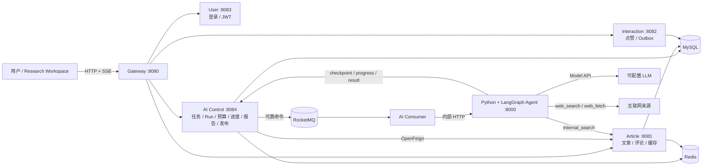

# XPlanet 秋招版最终方案

> 文档状态：唯一有效的后续实施基线
>
> 形成日期：2026-07-20
>
> 适用目标：硕士秋招的 Agent 应用开发、AI 全栈、Agent 后端、Java + AI 应用岗位
>
> 当前代码基线：`9fbb15c` 完成的 v2 可运行系统；后续 `eff46b1` 仅增加过期方案文档
>
> 实施原则：每个阶段实现、测试、提交并推送后，才进入下一阶段

## 0. 最终结论

XPlanet 秋招版不再追求“大而全的企业级多 Agent 平台”，也不继续增加仅用于展示技术数量的组件。最终项目定义为：

> **XPlanet Research：面向开发者的可追溯技术研究 Agent 与知识社区。用户提交技术问题后，Agent 动态规划并循环调用 Web 和站内知识工具，提取证据、生成带引用报告，并通过 Critic 发现证据缺口后定向补充研究；用户审核报告后可幂等发布为社区文章，文章又能进入站内知识检索。Java 平台负责身份、任务可靠性、发布和互动，Python/LangGraph 负责 Agent 决策、工具、证据和评测。**

秋招版的核心不是组件数量，而是一个能够现场演示、解释、测试和量化的完整闭环：

```text
问题 → 动态计划 → 工具循环 → 证据 → 报告 → Critic 补研究
     → 人工审核 → 幂等发布 → 站内知识索引 → 后续研究复用
```

目标叙事比例：

- Agent 产品能力与实现：约 65%；
- Java 后端可靠性与社区能力：约 35%；
- 比例按主流程、演示时间和简历内容衡量，不按代码行数机械计算。

## 1. 文档规则

本文是后续唯一的目标架构和实施清单。以下规则必须长期遵守：

1. `已实现` 只能用于当前代码中真实存在并通过测试的能力；
2. `目标` 表示已经确定实施，但尚未完成；
3. 未运行真实模型、真实 Web 搜索或真实站内检索时，不得宣传相应质量；
4. 旧链路只有在新链路通过等价测试后才能删除；
5. 每阶段先执行局部测试，再执行全量回归和相关 smoke；
6. 测试通过后更新本文状态，并独立 commit、push；
7. 简历只写已完成、可演示、可复现的能力和数字；
8. 新需求若不服务核心闭环、评测指标或明确面试问题，默认不做。

## 2. 当前基线与最终差距

### 2.1 当前已经实现并保留

| 能力 | 当前价值 | 秋招版处理 |
|---|---|---|
| Gateway 统一入口 | 路由、CORS、TraceId、JWT 前置校验 | 保留，不扩建注册中心 |
| bcrypt + JWT + 资源归属校验 | 完成身份和权限闭环 | 保留 |
| 文章、评论、点赞、热榜 | 知识承载与人类反馈基础 | 保留，不继续扩展普通社区功能 |
| Caffeine + Redis 二级缓存 | 热点读、穿透/击穿/雪崩处理 | 保留为后端亮点 |
| 点赞状态机 + Outbox + RocketMQ + 幂等投影 | 最终一致性和消息可靠性案例 | 保留，不再重构 |
| AI 任务状态机、预算、取消和请求幂等 | 长任务控制面 | 保留 |
| AI 命令 Outbox + MQ | 可靠提交与重投 | 保留 |
| LangGraph 动态工具循环 | Agent 可按预算选择 Search/Fetch/Finish | 保留 |
| 节点 checkpoint + 强退恢复 | 已有故障恢复基础 | 保留并覆盖新节点 |
| Source、Evidence、Claim、Citation、Report | 可追溯数据与质量骨架 | 保留并继续做真实样本抽检 |
| Redis Stream + SSE | 实时进度 | 用于 Agent 工作台 |
| 报告人工审核 + OpenFeign 幂等发布 | Human-in-the-loop 和业务闭环 | 保留 |
| 离线 Provider、pytest、Maven 测试和 smoke 脚本 | 零成本回归基础 | 扩充真实质量评测 |

### 2.2 基线差距与实施状态

1. **Research Workspace（已完成）**：现已展示任务、预算、SSE 节点时间线、来源、Evidence、Citation、模型用量、报告审核和发布；
2. **动态工具循环（已完成）**：Planner、Decision、Search/Fetch、预算、去重、安全抓取和恢复均已实现；
3. **站内知识没有进入 Agent 工具**：社区和 Agent 只有“报告发布文章”的单向关系；
4. **Claim–Evidence–Critic（工程闭环已完成）**：已实现显式 Claim、Evidence 哈希、结构化 Critic、单次补研究和词面支持门禁；真实联网语义质量仍待有密钥时抽检。

这四项是后续全部工作的唯一主线。

## 3. 秋招版范围

### 3.1 必须完成的 P0 能力

#### A. Research Workspace

前端必须支持并展示：

- 登录与当前用户；
- 创建研究任务及预算；
- 任务列表和状态；
- SSE 节点时间线；
- 动态研究计划；
- 每次工具调用的名称、输入摘要、状态、耗时和结果数量；
- 来源、Evidence 和对应 Claim；
- Markdown 报告预览；
- 取消任务；
- 审核并发布文章；
- 打开发布后的社区文章。

#### B. 单 Agent 动态工具循环

LangGraph 不再是固定的“规划一次、搜索一次、写作一次”，而是让 Agent 根据当前计划、证据和预算决定下一步：

```text
PLAN → DECIDE_ACTION
             ├─ web_search
             ├─ web_fetch
             ├─ internal_search
             └─ finish_research
工具结果 → NORMALIZE_EVIDENCE → DECIDE_ACTION
finish → WRITE → CRITIC
                  ├─ 有关键缺口且未超预算 → DECIDE_ACTION
                  └─ 通过/预算耗尽 → FINALIZE
```

必须具备：

- 模型生成结构化计划，而不是写死三步；
- 工具参数使用 Pydantic Schema 校验；
- 每次动作都受工具次数、来源数、Token 和截止时间约束；
- 搜索、抓取、站内检索分别是独立工具；
- Critic 最多触发一次定向补研究，禁止无限自我反思；
- 相同 URL 和相同内容哈希去重；
- checkpoint 保存下一节点、预算和已获得证据，恢复后不重复已完成节点。

#### C. Evidence 与 Citation 闭环

每个关键结论必须绑定至少一个 Evidence：

```text
SourceDocument
  └─ EvidenceChunk(locator + content + sourceRef)
       └─ Citation(claimId + evidenceRef + supportScore)
            └─ Report 中的 Claim
```

需要区分：

- 引用 ID 存在；
- Evidence 来源可定位；
- Evidence 在语义上支持 Claim；
- 来源之间是否冲突。

Critic 输出结构化问题列表：缺少证据、证据不支持、来源质量低、结论冲突、覆盖不足。只有影响核心结论的问题才触发补研究。

#### D. 最小站内知识检索

Agent 新增 `internal_search` 工具，直接检索 MySQL 中已发布且未删除的社区文章：

```text
已发布文章 → MySQL FULLTEXT(title, content)
用户问题 → internal_search → TopK 文章/摘要/相关度 → Evidence
```

约束：

- 不新增 Qdrant、Embedding 服务、索引双写和重建任务；
- MySQL 文章既是事实源也是秋招版搜索索引，发布成功即可被检索；
- FULLTEXT 负责候选召回，文章状态与删除标记在同一 SQL 中过滤；
- 初版只索引已发布且未删除的文章；
- 点赞数只作为可解释的轻量排序信号，不直接代表事实正确性。

这是有意识的精简：当前数据规模和面试时间不足以证明向量库的必要性。未来只有当同义表达召回数据显著差于目标时，再把检索 Provider 替换成 Embedding + 向量库，Agent 工具契约无需改变。

#### E. 评测与可复现实验

建立两套评测：

1. `offline-demo`：CI 和日常回归使用固定语料，不产生模型费用；
2. `live-eval`：显式提供 Key 时运行真实模型、Web Search 和 MySQL 站内检索。

至少维护 30 个问题的 JSONL 数据集，覆盖：

- 技术方案比较；
- 架构解释；
- 故障分析；
- 站内知识可回答问题；
- 无足够证据时应表达不确定的问题；
- Prompt 注入和恶意 URL 输入。

核心指标：

| 指标 | 含义 | 秋招版验收 |
|---|---|---|
| Completion Rate | 预算内生成完整报告 | live 数据集不低于 90% |
| Citation Integrity | Citation 指向存在的 Evidence | 100% |
| Claim Support | Evidence 语义支持 Claim | 抽样或 Judge 评测不低于 80% |
| Internal Recall@5 | 标注相关站内文章能否被召回 | 不低于 80% |
| Budget Violation | 是否超工具/来源/Token/时间预算 | 0 |
| Recovery Success | 强退重投后能否完成且无重复副作用 | 100% 测试用例通过 |
| Duplicate Publish | 重复审核是否产生多篇文章 | 0 |
| Latency/Cost | p50、p95、Token 和估算成本 | 记录真实数据，不预设虚假优化数字 |

### 3.2 只保留一个可选增强项

若全部 P0 已完成、测试稳定且仍有时间，只允许增加：

> **有界并行子问题研究**：Planner 最多拆成 3 个相互独立的子问题，并发执行搜索，最后合并 Finding；它仍是一个 Lead Agent 的内部并行，不宣传成多个自治 Agent。

启用条件：对同一评测集证明总延迟或覆盖率有明确改善，并且 Token 成本可解释。没有数据则不做。

### 3.3 明确不做

秋招版删除或拒绝以下规划：

- 不迁移成 Python 自有数据库和独立 Agent schema；
- 不重做 Java/Python 全部状态所有权；
- 不拆 `xplanet-agent-worker` 新服务；
- 不把 Java 服务物理合并；
- 不引入 Nacos、Dubbo、Seata；
- 不引入 Kafka、Elasticsearch；
- 不引入 Kubernetes、Service Mesh；
- 不搭建完整 Prometheus + Grafana + OpenTelemetry 平台；
- 不做长期记忆、用户画像和自动反馈学习；
- 不开放 Shell、代码执行、任意 MCP 或浏览器自动操作；
- 不做多模型智能路由和复杂降级矩阵；
- 不堆 Clarifier、Supervisor、Researcher、Writer 等多个只有 Prompt 不同的“伪 Agent”；
- 不继续扩展关注、私信、收藏等普通社区功能；
- 不为了简历数字编造高并发 QPS、准确率或成本收益。

## 4. 最终总体架构



### 4.1 为什么仍保留这些组件

| 组件 | 解决的问题 | 是否必要 |
|---|---|---|
| Gateway | 单一入口、CORS、TraceId、前置 JWT | 必要 |
| MySQL | 任务、报告、证据、文章和 Outbox 的最终事实 | 必要 |
| Redis | 缓存、限流、热榜、SSE 进度流 | 必要，已有多处真实使用 |
| RocketMQ | 点赞、缓存失效和 AI 长任务削峰/重投 | 必要，已有可靠链路 |
| OpenFeign | Java 服务间类型化 HTTP 调用 | 必要，沿用现状 |
| LangGraph | 显式状态、条件路由和恢复节点 | 必要 |

Spring Cloud Gateway 已满足当前服务治理需求。服务地址通过环境变量和 Docker DNS 配置，项目规模不足以证明 Nacos、Dubbo 或 Seata 的收益。

### 4.2 服务职责不再调整

| 模块 | 最终职责 | 不承担 |
|---|---|---|
| `xplanet-web` | 研究工作台和社区演示 | 复杂前端工程体系 |
| `xplanet-gateway` | 对外唯一入口 | 业务逻辑、最终鉴权 |
| `xplanet-user` | 用户、登录、JWT | Agent 状态 |
| `xplanet-article` | 文章、评论、缓存、发布落点、知识原文 | Agent 编排 |
| `xplanet-interaction` | 点赞关系、可靠事件、计数投影 | 文章事实、RAG 事实 |
| `xplanet-ai` | 任务/Run/预算/状态/checkpoint/SSE/报告/审核发布 | 模型推理和搜索算法 |
| `xplanet-agent` | 规划、动作决策、工具执行、Evidence、写作、Critic、评测 | 用户身份和社区事务 |
| `xplanet-common` | Java 公共鉴权、异常和响应 | 业务 DTO 堆积 |
| `xplanet-api` | Java 跨服务契约 | Python 内部模型 |

## 5. 最终主流程

### 5.1 创建和执行研究任务

```text
1. 用户通过 Gateway 登录，获得 JWT。
2. 前端 POST /api/ai/tasks，并携带 Idempotency-Key。
3. xplanet-ai 在一个事务内写 ai_task、ai_run 和 ai_outbox。
4. Outbox relay 将 RUN_REQUESTED 发布到 RocketMQ。
5. AI Consumer 收到消息，调用 Python Agent。
6. Agent 从 Java 读取 checkpoint；若没有则从 VALIDATE_INPUT 开始。
7. Agent 动态生成计划，循环决定和执行工具。
8. 每个关键节点回写 checkpoint，并把进度写入 Redis Stream。
9. 前端通过 SSE 展示计划、工具、证据、写作和 Critic 状态。
10. Agent 返回 Source/Evidence/Citation/Report/Usage。
11. Java 在事务内验证引用闭包并落库，任务进入 SUCCEEDED。
```

### 5.2 Critic 补研究

```text
初稿 → 提取关键 Claim
     → 检查每个 Claim 的 Evidence 支持度
     → 若存在关键缺口且 revision=0、预算充足
          → 生成定向 query → 回到工具循环
     → 否则输出最终报告并显式标注不确定项
```

Critic 不是为了无限提高分数，而是防止无引用结论和明显证据缺口。最多补研究一次。

### 5.3 审核、发布和知识回流

```text
1. 用户查看报告、来源和 Evidence。
2. 用户主动点击“审核并发布”；Agent 无权自行发布。
3. xplanet-ai 通过 OpenFeign 调用 article 内部发布接口。
4. report_id 作为幂等键；重复请求返回同一 article_id。
5. MySQL FULLTEXT 与文章事实同库，发布成功后无需额外索引双写。
6. 后续任务通过 internal_search 检索该文章。
```

### 5.4 失败、取消和恢复

- 模型/search/fetch 必须有独立超时和有限重试；
- 取消在每个节点和工具调用边界检查；
- MQ 至少一次投递，runId 和节点 input hash 保证恢复幂等；
- 已完成 checkpoint 不重复执行；
- 最多尝试 3 次后明确进入 `FAILED`，不无限重试；
- 报告落库和任务成功状态同事务；
- 发布操作通过 `ai_published_article.report_id` 唯一约束去重。

## 6. Agent Runtime 设计

### 6.1 状态

Agent State 只保留运行所需字段：

```text
task/run identity
question
plan/subquestions
pending action
sources/evidence/citations
draft
critic issues
revision count
tool/source/token/time budget
usage and errors
next node
```

大文本尽量放 Source/Evidence/Report 持久化对象，checkpoint 保存恢复所需的引用和摘要，避免状态无限膨胀。

### 6.2 节点

| 节点 | 主要输入 | 输出 | 是否 checkpoint |
|---|---|---|---|
| `validate_input` | 问题、预算 | 规范化问题 | 是 |
| `planner` | 问题 | 结构化计划/子问题 | 是 |
| `decide_action` | 计划、已有证据、剩余预算 | 下一工具或结束 | 是 |
| `execute_tool` | 类型化工具调用 | ToolResult | 是 |
| `evidence_builder` | ToolResult | 去重 Evidence | 是 |
| `writer` | 计划和 Evidence | 带 Claim 标识的初稿 | 是 |
| `critic` | 初稿和 Citation | 问题列表/补研究 query | 是 |
| `finalize` | 最终稿和 Usage | ResearchResult | 是 |

### 6.3 三个工具

| 工具 | 输入 | 输出 | 关键保护 |
|---|---|---|---|
| `web_search` | query、maxResults | 标题、URL、摘要 | 次数限制、去重、超时 |
| `web_fetch` | URL | 正文片段、hash、locator | SSRF 防护、大小限制、类型限制、超时 |
| `internal_search` | query、topK | articleId、chunk、score | topK 限制、只检索有效文章 |

不新增没有实际使用场景的工具。

### 6.4 Provider 边界

重构当前“大而全”的 `ResearchProvider.research()`：

- `ModelProvider`：结构化计划、动作决策、写作和 Critic；
- `SearchProvider`：Web 搜索；
- `InternalSearchProvider`：站内文章全文检索；
- `ToolRegistry`：工具 Schema、执行、超时和统计；
- `offline-demo`：固定模型和搜索结果；
- `live`：通过环境变量启用真实 Provider。

模型名、Base URL 和 Key 全部来自环境变量，不硬编码凭证或把特定模型写死为项目能力。

## 7. 数据与接口

### 7.1 数据所有权

秋招版不迁移现有状态所有权：

- MySQL 中 `ai_task/ai_run/ai_run_step/source_document/evidence_chunk/ai_report/report_citation/model_usage` 继续由 `xplanet-ai` 管理；
- Redis Stream 只保存短期进度，不作为任务最终事实；
- 站内检索直接读取 `xplanet-article` 所拥有的已发布文章，不复制第二份知识事实；
- Python 通过现有内部 Token 回写进度、checkpoint 和结果；
- 社区文章仍由 `xplanet-article` 唯一拥有。

这是刻意的秋招取舍：先把 Agent 主流程做深，不投入高风险的双写迁移。

### 7.2 面向用户的 API

尽量复用现有契约：

```text
POST   /api/ai/tasks
GET    /api/ai/tasks
GET    /api/ai/tasks/{taskId}
DELETE /api/ai/tasks/{taskId}
GET    /api/ai/tasks/{taskId}/events
GET    /api/ai/tasks/{taskId}/report
POST   /api/ai/tasks/{taskId}/report/approve
```

需要增强但不另起一套 Thread API：

- Task VO 增加结构化 plan、当前 action、预算使用和失败阶段；
- SSE 增加 `PLAN_CREATED/TOOL_STARTED/TOOL_COMPLETED/EVIDENCE_ADDED/CRITIC_COMPLETED`；
- Report VO 返回来源、Evidence、Claim/Citation 和 Usage 汇总；
- 旧客户端字段尽量保持兼容。

### 7.3 内部知识索引 API

只增加最小内部接口：

```text
GET  /internal/articles/knowledge?cursor=&limit=
POST /internal/knowledge/index/{articleId}
POST /internal/knowledge/rebuild
```

所有接口要求内部 Token；重建接口只允许本地脚本或管理员调用，并具有并发锁和批量上限。

### 7.4 SSE 事件最小结构

```json
{
  "eventId": "stream-id",
  "taskId": 1,
  "runId": "uuid",
  "type": "TOOL_COMPLETED",
  "node": "execute_tool",
  "status": "COMPLETED",
  "progress": 45,
  "message": "web_search 返回 5 个来源",
  "occurredAt": "ISO-8601"
}
```

前端只展示安全摘要，不通过 SSE 泄露完整 Prompt、Token、密钥或未清洗网页正文。

## 8. 前端最终形态

秋招版不引入 Vue/React 构建链，保留无 Node 的静态演示方式，但把单文件拆为清晰模块：

```text
xplanet-web/
├─ index.html
├─ assets/app.css
└─ js/
   ├─ api.js
   ├─ auth.js
   ├─ research.js
   ├─ community.js
   └─ app.js
```

页面布局：

```text
┌──────────────┬──────────────────────────────┬────────────────────┐
│ 任务列表      │ Research Workspace           │ Evidence / Report  │
│ 状态/时间     │ 问题、计划、节点、工具时间线   │ 来源、证据、引用     │
│ 新建/取消     │ SSE 实时更新                  │ 审核发布             │
└──────────────┴──────────────────────────────┴────────────────────┘
```

社区列表作为“已发布知识”二级入口，不再占据首页中心。

## 9. 安全和可靠性边界

必须实现：

- Gateway 前置 JWT + 下游再次鉴权；
- Task/Report 所有者校验；
- 内部接口独立 Token；
- URL 仅允许 `http/https`，拒绝 localhost、环回、私网、链路本地地址和重定向绕过；
- fetch 限制响应体大小、Content-Type、连接/读取超时；
- 工具输入 Schema 校验，网页内容始终按不可信数据处理；
- 发布必须由用户确认；
- 日志和 SSE 不记录密钥、完整 Authorization 或敏感 Prompt；
- 模型、工具、总任务均设置预算；
- 离线模式默认可运行，真实外部调用必须显式配置。

秋招版只通过 Micrometer/Actuator 和结构化日志记录必要指标，不搭建完整观测平台。

## 10. 分阶段实施计划

### Phase 0：方案收敛与基线锁定

状态：`本次完成`

- 删除两份旧的重构/优化大方案；
- 本文成为唯一实施基线；
- 修正 README、架构文档、入门文档和 skill project-map 的引用；
- 不改变运行代码。

验收：

- 仓库内不存在旧方案文件名和 v3 实施引用；
- Markdown 链接有效；
- Git diff 只包含文档收敛。

### Phase 1：Agent 工作台纵向闭环

状态：`已完成（2026-07-20）`

目标：不改 Agent 算法，先让已有真实链路完整可见。

任务：

1. 拆分 `xplanet-web/index.html`；
2. 实现任务创建、列表、详情、取消；
3. 实现带 Last-Event-ID 的 SSE 重连；
4. 展示步骤、来源、Evidence、Citation、Usage 和报告；
5. 实现审核发布并跳转文章；
6. 补 API 错误、空状态和失败状态展示。

测试门禁：

- Java 全量 `mvn test`；
- Python `pytest`；
- offline 模式完整 smoke；
- 浏览器 E2E：登录→创建→SSE→报告→发布→重复发布。

验收记录（2026-07-20）：

- 5 个前端脚本通过 `node --check`；
- Maven 全量 94 个测试通过，Python 10 个测试通过；
- Playwright 真实浏览器完成登录、任务创建、7 个 SSE 节点、报告/Evidence、审核发布和文章打开，桌面/移动布局控制台均为 0 error；
- 重复审核返回相同 `articleId`，验证幂等发布；
- Docker offline smoke 验证 Gateway、Agent、7 个 checkpoint、Evidence、取消、点赞投影和缓存失效链路。

### Phase 2：真实动态工具循环

目标：消除固定 Planner 和一体化 Provider。

任务：

1. 拆分 `ModelProvider/SearchProvider/ToolRegistry`；
2. 新增结构化 Planner 和 `decide_action`；
3. 实现 `web_search/web_fetch`；
4. 完成预算、去重、超时、错误分类；
5. 将工具事件写入 checkpoint 和 SSE；
6. 保持 offline Provider 可重复运行。

测试门禁：

- 每个节点和条件路由单元测试；
- Provider 契约测试；
- 超预算、超时、取消、坏 Schema、重复 URL 测试；
- 强退恢复测试证明已完成工具不重复执行；
- 有明确 API Key 和成本授权时至少做 5 个问题的显式 live smoke，结果只记录不先夸大质量；没有密钥时以 MockTransport 契约测试验收工程链路，live 质量不得标为已验证。

验收记录（2026-07-20）：

- 拆分 `ModelProvider`、`SearchProvider`、`ToolRegistry` 和 `DocumentFetcher`，联网路径不再由单次 Provider 同时搜索和写整篇报告；
- LangGraph 改为 `Planner → Decide Action → Execute Tool → Evidence Builder → Decide Action` 条件循环，支持 `web_search`、`web_fetch`、`finish_research`；
- 工具次数、决策次数、来源数、输出 Token 和 deadline 均有硬上限；重复 query/URL 会自动替换为下一个有效动作，抓取只接受搜索候选 URL；
- `web_fetch` 已限制 HTTP(S)、80/443、公网 DNS、逐跳重定向、内容类型、响应大小和超时；生产 egress proxy 仍保留为明确边界；
- checkpoint 升级到 schema v2，`EXECUTE_TOOL` 先保存完整工具结果再进入 Evidence Builder；兼容读取 schema v1，但旧固定工作流状态会从 Planner 安全重建；
- 永久输入/Schema/工具拒绝映射为 HTTP 400/409/422 并直接失败确认，超时和服务异常保留为可重试错误，避免确定性错误浪费 MQ 重投；
- Python 22 项测试、Java 98 项测试和 10 条离线评测通过；离线评测成功率/引用索引有效率均为 100%，不代表事实支持率；
- Docker smoke 通过：Task 31 产生 5 次工具、6 次决策、21 个 checkpoint 和 26 条进度，随后完成人工审核及幂等发布；
- 一次性强退恢复通过：Task 34 在首个工具结果落库后退出，2 次 run attempt、3 个工具步骤、15 个 checkpoint，最终进入 `WAITING_REVIEW`；
- OpenAI 结构化规划/决策/写作和 Hosted Web Search 已通过 MockTransport；当前环境无 API Key，未执行真实联网质量验收，也不声称真实模型质量已达标。

### Phase 3：Evidence/Critic 质量闭环

目标：从“有引用”升级为“引用尽量支持结论”。

任务：

1. Writer 输出 Claim 标识；
2. Evidence Builder 保存 locator 和内容 hash；
3. Critic 输出结构化问题；
4. 最多一次定向补研究；
5. 报告显式显示不确定项和冲突来源；
6. 增加 Claim Support 评测。

测试门禁：

- Citation Integrity 100%；
- 缺证据、冲突证据、错误引用测试；
- Critic 不无限循环；
- 报告落库事务回滚测试；
- 有真实 Key 和费用授权时执行 live 样本人工抽检并记录边界；无 Key 时不得声称语义质量已验收。

验收记录（2026-07-20）：

- Writer 输出唯一 Claim ID、原文 statement、一个或多个 Evidence ID 与置信度；工作流只从这些绑定生成 Citation，并要求 ID 在 Markdown 中可见；
- Evidence Builder 保存 locator 和独立片段 SHA-256，Java 契约、`evidence_chunk.content_hash`、Flyway V008 和查询 VO 全链路同步；
- Critic 输出结构化 `issues/uncertainties/conflicts/supplementalQuery`，覆盖缺证据、冲突证据、错误引用和不支持论点；
- Critic 只能触发一次补研究/重写，第二次审计后强制进入人工审核，避免反思死循环；
- checkpoint 升级到 schema v3 并兼容读取 v2：旧 Writer/Critic 状态会回到新 Writer 重建 Claim；
- Python 25 项测试、Java AI 模块测试和 10 条离线评测通过；离线 Citation Integrity 与词面 Claim Support 均为 100%；
- Java 测试验证错误证据哈希拒绝、Citation 写入失败不推进状态，`complete` 的事务边界保证真实数据库整体回滚；
- OpenAI Writer/Critic 严格结构化契约通过 MockTransport；当前无真实 API Key，因此 live 语义支持率仍明确标记为未验收。
- Flyway 007→008、Docker smoke 和一次性强退恢复通过：Task 48 完成 schema v3 证据报告并幂等发布 Article 120；Task 47 在首个工具 checkpoint 后退出，2 次 attempt、3 个工具步骤且最终恢复到 `WAITING_REVIEW`。

### Phase 4：最小站内知识检索

目标：打通“研究→发布→知识→再研究”。

任务：

1. 为已发布文章增加 MySQL FULLTEXT 索引；
2. 在 `xplanet-article` 提供受内部 Token 保护的 TopK 检索接口；
3. Agent 新增有界 `internal_search` 工具和 Provider；
4. 将站内结果转换为 Source/Evidence 并参与 Critic；
5. 建立带相关文章标注的站内召回数据集。

测试门禁：

- FULLTEXT 迁移在新旧数据库均可执行；
- 私有/删除文章不会被召回，TopK 有硬上限；
- Internal Recall@5 达到 80%；
- 完整 smoke 证明新发布文章能被后续任务召回。

验收记录（2026-07-21）：

- Flyway V009 为 `article(title, content)` 增加 ngram FULLTEXT，迁移已在现有 V008 数据库执行成功；
- Article 提供受 `X-Agent-Token` 保护的内部 TopK 接口，查询长度、TopK 上限和 `deleted = 0` 均有硬约束；
- Agent 新增独立 `InternalSearchProvider` 与 `internal_search` Action，站内文章转换为 Source/Evidence 并进入同一 Writer/Critic 链路；
- checkpoint 升级到 schema v4，保存已尝试的站内查询，同时兼容读取 v2/v3；
- 5 条标注数据的 Internal Recall@5 为 100%（门槛 80%）；
- Docker smoke 中 Task 50 发布 Article 121，后续 Task 51 在 `maxToolCalls=1` 时通过 `internal_search` 召回该文章；
- Article 局部测试、Python 28 项测试、迁移、召回脚本和完整 smoke 均通过；真实向量语义召回不在本阶段声称范围内。

### Phase 5：评测、可靠性和发布收口

目标：形成可以写进简历并现场复现的证据。

任务：

1. 数据集扩展到至少 30 个问题；
2. 输出机器可读 JSON 和 `docs/evaluation-results.md`；
3. 统计完成率、支持率、Internal Recall@5、Token、成本和延迟；
4. 重新执行恢复、重复消息、重复发布、MQ 暂停测试；
5. 清理新链路替代后的死代码和过时配置；
6. 更新 README、架构、零基础导读、演示脚本和面试材料；
7. 录制或准备一条 3～5 分钟稳定演示路径。

测试门禁：

- Java/Python 全量测试；
- Docker 全栈启动与 health；
- 登录到发布再到站内召回的真实 E2E；
- 故障恢复 smoke；
- 评测指标达到本文门槛；
- README 中所有“已实现”均可由代码、测试或实验结果证明。

## 11. 每阶段 Git 规则

每阶段严格按以下顺序：

```text
实现最小闭环
→ 局部测试
→ 全量测试
→ 相关 Docker/smoke/E2E
→ 更新本文状态和实验结果
→ 检查 git diff
→ commit
→ push
→ 进入下一阶段
```

建议提交边界：

```text
docs: define autumn recruiting target architecture
feat(web): add research workspace
feat(agent): add bounded tool decision loop
feat(agent): add claim evidence critic loop
feat(rag): add internal knowledge retrieval
test: add agent quality evaluation suite
docs: finalize demo and interview evidence
```

不得把多个未验证阶段压成一个巨大提交。

## 12. 最终 Definition of Done

项目只有同时满足以下条件才算“秋招版完成”：

1. 外部用户只通过 Gateway 完成登录、研究、查看、取消和发布；
2. 工作台实时展示计划、工具、Evidence、Critic 和报告；
3. Planner 和下一工具由模型结构化决定，不是固定三步；
4. Agent 至少真实使用 Web 和站内知识两类工具；
5. 关键 Claim 有可定位 Evidence，错误引用不能落库；
6. Critic 能发现缺口并至多补研究一次；
7. 发布必须人工确认且重复发布不产生副作用；
8. 新发布文章可以被 `internal_search` 召回；
9. 预算、取消、超时和强退恢复有自动化测试；
10. 至少 30 个真实评测问题并输出可复现数据；
11. Java、Python、Compose、smoke 和浏览器 E2E 全部通过；
12. README、架构图、新手文档和简历表述与真实代码一致；
13. 所有阶段均已 commit 并 push；
14. 没有旧方案、死代码或重复入口继续干扰理解。

## 13. 最终简历与面试口径

### 13.1 项目名称

**XPlanet Research——可追溯技术研究 Agent 与知识社区**

在完成可选并行增强前，不使用“多 Agent 平台”作为项目名称。

### 13.2 30 秒介绍

> XPlanet 是一个面向开发者的可追溯研究 Agent。Agent 会动态制定计划，并在预算内循环调用 Web 搜索、网页抓取和站内知识检索，根据 Evidence 生成带引用报告；Critic 会检查关键结论是否被证据支持，并最多触发一次定向补研究。Java 平台用任务状态机、Transactional Outbox、RocketMQ、checkpoint 和幂等发布保证长任务可靠执行，用户审核后报告可以发布成社区文章并进入后续检索。

### 13.3 简历四条上限

完成后只保留四类描述，并填入真实测试数据：

1. LangGraph 动态规划与有界工具循环；
2. Claim–Evidence–Citation、Critic 补研究和站内知识检索；
3. 离线/在线评测及完成率、支持率、Recall、成本、延迟；
4. Java 任务可靠性、checkpoint 恢复、Outbox/MQ 和幂等发布。

### 13.4 必须能够回答的问题

- 为什么这是 Agent，而不是固定工作流或一次 LLM 调用？
- 为什么只有一个 Agent，而没有堆多个角色？
- Agent 如何决定下一工具，如何防止无限循环和成本失控？
- Citation 存在为什么不等于 Evidence 支持 Claim？
- checkpoint 保存什么，MQ 重投为什么不会重复副作用？
- 为什么 Java 拥有任务事实、Python 负责编排？
- 为什么秋招版选择 MySQL FULLTEXT，而没有为了技术数量增加 Qdrant？
- 将来换成向量检索时，为什么 Agent 的 `internal_search` 契约不必改变？
- 为什么保留 Gateway、Redis、RocketMQ，却不引入 Nacos、Dubbo、Seata？
- 评测集如何构造，指标有什么缺陷，数据能否复现？

## 14. 允许的方案变更

后续只有以下情况允许修改本文：

- 当前代码事实与方案假设不一致；
- 某阶段测试证明设计不可行；
- 外部 Provider、成本或环境条件阻塞实现；
- 某能力无法改善核心指标或演示价值，需要删除；
- 招聘方向明确从 Agent 应用转为纯 Java 后端或纯算法。

任何变更必须写清原因、替代方案、影响阶段和测试方式。默认选择更小、可测、可解释的方案。

## 15. 实施状态

| 阶段 | 状态 | 完成条件 |
|---|---|---|
| Phase 0 方案收敛 | 已完成 | 本文唯一有效，旧方案删除，引用更新 |
| Phase 1 Agent 工作台 | 已完成 | 浏览器完整演示当前链路 |
| Phase 2 动态工具循环 | 已完成（live 质量待有密钥时验收） | 动态决策、工具边界、预算、去重和恢复通过 |
| Phase 3 Evidence/Critic | 已完成（live 语义质量待有密钥时验收） | Claim Support 可评测并有单次补研究 |
| Phase 4 站内知识检索 | 已完成 | 发布内容可被检索，Internal Recall@5 为 100% |
| Phase 5 评测与发布 | 待实施 | 全量验收、真实数据、文档与演示完成 |

后续实施从 **Phase 5：评测、可靠性和发布收口** 开始。
